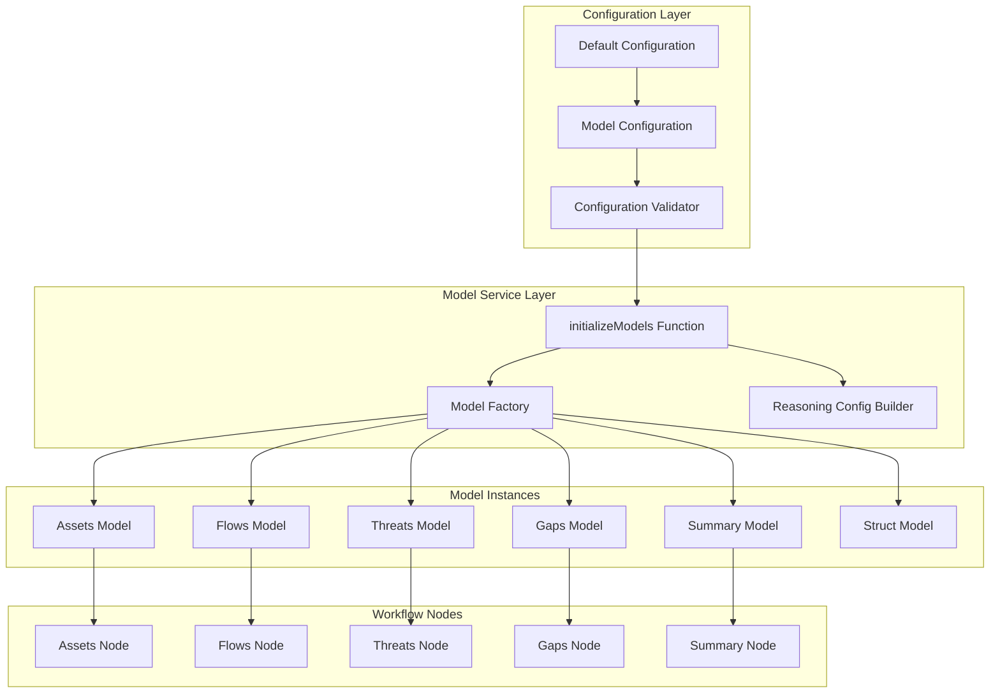
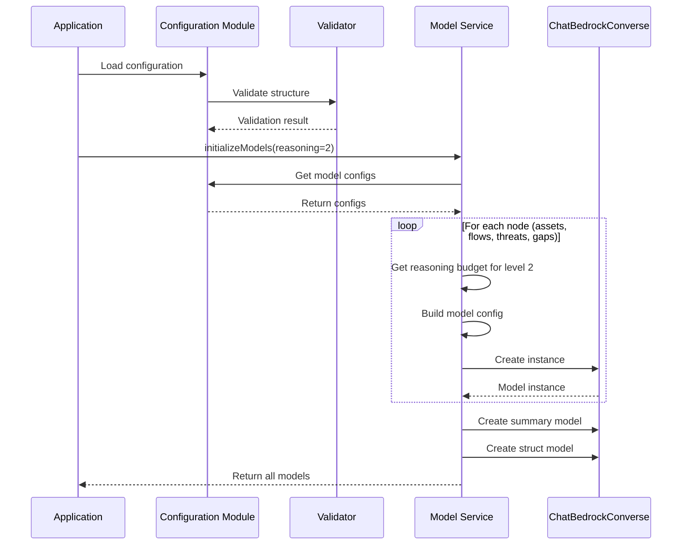

# Design Document

## Overview

This design document outlines the architecture for implementing granular model configuration in the embedded backend to match the Python backend's capability. The system will support per-node model selection and reasoning budget configuration, allowing different models and reasoning token budgets for each workflow node (assets, flows, threats, gaps) based on the reasoning level selected by the user.

### Key Design Principles

1. **Configuration Parity**: Match Python backend's model configuration structure exactly
2. **Per-Node Optimization**: Allow different models and reasoning budgets for each workflow node
3. **Reasoning Budget Mapping**: Support reasoning levels 0-3 with configurable token budgets per node
4. **Centralized Configuration**: Single source of truth for model configurations
5. **Backward Compatibility**: Maintain existing API surface while adding new capabilities
6. **Validation First**: Validate configuration before model initialization

## Architecture

### High-Level Architecture Diagram



### Configuration Flow



## Components and Interfaces

### 1. Configuration Structure

#### Model Configuration Schema

```javascript
// Configuration structure matching Terraform variables
const ModelConfiguration = {
  // Main model configuration with per-node settings
  model_main: {
    assets: {
      id: string,                    // Model ID (e.g., "anthropic.claude-3-5-haiku-20241022-v1:0")
      max_tokens: number,            // Maximum tokens (e.g., 64000)
      reasoning_budget: {
        "1": number,                 // Reasoning tokens for level 1
        "2": number,                 // Reasoning tokens for level 2
        "3": number                  // Reasoning tokens for level 3
      }
    },
    flows: {
      id: string,
      max_tokens: number,
      reasoning_budget: {
        "1": number,
        "2": number,
        "3": number
      }
    },
    threats: {
      id: string,
      max_tokens: number,
      reasoning_budget: {
        "1": number,
        "2": number,
        "3": number
      }
    },
    gaps: {
      id: string,
      max_tokens: number,
      reasoning_budget: {
        "1": number,
        "2": number,
        "3": number
      }
    }
  },
  
  // Summary model configuration
  model_summary: {
    id: string,                      // Model ID for summary generation
    max_tokens: number               // Maximum tokens for summary
  },
  
  // Structured output model configuration
  model_struct: {
    id: string,                      // Model ID for structured output
    max_tokens: number               // Maximum tokens
  },
  
  // List of models that support reasoning
  reasoning_models: string[]         // Array of model IDs with reasoning support
};
```

#### Default Configuration

```javascript
// embedded-backend/src/config/modelConfig.js

export const DEFAULT_MODEL_CONFIG = {
  model_main: {
    assets: {
      id: "anthropic.claude-3-5-haiku-20241022-v1:0",
      max_tokens: 64000,
      reasoning_budget: {
        "1": 16000,
        "2": 32000,
        "3": 63999
      }
    },
    flows: {
      id: "anthropic.claude-3-5-sonnet-20241022-v2:0",
      max_tokens: 64000,
      reasoning_budget: {
        "1": 8000,
        "2": 16000,
        "3": 24000
      }
    },
    threats: {
      id: "anthropic.claude-3-5-haiku-20241022-v1:0",
      max_tokens: 64000,
      reasoning_budget: {
        "1": 24000,
        "2": 48000,
        "3": 63999
      }
    },
    gaps: {
      id: "anthropic.claude-3-5-sonnet-20241022-v2:0",
      max_tokens: 64000,
      reasoning_budget: {
        "1": 4000,
        "2": 8000,
        "3": 12000
      }
    }
  },
  
  model_summary: {
    id: "anthropic.claude-3-5-haiku-20241022-v1:0",
    max_tokens: 4000
  },
  
  model_struct: {
    id: "anthropic.claude-3-5-haiku-20241022-v1:0",
    max_tokens: 64000
  },
  
  reasoning_models: [
    "anthropic.claude-3-5-sonnet-20241022-v2:0",
    "anthropic.claude-3-5-haiku-20241022-v1:0"
  ]
};
```

### 2. Configuration Validator

```javascript
// embedded-backend/src/config/configValidator.js

/**
 * Validate model configuration structure
 * @param {Object} config - Configuration object to validate
 * @throws {Error} If configuration is invalid
 */
export function validateModelConfig(config) {
  // Validate model_main structure
  if (!config.model_main) {
    throw new Error('Configuration missing model_main');
  }
  
  const nodes = ['assets', 'flows', 'threats', 'gaps'];
  for (const node of nodes) {
    if (!config.model_main[node]) {
      throw new Error(`Configuration missing model_main.${node}`);
    }
    
    const nodeConfig = config.model_main[node];
    
    // Validate required fields
    if (!nodeConfig.id) {
      throw new Error(`Configuration missing model_main.${node}.id`);
    }
    if (typeof nodeConfig.max_tokens !== 'number' || nodeConfig.max_tokens <= 0) {
      throw new Error(`Invalid max_tokens for model_main.${node}`);
    }
    if (!nodeConfig.reasoning_budget) {
      throw new Error(`Configuration missing model_main.${node}.reasoning_budget`);
    }
    
    // Validate reasoning budget
    const requiredLevels = ['1', '2', '3'];
    for (const level of requiredLevels) {
      if (typeof nodeConfig.reasoning_budget[level] !== 'number' || 
          nodeConfig.reasoning_budget[level] <= 0) {
        throw new Error(
          `Invalid reasoning_budget.${level} for model_main.${node}`
        );
      }
    }
  }
  
  // Validate model_summary
  if (!config.model_summary || !config.model_summary.id) {
    throw new Error('Configuration missing model_summary.id');
  }
  if (typeof config.model_summary.max_tokens !== 'number' || 
      config.model_summary.max_tokens <= 0) {
    throw new Error('Invalid max_tokens for model_summary');
  }
  
  // Validate model_struct
  if (!config.model_struct || !config.model_struct.id) {
    throw new Error('Configuration missing model_struct.id');
  }
  if (typeof config.model_struct.max_tokens !== 'number' || 
      config.model_struct.max_tokens <= 0) {
    throw new Error('Invalid max_tokens for model_struct');
  }
  
  // Validate reasoning_models
  if (!Array.isArray(config.reasoning_models)) {
    throw new Error('Configuration reasoning_models must be an array');
  }
  
  return true;
}
```

### 3. Enhanced Model Service

#### Model Initialization Function

```javascript
// embedded-backend/src/services/modelService.js (enhanced)

import { ChatBedrockConverse } from '@langchain/aws';
import { getCredentials } from '../config/credentials.js';
import { DEFAULT_MODEL_CONFIG } from '../config/modelConfig.js';
import { validateModelConfig } from '../config/configValidator.js';

// Temperature constants
const MODEL_TEMPERATURE_DEFAULT = 0.7;
const MODEL_TEMPERATURE_REASONING = 1.0;

/**
 * Initialize all models with granular configuration
 * @param {number} reasoning - Reasoning level (0-3)
 * @param {Object} customConfig - Optional custom configuration (defaults to DEFAULT_MODEL_CONFIG)
 * @returns {Object} Object containing all initialized model instances
 */
export function initializeModels(reasoning = 0, customConfig = null) {
  const config = customConfig || DEFAULT_MODEL_CONFIG;
  
  // Validate configuration
  validateModelConfig(config);
  
  // Get AWS credentials
  const credentials = getCredentials();
  if (!credentials) {
    throw new Error('AWS credentials not configured');
  }
  
  console.log('Initializing models with reasoning level:', reasoning);
  
  // Initialize each node-specific model
  const assets_model = createNodeModel(
    config.model_main.assets,
    reasoning,
    config.reasoning_models,
    credentials,
    'assets'
  );
  
  const flows_model = createNodeModel(
    config.model_main.flows,
    reasoning,
    config.reasoning_models,
    credentials,
    'flows'
  );
  
  const threats_model = createNodeModel(
    config.model_main.threats,
    reasoning,
    config.reasoning_models,
    credentials,
    'threats'
  );
  
  const gaps_model = createNodeModel(
    config.model_main.gaps,
    reasoning,
    config.reasoning_models,
    credentials,
    'gaps'
  );
  
  // Initialize summary model (no reasoning)
  const summary_model = createStandardModel(
    config.model_summary,
    credentials,
    'summary'
  );
  
  // Initialize struct model (no reasoning)
  const struct_model = createStandardModel(
    config.model_struct,
    credentials,
    'struct'
  );
  
  console.log('All models initialized successfully');
  
  return {
    assets_model,
    flows_model,
    threats_model,
    gaps_model,
    summary_model,
    struct_model
  };
}

/**
 * Create a node-specific model with optional reasoning
 * @param {Object} nodeConfig - Node configuration (id, max_tokens, reasoning_budget)
 * @param {number} reasoning - Reasoning level (0-3)
 * @param {Array} reasoningModels - List of model IDs that support reasoning
 * @param {Object} credentials - AWS credentials
 * @param {string} nodeName - Name of the node (for logging)
 * @returns {ChatBedrockConverse} Initialized model instance
 */
function createNodeModel(nodeConfig, reasoning, reasoningModels, credentials, nodeName) {
  const modelId = nodeConfig.id;
  const maxTokens = nodeConfig.max_tokens;
  
  // Build base configuration
  const config = {
    model: modelId,
    region: credentials.region,
    credentials: {
      accessKeyId: credentials.accessKeyId,
      secretAccessKey: credentials.secretAccessKey
    },
    maxTokens: maxTokens,
    temperature: MODEL_TEMPERATURE_DEFAULT
  };
  
  // Add session token if present
  if (credentials.sessionToken && credentials.sessionToken.trim()) {
    config.credentials.sessionToken = credentials.sessionToken.trim();
  }
  
  // Add reasoning configuration if enabled and supported
  const reasoningEnabled = reasoning > 0 && reasoningModels.includes(modelId);
  
  if (reasoningEnabled) {
    const reasoningBudget = nodeConfig.reasoning_budget[reasoning.toString()];
    
    if (!reasoningBudget) {
      console.warn(
        `No reasoning budget defined for ${nodeName} at level ${reasoning}, using default`
      );
    } else {
      config.modelKwargs = {
        thinking: {
          type: 'enabled',
          budget: reasoningBudget
        }
      };
      config.temperature = MODEL_TEMPERATURE_REASONING;
      
      console.log(
        `Reasoning enabled for ${nodeName}: budget=${reasoningBudget}, model=${modelId}`
      );
    }
  } else if (reasoning > 0) {
    console.warn(
      `Reasoning requested for ${nodeName} but model ${modelId} does not support it`
    );
  }
  
  return new ChatBedrockConverse(config);
}

/**
 * Create a standard model without reasoning
 * @param {Object} modelConfig - Model configuration (id, max_tokens)
 * @param {Object} credentials - AWS credentials
 * @param {string} modelName - Name of the model (for logging)
 * @returns {ChatBedrockConverse} Initialized model instance
 */
function createStandardModel(modelConfig, credentials, modelName) {
  const config = {
    model: modelConfig.id,
    region: credentials.region,
    credentials: {
      accessKeyId: credentials.accessKeyId,
      secretAccessKey: credentials.secretAccessKey
    },
    maxTokens: modelConfig.max_tokens,
    temperature: MODEL_TEMPERATURE_DEFAULT
  };
  
  // Add session token if present
  if (credentials.sessionToken && credentials.sessionToken.trim()) {
    config.credentials.sessionToken = credentials.sessionToken.trim();
  }
  
  console.log(`Initialized ${modelName} model: ${modelConfig.id}`);
  
  return new ChatBedrockConverse(config);
}
```

### 4. Workflow Integration

#### Agent Executor Updates

```javascript
// embedded-backend/src/adapter/agentExecutor.js (updated)

import { initializeModels } from '../services/modelService.js';
import { createThreatModelingWorkflow } from '../agents/threatDesigner.js';

/**
 * Execute the threat modeling agent workflow
 * @param {Object} initialState - Initial agent state
 * @param {number} reasoning - Reasoning level (0-3)
 * @param {number} iteration - Iteration count
 * @returns {Promise<Object>} Final state
 */
export async function executeAgent(initialState, reasoning = 0, iteration = 0) {
  console.log('Executing agent with reasoning level:', reasoning);
  
  // Initialize all models with granular configuration
  const models = initializeModels(reasoning);
  
  // Create workflow
  const workflow = createThreatModelingWorkflow();
  
  // Build configuration object
  const config = {
    configurable: {
      // Node-specific models
      model_assets: models.assets_model,
      model_flows: models.flows_model,
      model_threats: models.threats_model,
      model_gaps: models.gaps_model,
      
      // Utility models
      model_summary: models.summary_model,
      model_struct: models.struct_model,
      
      // Workflow configuration
      reasoning: reasoning > 0,
      max_retry: 15,
      recursion_limit: 50
    }
  };
  
  // Execute workflow
  const result = await workflow.invoke(initialState, config);
  
  return result;
}
```

#### Node Updates

```javascript
// embedded-backend/src/agents/nodes.js (updated sections)

/**
 * Define assets from architecture analysis
 * Uses model_assets from config
 */
export async function defineAssets(state, config) {
  console.log('Node: defineAssets');
  
  const job_id = state.job_id || 'unknown';
  
  try {
    stateManager.setJobStatus(job_id, JobState.ASSETS, state.retry || 0);
    
    const msg_builder = new MessageBuilder(
      state.image_data,
      state.description || '',
      list_to_string(state.assumptions || [])
    );
    
    const human_message = msg_builder.createAssetMessage();
    const system_prompt = new SystemMessage({ content: asset_prompt() });
    const messages = [system_prompt, human_message];
    
    // Use model_assets from config
    const model = config.configurable?.model_assets;
    if (!model) {
      throw new Error('Assets model not found in config');
    }
    
    const model_with_structure = model.withStructuredOutput(AssetsListSchema);
    const structured_response = await model_with_structure.invoke(messages);
    
    return { assets: structured_response };
  } catch (error) {
    console.error('Error in defineAssets:', error);
    stateManager.setJobStatus(job_id, JobState.FAILED, state.retry || 0);
    throw error;
  }
}

// Similar updates for defineFlows, defineThreats, and gapAnalysis nodes
// Each uses their respective model from config:
// - defineFlows uses config.configurable.model_flows
// - defineThreats uses config.configurable.model_threats
// - gapAnalysis uses config.configurable.model_gaps
```

## Data Models

### Configuration Data Model

```typescript
interface NodeModelConfig {
  id: string;
  max_tokens: number;
  reasoning_budget: {
    "1": number;
    "2": number;
    "3": number;
  };
}

interface SimpleModelConfig {
  id: string;
  max_tokens: number;
}

interface ModelConfiguration {
  model_main: {
    assets: NodeModelConfig;
    flows: NodeModelConfig;
    threats: NodeModelConfig;
    gaps: NodeModelConfig;
  };
  model_summary: SimpleModelConfig;
  model_struct: SimpleModelConfig;
  reasoning_models: string[];
}
```

### Model Instances Data Model

```typescript
interface InitializedModels {
  assets_model: ChatBedrockConverse;
  flows_model: ChatBedrockConverse;
  threats_model: ChatBedrockConverse;
  gaps_model: ChatBedrockConverse;
  summary_model: ChatBedrockConverse;
  struct_model: ChatBedrockConverse;
}
```

## Error Handling

### Configuration Validation Errors

```javascript
class ConfigurationError extends Error {
  constructor(message, field) {
    super(message);
    this.name = 'ConfigurationError';
    this.field = field;
  }
}

// Usage
try {
  validateModelConfig(config);
} catch (error) {
  if (error instanceof ConfigurationError) {
    console.error(`Configuration error in field ${error.field}: ${error.message}`);
    // Show user-friendly error message
  }
  throw error;
}
```

### Model Initialization Errors

```javascript
try {
  const models = initializeModels(reasoning);
} catch (error) {
  console.error('Failed to initialize models:', error);
  
  // Check for specific error types
  if (error.message.includes('credentials')) {
    throw new Error('AWS credentials are invalid or missing');
  } else if (error.message.includes('Configuration')) {
    throw new Error('Model configuration is invalid');
  } else {
    throw new Error('Failed to initialize models: ' + error.message);
  }
}
```

## Testing Strategy

### Unit Testing

1. **Configuration Validator Tests**
   - Test valid configuration passes validation
   - Test missing fields are detected
   - Test invalid field types are detected
   - Test invalid reasoning budget values are detected

2. **Model Initialization Tests**
   - Test models are created with correct parameters
   - Test reasoning configuration is applied correctly
   - Test reasoning is skipped for unsupported models
   - Test error handling for invalid credentials

3. **Reasoning Budget Selection Tests**
   - Test correct budget is selected for each reasoning level
   - Test reasoning level 0 disables reasoning
   - Test fallback behavior for missing budget values

### Integration Testing

1. **End-to-End Workflow Tests**
   - Test workflow with reasoning level 0 (no reasoning)
   - Test workflow with reasoning level 1
   - Test workflow with reasoning level 2
   - Test workflow with reasoning level 3
   - Verify each node uses its designated model

2. **Configuration Loading Tests**
   - Test default configuration loads correctly
   - Test custom configuration can be provided
   - Test configuration validation catches errors early

### Manual Testing Checklist

- [ ] Default configuration loads successfully
- [ ] Models initialize with reasoning level 0
- [ ] Models initialize with reasoning level 1
- [ ] Models initialize with reasoning level 2
- [ ] Models initialize with reasoning level 3
- [ ] Assets node uses assets_model
- [ ] Flows node uses flows_model
- [ ] Threats node uses threats_model
- [ ] Gaps node uses gaps_model
- [ ] Summary uses summary_model
- [ ] Reasoning budgets are applied correctly
- [ ] Non-reasoning models skip reasoning config
- [ ] Configuration validation catches errors
- [ ] Error messages are clear and actionable

## Performance Considerations

### Model Instance Reuse

- Models are initialized once per workflow execution
- Same model instances are reused across multiple node invocations
- No need to recreate models between nodes

### Memory Management

- Model instances are garbage collected after workflow completion
- Configuration is loaded once and cached
- No persistent state between workflow executions

### Token Budget Optimization

- Different nodes have different reasoning budgets based on complexity
- Assets: Higher budget (16k-64k) for detailed analysis
- Flows: Medium budget (8k-24k) for relationship mapping
- Threats: Highest budget (24k-64k) for comprehensive threat identification
- Gaps: Lower budget (4k-12k) for focused gap analysis

## Migration Path

### Existing Code Compatibility

1. **Backward Compatible Changes**
   - Existing `initializeModel` function remains available
   - New `initializeModels` function added alongside
   - Nodes updated to use specific models from config
   - Old single-model approach still works for simple cases

2. **Migration Steps**
   - Add configuration module with defaults
   - Add validator module
   - Update model service with new initialization function
   - Update agent executor to use new initialization
   - Update nodes to use specific models from config
   - Test thoroughly with all reasoning levels

### Rollback Strategy

- Keep old `initializeModel` function as fallback
- Configuration can be disabled to use single model
- Nodes can fall back to `model_main` if specific model not found

## Future Enhancements

### Potential Improvements

1. **Dynamic Configuration**: Allow users to customize model selection in UI
2. **Model Performance Metrics**: Track token usage and latency per node
3. **Cost Optimization**: Automatically select cheaper models for simpler tasks
4. **A/B Testing**: Compare different model configurations for quality
5. **Configuration Presets**: Provide preset configurations for different use cases (fast, balanced, thorough)

### Scalability Considerations

1. **Configuration Storage**: Consider storing user preferences in sessionStorage
2. **Model Caching**: Cache model instances across multiple workflow runs
3. **Lazy Loading**: Initialize models only when needed
4. **Configuration Validation**: Move validation to build time where possible
