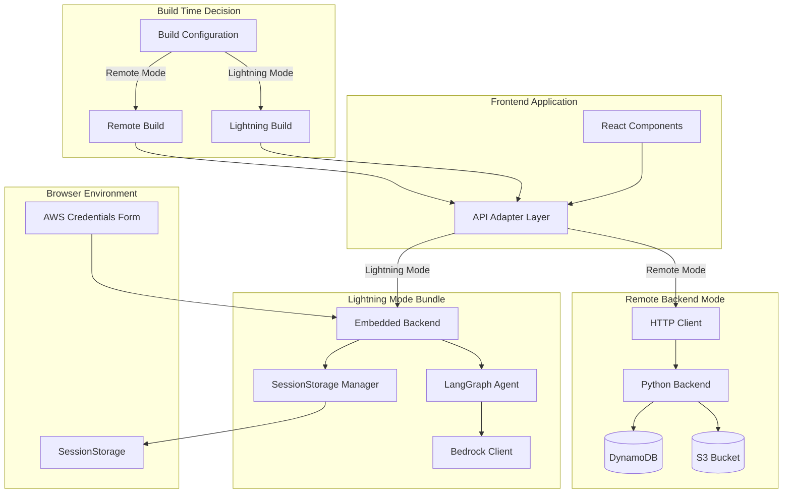
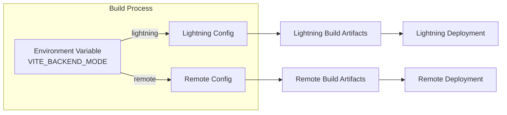
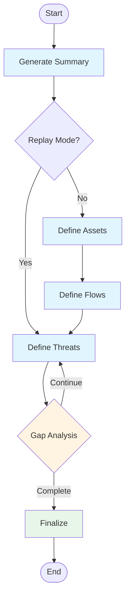

# Design Document

## Overview

This design document outlines the architecture for implementing a "Lightning Mode" version of the threat modeling application that runs entirely in the browser. The system will support two distinct deployment modes determined at build time: Remote Backend Mode (current server-based architecture) and Lightning Mode (browser-based embedded backend). The design ensures zero changes to existing frontend logic while providing seamless operation in both modes through a unified API adapter layer.

### Key Design Principles

1. **Build-Time Mode Selection**: Deployment mode is determined during the build process, not at runtime
2. **API Contract Preservation**: Embedded backend maintains identical interfaces to existing Python backend
3. **Separation of Concerns**: Frontend and embedded backend have independent build configurations
4. **Browser Compatibility First**: All implementations follow proven patterns from working_example
5. **Stateless Operation**: Lightning Mode uses sessionStorage for ephemeral state management
6. **Zero Frontend Impact**: Existing frontend components remain unchanged except for build configuration

## Architecture

### High-Level Architecture Diagram



### Mode Selection Architecture



## Components and Interfaces

### 1. Build Configuration System

#### Environment Variables

```javascript
// .env.lightning (for Lightning Mode builds)
VITE_BACKEND_MODE=lightning
VITE_SENTRY_ENABLED=false
VITE_THREAT_CATALOG_ENABLED=false

// .env.remote (for Remote Backend Mode builds)
VITE_BACKEND_MODE=remote
VITE_SENTRY_ENABLED=true
VITE_THREAT_CATALOG_ENABLED=true
```

#### Build Scripts

```json
{
  "scripts": {
    "build:lightning": "vite build --mode lightning",
    "build:remote": "vite build --mode remote",
    "dev:lightning": "vite --mode lightning",
    "dev:remote": "vite --mode remote"
  }
}
```

### 2. API Adapter Layer

The API adapter provides a unified interface that routes calls to the appropriate backend based on build-time configuration.

#### Interface Definition

```typescript
// Type definitions for API adapter
interface ThreatModelingAPI {
  startThreatModeling(
    key: string,
    iteration: number,
    reasoning: number,
    title: string,
    description: string,
    assumptions: string[],
    replay?: boolean,
    id?: string,
    instructions?: string
  ): Promise<{ data: { id: string } }>;
  
  updateTm(id: string, payload: object): Promise<{ data: object }>;
  
  restoreTm(id: string): Promise<{ data: boolean }>;
  
  generateUrl(fileType: string): Promise<{ 
    data: { presigned: string; name: string } 
  }>;
  
  getDownloadUrl(fileName: string): Promise<Blob>;
  
  getThreatModelingStatus(id: string): Promise<{ 
    data: { id: string; state: string; retry: number } 
  }>;
  
  getThreatModelingTrail(id: string): Promise<{ 
    data: { 
      id: string; 
      assets: string; 
      flows: string; 
      gaps: string[]; 
      threats: string[] 
    } 
  }>;
  
  getThreatModelingResults(id: string): Promise<{ 
    data: { job_id: string; state: string; item: object } 
  }>;
  
  getThreatModelingAllResults(): Promise<{ 
    data: { catalogs: object[] } 
  }>;
  
  deleteTm(id: string): Promise<{ 
    data: { job_id: string; state: string } 
  }>;
}
```

#### Adapter Implementation Structure

```javascript
// src/services/ThreatDesigner/apiAdapter.js

import { BACKEND_MODE } from '../../config';

// Import implementations
import * as remoteBackend from './remoteBackend';
import * as embeddedBackend from './embeddedBackend';

// Select implementation at module load time (build-time decision)
const backend = BACKEND_MODE === 'lightning' 
  ? embeddedBackend 
  : remoteBackend;

// Export unified interface
export const {
  startThreatModeling,
  updateTm,
  restoreTm,
  generateUrl,
  getDownloadUrl,
  getThreatModelingStatus,
  getThreatModelingTrail,
  getThreatModelingResults,
  getThreatModelingAllResults,
  deleteTm
} = backend;
```

### 3. Embedded Backend Architecture

The embedded backend replicates the Python backend functionality in JavaScript, running entirely in the browser.

#### Directory Structure

```
embedded-backend/
├── package.json                 # Separate dependencies
├── vite.config.js              # Browser-specific build config
└── src/
    ├── index.js                # Main entry point
    ├── adapter/                # API adapter implementation
    │   └── threatDesignerAdapter.js
    ├── agents/                 # LangGraph agents
    │   ├── threatDesigner.js   # Main agent workflow
    │   ├── nodes.js            # Agent node implementations
    │   └── state.js            # State definitions
    ├── services/               # Business logic
    │   ├── modelService.js     # Bedrock model invocation
    │   ├── messageBuilder.js   # Message construction
    │   └── prompts.js          # System prompts
    ├── storage/                # SessionStorage management
    │   ├── stateManager.js     # State persistence
    │   └── trailManager.js     # Trail tracking
    ├── stubs/                  # Browser compatibility stubs
    │   ├── empty.js            # Credential provider stubs
    │   ├── fs.js               # Filesystem stubs
    │   ├── child_process.js    # Process stubs
    │   └── os.js               # OS stubs
    └── config/
        └── credentials.js      # AWS credentials management
```

#### Agent Workflow Architecture



### 4. State Management System

#### SessionStorage Schema

```javascript
// State storage structure
const SESSION_STORAGE_KEYS = {
  // Job status tracking
  JOB_STATUS: 'tm_job_status_{id}',      // { id, state, retry }
  
  // Job results
  JOB_RESULTS: 'tm_job_results_{id}',    // Complete threat model data
  
  // Trail tracking
  JOB_TRAIL: 'tm_job_trail_{id}',        // { assets, flows, gaps, threats }
  
  // All jobs index
  ALL_JOBS: 'tm_all_jobs',               // Array of job IDs
  
  // AWS credentials
  AWS_CREDENTIALS: 'tm_aws_credentials',  // { accessKeyId, secretAccessKey, sessionToken, region }
  
  // Uploaded files (base64)
  UPLOADED_FILES: 'tm_uploaded_files_{key}' // Base64 image data
};
```

#### State Manager Interface

```javascript
class StateManager {
  // Job status operations
  setJobStatus(id, state, retry = 0);
  getJobStatus(id);
  
  // Results operations
  setJobResults(id, results);
  getJobResults(id);
  updateJobResults(id, updates);
  
  // Trail operations
  setJobTrail(id, trail);
  getJobTrail(id);
  updateJobTrail(id, updates);
  
  // Job index operations
  addJobToIndex(id, metadata);
  getAllJobs();
  removeJobFromIndex(id);
  
  // File operations
  storeUploadedFile(key, base64Data);
  getUploadedFile(key);
  deleteUploadedFile(key);
  
  // Cleanup
  clearJobData(id);
  clearAllData();
}
```

### 5. AWS Credentials Management

#### Credentials Form Component

The credentials form replaces the login form in Lightning Mode, reusing the existing login page layout.

```javascript
// Component structure
<CredentialsForm>
  <FormField label="AWS Access Key ID">
    <Input type="password" />
  </FormField>
  
  <FormField label="AWS Secret Access Key">
    <Input type="password" />
  </FormField>
  
  <FormField label="AWS Session Token (Optional)">
    <Input type="password" />
  </FormField>
  
  <FormField label="AWS Region">
    <Select options={AWS_REGIONS} />
  </FormField>
  
  <Button onClick={handleSubmit}>
    Start Lightning Mode
  </Button>
</CredentialsForm>
```

#### Credentials Storage

```javascript
class CredentialsManager {
  setCredentials(credentials) {
    // Store in sessionStorage (ephemeral)
    sessionStorage.setItem('tm_aws_credentials', JSON.stringify({
      accessKeyId: credentials.accessKeyId,
      secretAccessKey: credentials.secretAccessKey,
      sessionToken: credentials.sessionToken,
      region: credentials.region,
      timestamp: Date.now()
    }));
  }
  
  getCredentials() {
    const stored = sessionStorage.getItem('tm_aws_credentials');
    return stored ? JSON.parse(stored) : null;
  }
  
  clearCredentials() {
    sessionStorage.removeItem('tm_aws_credentials');
  }
  
  hasValidCredentials() {
    const creds = this.getCredentials();
    return creds && creds.accessKeyId && creds.secretAccessKey;
  }
}
```

### 6. Browser Compatibility Layer

#### Vite Configuration (from working_example)

```javascript
// embedded-backend/vite.config.js
import { defineConfig } from 'vite';
import { nodePolyfills } from 'vite-plugin-node-polyfills';
import path from 'path';

export default defineConfig({
  plugins: [
    nodePolyfills({
      globals: {
        Buffer: true,
        global: true,
        process: true,
      },
      protocolImports: true,
      exclude: ['fs', 'child_process', 'os'],
    }),
  ],
  resolve: {
    alias: {
      // Runtime config for AWS SDK
      './runtimeConfig': './runtimeConfig.browser',
      
      // Node.js module stubs
      'child_process': path.resolve(__dirname, './src/stubs/child_process.js'),
      'fs': path.resolve(__dirname, './src/stubs/fs.js'),
      'os': path.resolve(__dirname, './src/stubs/os.js'),
      'node:child_process': path.resolve(__dirname, './src/stubs/child_process.js'),
      'node:fs': path.resolve(__dirname, './src/stubs/fs.js'),
      'node:os': path.resolve(__dirname, './src/stubs/os.js'),
      
      // AWS credential provider stubs (critical for browser)
      '@aws-sdk/credential-provider-node': path.resolve(__dirname, './src/stubs/empty.js'),
      '@aws-sdk/credential-provider-process': path.resolve(__dirname, './src/stubs/empty.js'),
      '@aws-sdk/credential-provider-ini': path.resolve(__dirname, './src/stubs/empty.js'),
      '@aws-sdk/credential-provider-env': path.resolve(__dirname, './src/stubs/empty.js'),
      '@aws-sdk/credential-provider-sso': path.resolve(__dirname, './src/stubs/empty.js'),
      '@aws-sdk/token-providers': path.resolve(__dirname, './src/stubs/empty.js'),
    },
  },
  define: {
    'global': 'globalThis',
    'process.env': {},
  },
  optimizeDeps: {
    esbuildOptions: {
      define: {
        global: 'globalThis',
      },
    },
    exclude: [
      '@aws-sdk/credential-provider-node',
      '@aws-sdk/credential-provider-process',
      '@aws-sdk/credential-provider-ini',
      '@aws-sdk/credential-provider-env',
      '@aws-sdk/credential-provider-sso',
      '@aws-sdk/token-providers',
    ],
  },
  build: {
    lib: {
      entry: path.resolve(__dirname, 'src/index.js'),
      name: 'EmbeddedBackend',
      fileName: (format) => `embedded-backend.${format}.js`,
      formats: ['es']
    },
    rollupOptions: {
      external: [],
      output: {
        globals: {}
      }
    }
  }
});
```

#### ChatBedrockConverse Initialization

```javascript
// embedded-backend/src/services/modelService.js
import { ChatBedrockConverse } from '@langchain/aws';
import { getCredentials } from '../config/credentials';

export function initializeModel(modelId, temperature = 0.7) {
  const credentials = getCredentials();
  
  if (!credentials) {
    throw new Error('AWS credentials not configured');
  }
  
  return new ChatBedrockConverse({
    model: modelId,
    region: credentials.region,
    credentials: {
      accessKeyId: credentials.accessKeyId,
      secretAccessKey: credentials.secretAccessKey,
      sessionToken: credentials.sessionToken
    },
    temperature
  });
}
```

### 7. LangGraph Agent Implementation

#### State Definition

```javascript
// embedded-backend/src/agents/state.js
import { Annotation } from '@langchain/langgraph/web';

export const AgentState = Annotation.Root({
  job_id: Annotation({ reducer: (x, y) => y ?? x }),
  summary: Annotation({ reducer: (x, y) => y ?? x }),
  assets: Annotation({ reducer: (x, y) => y ?? x }),
  image_data: Annotation({ reducer: (x, y) => y ?? x }),
  system_architecture: Annotation({ reducer: (x, y) => y ?? x }),
  description: Annotation({ reducer: (x, y) => y ?? x }),
  assumptions: Annotation({ reducer: (x, y) => y ?? x }),
  threat_list: Annotation({ 
    reducer: (x, y) => {
      if (!x) return y;
      if (!y) return x;
      // Merge threat lists, avoiding duplicates
      const existingNames = new Set(x.threats.map(t => t.name));
      const newThreats = y.threats.filter(t => !existingNames.has(t.name));
      return {
        threats: [...x.threats, ...newThreats]
      };
    }
  }),
  iteration: Annotation({ reducer: (x, y) => y ?? x }),
  retry: Annotation({ reducer: (x, y) => y ?? x }),
  s3_location: Annotation({ reducer: (x, y) => y ?? x }),
  title: Annotation({ reducer: (x, y) => y ?? x }),
  owner: Annotation({ reducer: (x, y) => y ?? x }),
  stop: Annotation({ reducer: (x, y) => y ?? x }),
  gap: Annotation({ 
    reducer: (x, y) => {
      if (!x) return y || [];
      if (!y) return x;
      return [...x, ...y];
    }
  }),
  replay: Annotation({ reducer: (x, y) => y ?? x }),
  instructions: Annotation({ reducer: (x, y) => y ?? x })
});
```

#### Workflow Graph

```javascript
// embedded-backend/src/agents/threatDesigner.js
import { StateGraph, START, END } from '@langchain/langgraph/web';
import { AgentState } from './state';
import * as nodes from './nodes';

export function createThreatModelingWorkflow() {
  const workflow = new StateGraph(AgentState);
  
  // Add nodes
  workflow.addNode('generate_summary', nodes.generateSummary);
  workflow.addNode('define_assets', nodes.defineAssets);
  workflow.addNode('define_flows', nodes.defineFlows);
  workflow.addNode('define_threats', nodes.defineThreats);
  workflow.addNode('gap_analysis', nodes.gapAnalysis);
  workflow.addNode('finalize', nodes.finalize);
  
  // Set entry point
  workflow.addEdge(START, 'generate_summary');
  
  // Conditional routing from summary
  workflow.addConditionalEdges(
    'generate_summary',
    nodes.routeReplay,
    {
      'replay': 'define_threats',
      'full': 'define_assets'
    }
  );
  
  // Linear flow for full analysis
  workflow.addEdge('define_assets', 'define_flows');
  workflow.addEdge('define_flows', 'define_threats');
  
  // Conditional routing from threats
  workflow.addConditionalEdges(
    'define_threats',
    nodes.shouldContinue,
    {
      'gap_analysis': 'gap_analysis',
      'finalize': 'finalize'
    }
  );
  
  // Gap analysis routing
  workflow.addConditionalEdges(
    'gap_analysis',
    nodes.shouldRetry,
    {
      'continue': 'define_threats',
      'finalize': 'finalize'
    }
  );
  
  // End
  workflow.addEdge('finalize', END);
  
  return workflow.compile();
}
```

## Data Models

### Job Status Model

```javascript
{
  id: string,              // Unique job identifier (UUID)
  state: string,           // START | ASSETS | FLOW | THREAT | THREAT_RETRY | FINALIZE | COMPLETE | FAILED
  retry: number,           // Current retry count
  owner: string,           // User identifier (in Lightning Mode: "LIGHTNING_USER")
  updated_at: string       // ISO timestamp
}
```

### Job Results Model

```javascript
{
  job_id: string,
  s3_location: string,     // In Lightning Mode: storage key for base64 data
  owner: string,
  title: string,
  summary: string,
  description: string,
  assumptions: string[],
  assets: {
    assets: Array<{
      type: 'asset' | 'entity',
      name: string,
      description: string
    }>
  },
  system_architecture: {
    data_flows: Array<{
      flow_description: string,
      source_entity: string,
      target_entity: string
    }>,
    trust_boundaries: Array<{
      purpose: string,
      source_entity: string,
      target_entity: string
    }>,
    threat_sources: Array<{
      category: string,
      description: string,
      example: string
    }>
  },
  threat_list: {
    threats: Array<{
      name: string,
      stride_category: string,
      description: string,
      target: string,
      impact: string,
      likelihood: 'Low' | 'Medium' | 'High',
      mitigations: string[],
      source: string,
      prerequisites: string[],
      vector: string,
      starred: boolean
    }>
  },
  retry: number,
  backup: object           // Previous version for restore functionality
}
```

### Trail Model

```javascript
{
  id: string,
  assets: string,          // Reasoning text for assets phase
  flows: string,           // Reasoning text for flows phase
  gaps: string[],          // Array of gap analysis reasoning
  threats: string[]        // Array of threat reasoning (one per iteration)
}
```

## Error Handling

### Error Response Format

All errors from the embedded backend must match the format of the remote backend:

```javascript
{
  error: string,           // User-friendly error message
  message: string,         // Detailed error message
  job_id: string          // Job ID if available
}
```

### Error Types and HTTP-Equivalent Status Codes

```javascript
const ERROR_TYPES = {
  VALIDATION_ERROR: { code: 400, message: 'Validation failed' },
  UNAUTHORIZED: { code: 401, message: 'Unauthorized access' },
  NOT_FOUND: { code: 404, message: 'Resource not found' },
  CREDENTIALS_ERROR: { code: 401, message: 'Invalid AWS credentials' },
  MODEL_ERROR: { code: 422, message: 'Model invocation failed' },
  INTERNAL_ERROR: { code: 500, message: 'Internal server error' }
};
```

### Error Handling Strategy

```javascript
class ThreatModelingError extends Error {
  constructor(type, message, jobId = null) {
    super(message);
    this.name = 'ThreatModelingError';
    this.type = type;
    this.statusCode = ERROR_TYPES[type].code;
    this.jobId = jobId;
  }
  
  toResponse() {
    return {
      error: ERROR_TYPES[this.type].message,
      message: this.message,
      job_id: this.jobId
    };
  }
}

// Usage in adapter
try {
  const result = await executeAgent(state);
  return { data: result };
} catch (error) {
  if (error instanceof ThreatModelingError) {
    throw {
      response: {
        status: error.statusCode,
        data: error.toResponse()
      }
    };
  }
  // Handle unexpected errors
  throw {
    response: {
      status: 500,
      data: {
        error: 'Internal server error',
        message: error.message,
        job_id: null
      }
    }
  };
}
```

## Testing Strategy

### Unit Testing Approach

1. **State Manager Tests**
   - Test sessionStorage operations
   - Test data serialization/deserialization
   - Test cleanup operations

2. **Agent Node Tests**
   - Test each node in isolation
   - Mock model responses
   - Verify state transformations

3. **API Adapter Tests**
   - Test response format compatibility
   - Test error handling
   - Verify promise resolution

### Integration Testing Approach

1. **End-to-End Workflow Tests**
   - Test complete threat modeling workflow
   - Verify state persistence across nodes
   - Test replay functionality

2. **Browser Compatibility Tests**
   - Test in multiple browsers (Chrome, Firefox, Safari)
   - Verify ChatBedrockConverse functionality
   - Test credential management

3. **Mode Switching Tests**
   - Build both modes
   - Verify correct backend is used
   - Test feature flag behavior

### Manual Testing Checklist

- [ ] Lightning Mode build completes successfully
- [ ] Remote Mode build completes successfully
- [ ] Credentials form displays in Lightning Mode
- [ ] Login form displays in Remote Mode
- [ ] Threat modeling workflow completes in Lightning Mode
- [ ] Threat modeling workflow completes in Remote Mode
- [ ] Results format is identical between modes
- [ ] Sentry is disabled in Lightning Mode
- [ ] Threat Catalog is disabled in Lightning Mode
- [ ] State persists during session in Lightning Mode
- [ ] State clears on browser close in Lightning Mode
- [ ] Error messages match between modes

## Implementation Phases

### Phase 1: Foundation (Requirements 6, 9)
- Set up embedded-backend directory structure
- Configure separate package.json and vite.config.js
- Implement browser compatibility stubs from working_example
- Verify ChatBedrockConverse works in browser

### Phase 2: State Management (Requirements 4, 5)
- Implement StateManager for sessionStorage operations
- Implement CredentialsManager for AWS credentials
- Create credentials form component
- Integrate credentials form into login page

### Phase 3: Agent Conversion (Requirements 3, 9)
- Convert Python state definitions to JavaScript
- Implement LangGraph workflow using @langchain/langgraph/web
- Convert agent nodes to JavaScript
- Implement model service with ChatBedrockConverse

### Phase 4: API Adapter (Requirements 2, 8)
- Implement embedded backend adapter functions
- Create API adapter layer with mode selection
- Update frontend imports to use adapter
- Verify response format compatibility

### Phase 5: Build Configuration (Requirements 1, 6)
- Create build-time configuration system
- Implement environment-based mode selection
- Create separate build scripts
- Configure conditional imports

### Phase 6: Feature Flags (Requirement 7)
- Implement Sentry disable logic for Lightning Mode
- Implement Threat Catalog disable logic for Lightning Mode
- Add UI indicators for disabled features
- Test feature availability in both modes

### Phase 7: Error Handling (Requirement 10)
- Implement error response formatting
- Add error handling to all adapter functions
- Test error scenarios in both modes
- Verify error message consistency

### Phase 8: Integration & Testing
- End-to-end testing of Lightning Mode
- End-to-end testing of Remote Mode
- Cross-browser compatibility testing
- Performance testing and optimization

## Security Considerations

### Credentials Security

1. **Storage**: AWS credentials stored in sessionStorage (ephemeral, cleared on browser close)
2. **Transmission**: Credentials never transmitted to any server
3. **Scope**: Credentials used only for direct Bedrock API calls
4. **Validation**: Credentials validated on first use, errors displayed to user

### Data Privacy

1. **Local Processing**: All threat modeling data processed locally in browser
2. **No Server Storage**: No data persisted to remote servers in Lightning Mode
3. **Session Isolation**: Each browser session is independent
4. **Data Cleanup**: All data cleared when browser session ends

### AWS IAM Permissions

Users must have IAM permissions for:
- `bedrock:InvokeModel` on the specific model IDs used
- Recommended: Create a dedicated IAM user with minimal Bedrock permissions

## Performance Considerations

### Bundle Size Optimization

1. **Code Splitting**: Embedded backend loaded only in Lightning Mode
2. **Tree Shaking**: Unused LangChain modules excluded from bundle
3. **Lazy Loading**: Agent workflow compiled on first use

### Runtime Performance

1. **Model Selection**: Use efficient models (Claude 3 Haiku for faster responses)
2. **Streaming**: Consider streaming responses for better UX
3. **Caching**: Cache model instances for reuse within session

### Memory Management

1. **State Cleanup**: Clear completed job data from sessionStorage
2. **Image Handling**: Compress base64 images before storage
3. **Garbage Collection**: Ensure proper cleanup of agent instances

## Deployment Strategy

### Build Process

```bash
# Build Lightning Mode
npm run build:lightning

# Build Remote Mode
npm run build:remote

# Deploy to different environments
# Lightning Mode → Static hosting (S3, Netlify, Vercel)
# Remote Mode → Amplify with backend integration
```

### Environment Configuration

```javascript
// Lightning Mode deployment
{
  "VITE_BACKEND_MODE": "lightning",
  "VITE_SENTRY_ENABLED": "false",
  "VITE_THREAT_CATALOG_ENABLED": "false"
}

// Remote Mode deployment
{
  "VITE_BACKEND_MODE": "remote",
  "VITE_SENTRY_ENABLED": "true",
  "VITE_THREAT_CATALOG_ENABLED": "true",
  "VITE_API_ENDPOINT": "https://api.example.com"
}
```

## Migration Path

### Existing Users

- No changes required for existing deployments
- Continue using Remote Mode with full functionality
- Lightning Mode is an additional deployment option

### New Deployments

1. Choose deployment mode based on requirements:
   - **Lightning Mode**: For demos, POCs, offline use, no infrastructure
   - **Remote Mode**: For production, team collaboration, data persistence

2. Configure build environment accordingly
3. Deploy to appropriate hosting platform

## Future Enhancements

### Potential Improvements

1. **Hybrid Mode**: Allow switching between modes within a session
2. **Export/Import**: Save Lightning Mode results for later import
3. **Offline Support**: Service worker for complete offline functionality
4. **Model Selection**: UI for choosing different Bedrock models
5. **Advanced Caching**: Cache model responses for similar inputs
6. **Collaboration**: WebRTC for peer-to-peer threat model sharing

### Scalability Considerations

1. **Model Costs**: Users pay for their own Bedrock usage in Lightning Mode
2. **Browser Limits**: SessionStorage has ~5-10MB limit per domain
3. **Concurrent Jobs**: Browser can handle multiple jobs in separate tabs
4. **Large Diagrams**: May need image compression for large architecture diagrams
