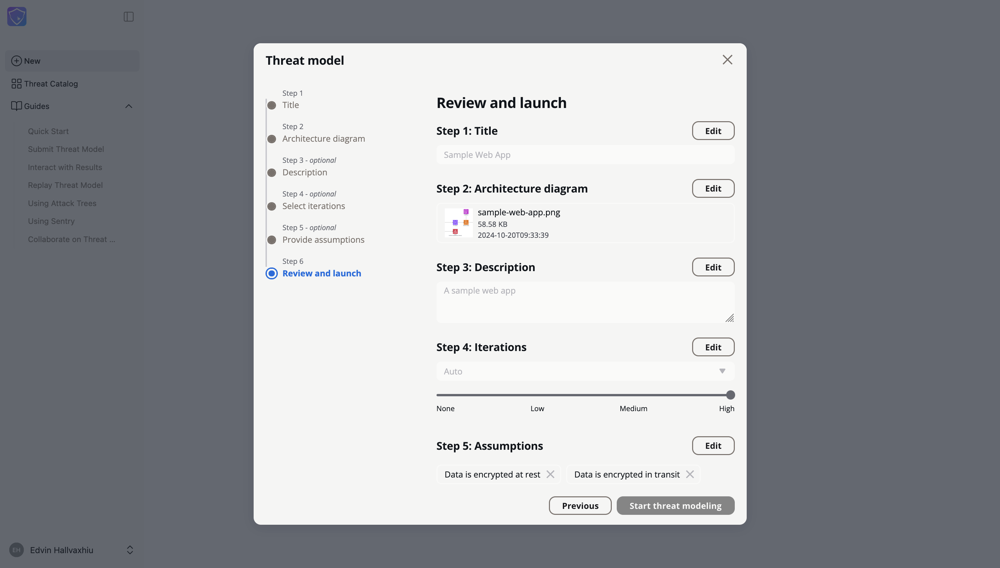
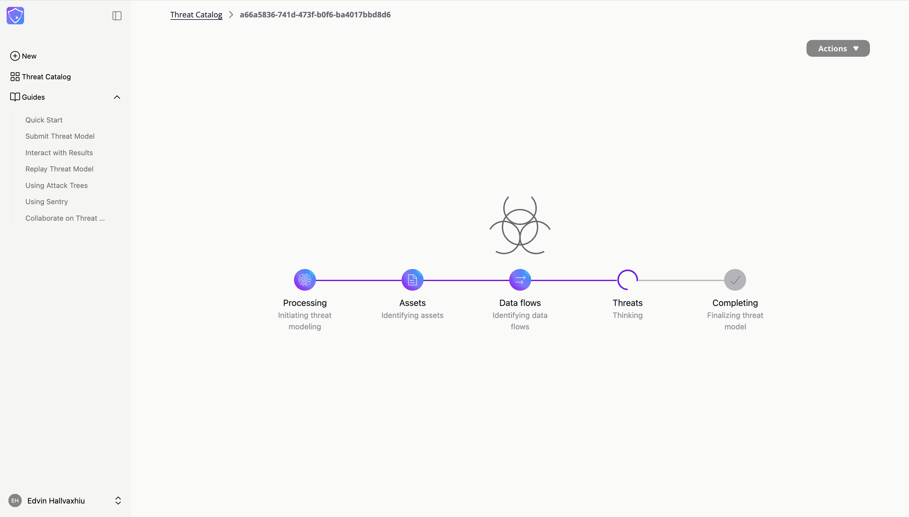
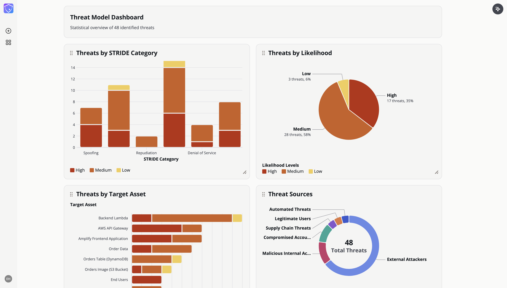
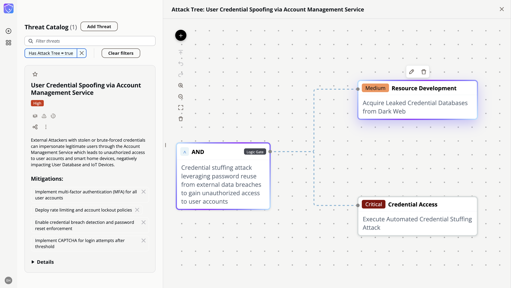
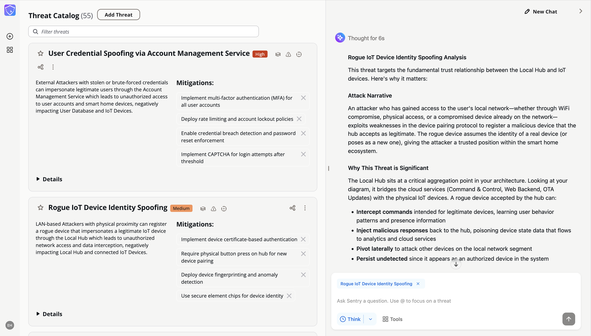
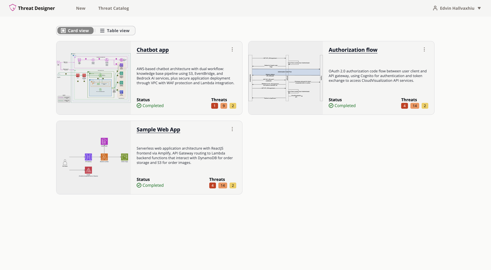
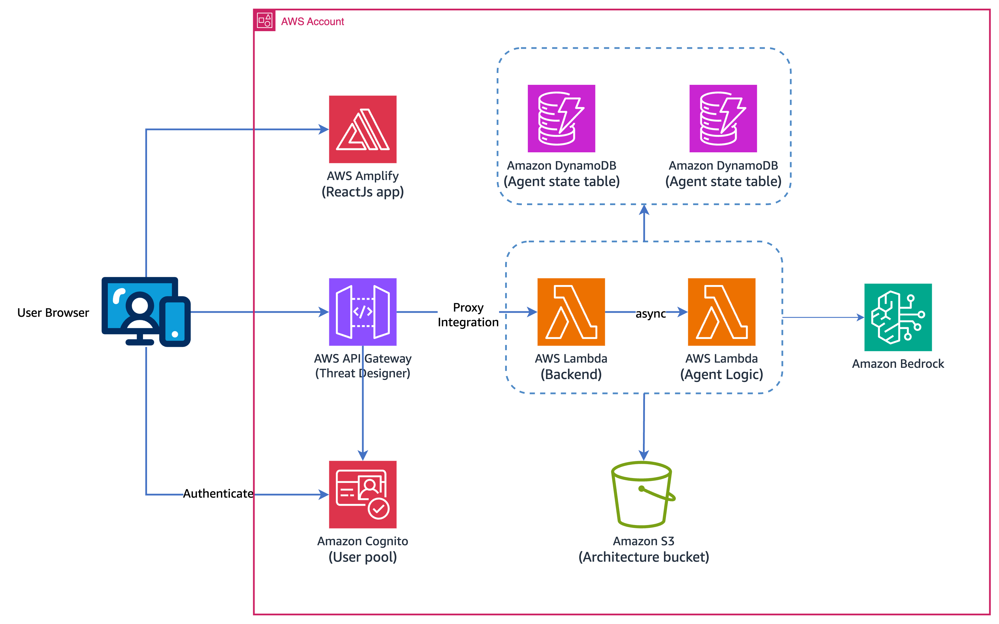

<p align="center">
  
</p>

# Threat Designer: AI-powered threat modeling for secure system design

**Threat Designer** is an AI-driven agent that automates and streamlines the threat modeling process for secure system design. Harnessing the power of large language models (LLMs), it analyzes system architectures, identifies potential security threats, and generates detailed threat models—empowering developers and security professionals to incorporate security from the earliest stages of development.

---

## 🚀 Try It Now - Lightning Mode

**Experience Threat Designer instantly in your browser - no deployment required!**

**[Launch Lightning Mode →](https://awslabs.github.io/threat-designer/)**

Lightning Mode provides:

- ✅ Core AI-powered threat modeling
- ✅ Instant access - runs entirely in your browser
- ✅ Perfect for evaluation and quick threat assessments
- ✅ No AWS account or infrastructure needed

📖 **[Lightning Mode Quick Start Guide](https://github.com/awslabs/threat-designer/blob/lightning/main/README.md)**

---

## Quick Links

- 📖 [Read the AWS Blog Post](https://aws.amazon.com/blogs/machine-learning/accelerate-threat-modeling-with-generative-ai/)
- ⭐ [Star this repo](https://github.com/awslabs/threat-designer) to support the project
- 📚 [Getting started Guide](./quick-start-guide/quick-start.md)

---

## Features

- **Architecture Analysis** - Submit architecture diagrams and analyze for threats
- **Interactive Editing** - Update threat modeling results via the user interface
- **Iterative Refinement** - Replay threat modeling based on your edits and additional input
- **Multiple Export Formats** - Export results in PDF, DOCX, or JSON format
- **AI Assistant (Sentry)** - Interact with a built-in assistant to dive deep into threat models
- **Threat Catalog** - Explore and manage past threat models

<picture>
  <source media="(prefers-color-scheme: dark)" srcset="./assets/sign_in_dark.png">
  
</picture>

<picture>
  <source media="(prefers-color-scheme: dark)" srcset="./assets/wizard_dark.png">
  
</picture>

<picture>
  <source media="(prefers-color-scheme: dark)" srcset="./assets/processing_dark.png">
  
</picture>

<picture>
  <source media="(prefers-color-scheme: dark)" srcset="./assets/insights_dark.png">
  
</picture>

<picture>
  <source media="(prefers-color-scheme: dark)" srcset="./assets/attack_tree_dark.png">
  
</picture>

<picture>
  <source media="(prefers-color-scheme: dark)" srcset="./assets/sentry_dark.png">
  
</picture>

<picture>
  <source media="(prefers-color-scheme: dark)" srcset="./assets/threat_catalog_dark.png">
  
</picture>

---

## Architecture

### Solution Architecture

<picture>
  <source media="(prefers-color-scheme: dark)" srcset="./assets/threat_designer_arch_dark.png">
  
</picture>

**AWS Services Used:**

- AWS Amplify
- Amazon API Gateway
- Amazon Cognito
- AWS Lambda
- Amazon Bedrock AgentCore Runtime
- Amazon DynamoDB
- Amazon S3

### Agent Logic Flow

<p align="center">
  
</p>

---

## Getting Started

### Prerequisites

**Required Tools:**

The following tools must be installed on your local machine:

- [Node.js](https://nodejs.org/en/download) (v18 or later) and npm
- [curl](https://curl.se/)
- [jq](https://jqlang.org/download/)
- [Python](https://www.python.org/downloads/) (v3.12 or later) and pip
- [Terraform CLI](https://developer.hashicorp.com/terraform/install)
- [Docker](https://docs.docker.com/engine/install/) running
- [AWS CLI](https://docs.aws.amazon.com/cli/v1/userguide/cli-chap-install.html) configured with [appropriate credentials](https://docs.aws.amazon.com/cli/v1/userguide/cli-chap-configure.html)

**AI Model Provider:**

Threat Designer supports two AI providers. Choose one based on your preference:

#### Option 1: Amazon Bedrock (Default)

You must enable access to the following models in your AWS region:

- **Claude 4.5 Opus**
- **Claude 4.5 Sonnet**
- **Claude 4.5 Haiku**

To enable Claude models, follow the instructions [here](https://docs.aws.amazon.com/bedrock/latest/userguide/model-access-modify.html).

> **Note:** If deploying in a non-US region, verify the inference profile ID for your region. See [Supported Regions and models for inference profiles](https://docs.aws.amazon.com/bedrock/latest/userguide/inference-profiles-support.html).

#### Option 2: OpenAI

You'll need:

- A valid OpenAI API key
- Access to GPT-5.1 or GPT-5 Mini models

You'll be prompted to enter your API key during deployment.

### Installation and Deployment

1. **Clone the Repository**

```bash
git clone https://github.com/awslabs/threat-designer.git
cd threat-designer
```

2. **Make the deployment script executable:**

```bash
chmod +x deployment.sh
```

3. **Export AWS credentials**

```bash
# Option I: Export AWS temporary credentials
export AWS_ACCESS_KEY_ID="your_temp_access_key"
export AWS_SECRET_ACCESS_KEY="your_temp_secret_key"
export AWS_SESSION_TOKEN="your_temp_session_token"
export AWS_DEFAULT_REGION="your_region"

# Option II: Export AWS Profile
export AWS_PROFILE="your_profile_name"
```

4. **Run the deployment:**

```bash
./deployment.sh
```

During deployment, you'll be prompted to:

- Select your AI model provider (Amazon Bedrock or OpenAI)
- Enter your OpenAI API key (if using OpenAI)
- Provide a valid email address for user credentials
- Choose whether to enable Sentry AI Assistant

> **Note:** A user will be created in Amazon Cognito User Pool and temporary credentials will be sent to the configured email address.

### Accessing the Application

After successful deployment, you can find the Login URL in the output:

```sh
Application Login page: https://dev.xxxxxxxxxxxxxxxx.amplifyapp.com
```

---

## Configuration Options

### AI Model Provider Selection

Threat Designer supports two AI providers that can be selected during deployment:

```
Select AI model provider:
1) Amazon Bedrock (Claude) (default)
2) OpenAI (GPT-5.1)
```

#### Amazon Bedrock Configuration (default model)

**Used Models:**

- **Claude 4.5 family models**

**Key Characteristics:**

- **Reasoning**: Hybrid model
- **Reasoning Levels**: None, Low, Medium, High (maps to different reasoning token budget)

#### OpenAI Configuration

**Used Models:**

- **GPT-5 Mini** (default) - Faster and more cost-effective
- **GPT-5.1** - Maximum reasoning capability

**Key Characteristics:**

- **Reasoning**: Always enabled (built-in capability that cannot be disabled)
- **Reasoning Levels**: Low, Medium, High (maps to OpenAI's reasoning effort)

**To use OpenAI:**

1. Select option `2` when prompted for model provider during deployment
2. Enter your OpenAI API key when prompted
3. The system will configure both Threat Designer and Sentry to use OpenAI

#### Switching Between Providers

To switch between Amazon Bedrock and OpenAI:

1. Redeploy the solution using `./deployment.sh`
2. Select a different provider when prompted

> **Important:** Existing conversation sessions from one provider cannot be continued with a different provider. You'll need to start new threat modeling sessions after switching.

### Sentry AI Assistant (Optional Feature)

Sentry is an AI-powered assistant that helps you analyze and explore threat models through conversational interaction. This feature is **optional** and can be enabled or disabled during deployment.

#### Enabling/Disabling Sentry During Deployment

When you run `./deployment.sh`, you will be prompted:

```
Enable Sentry AI Assistant? (y/n, default: y)
```

- **Enable (y)**: Deploys the full Sentry infrastructure including Amazon Bedrock AgentCore Runtime, DynamoDB session table, and ECR repository. The Assistant drawer will be available in the UI.
- **Disable (n)**: Skips Sentry infrastructure deployment. The Assistant drawer will be hidden from the UI, and core threat modeling features will continue to work normally.

#### Toggling Sentry in Existing Deployments

**To disable Sentry:**

1. Update the `.deployment.config` file in the project root:

```bash
ENABLE_SENTRY=false
```

2. Redeploy the solution

**To enable Sentry:**

1. Update the `.deployment.config` file in the project root:

```bash
ENABLE_SENTRY=true
```

2. Redeploy the solution

---

## Clean Up

1. **Empty the Architecture Bucket**, following instructions [here](https://docs.aws.amazon.com/AmazonS3/latest/userguide/empty-bucket.html)

2. **Make the destroy script executable:**

```bash
chmod +x destroy.sh
```

3. **Export AWS credentials**

```bash
# Option I: Export AWS temporary credentials
export AWS_ACCESS_KEY_ID="your_temp_access_key"
export AWS_SECRET_ACCESS_KEY="your_temp_secret_key"
export AWS_SESSION_TOKEN="your_temp_session_token"
export AWS_DEFAULT_REGION="your_region"

# Option II: Export AWS Profile
export AWS_PROFILE="your_profile_name"
```

4. **Execute the script:**

```bash
./destroy.sh
```

---

## Contributing

See [CONTRIBUTING](CONTRIBUTING.md#security-issue-notifications) for more information.

## License

This library is licensed under the Apache License. See the [LICENSE](LICENSE) file.
