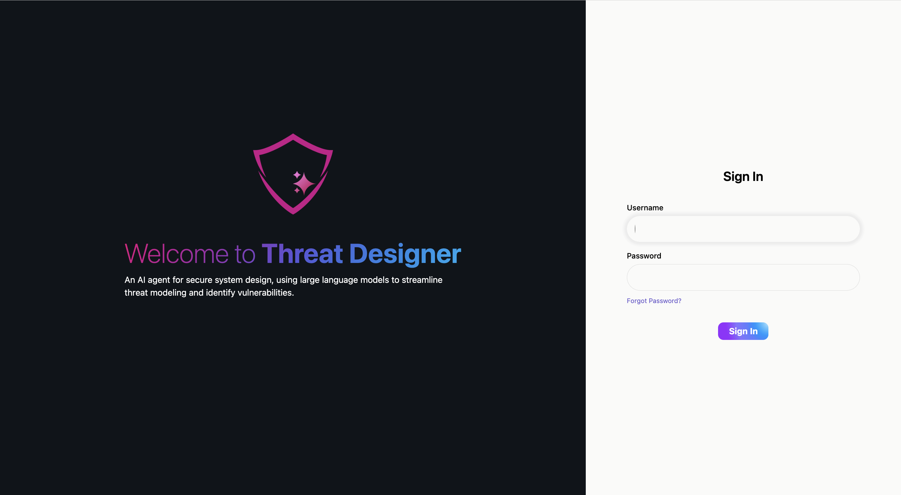
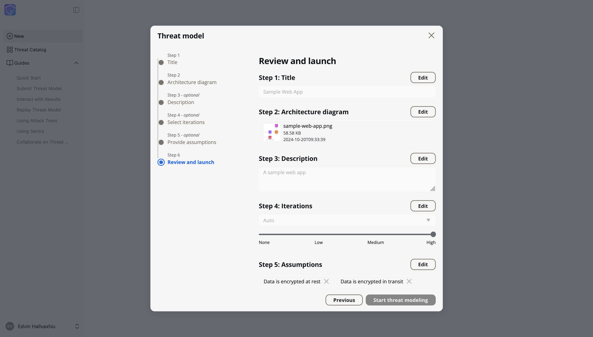
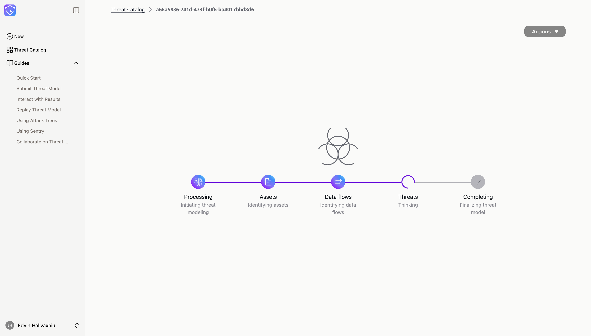
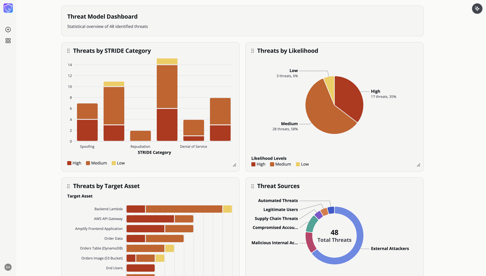
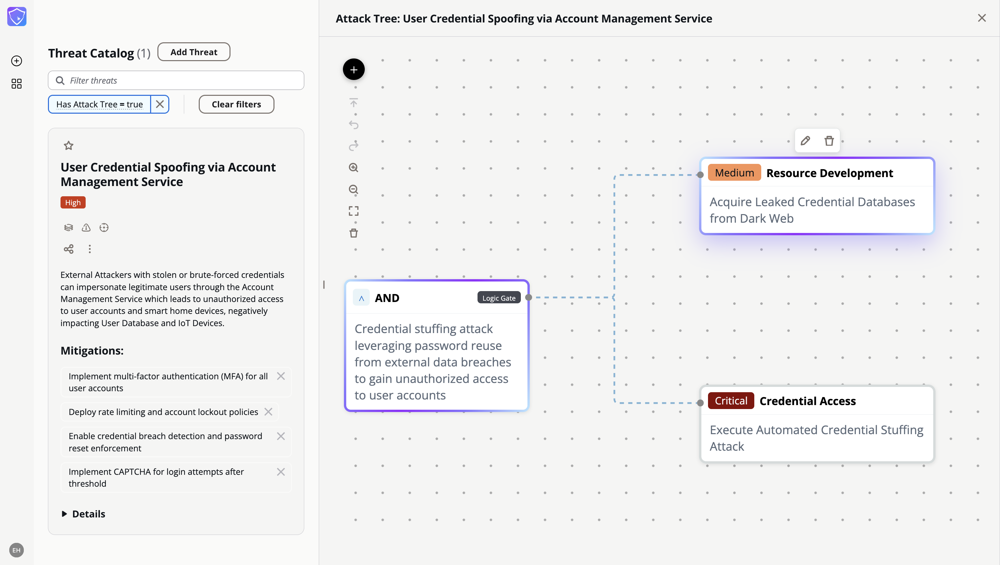
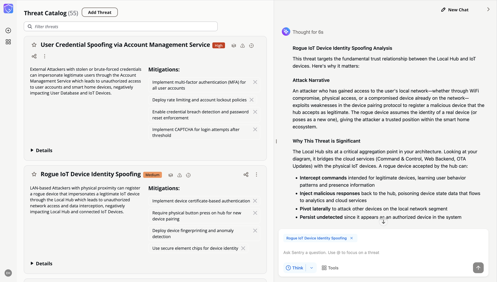
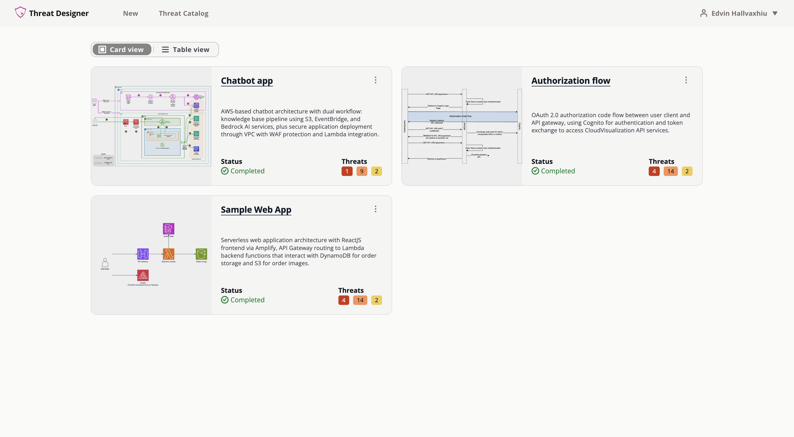
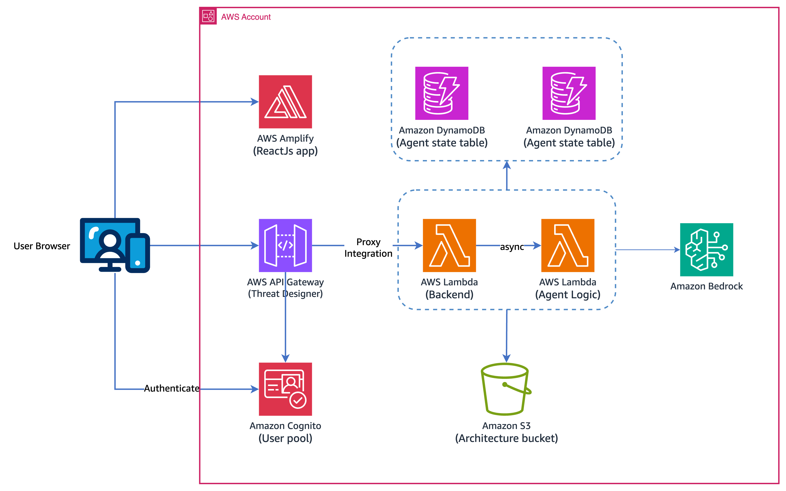
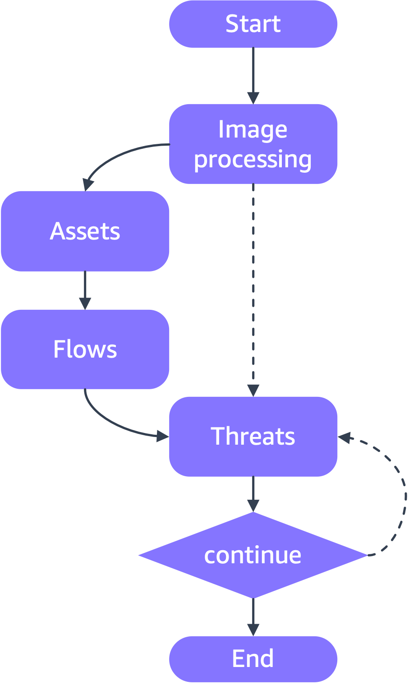

<p align="center">
  
</p>

# Threat Designer: AI-powered threat modeling for secure system design

**Threat Designer** is an AI-driven agent that automates and streamlines the threat modeling process for secure system design. Harnessing the power of large language models (LLMs), it analyzes system architectures, identifies potential security threats, and generates detailed threat models—empowering developers and security professionals to incorporate security from the earliest stages of development.

---

## Quick Links

- 📖 [Read the AWS Blog Post](https://aws.amazon.com/blogs/machine-learning/accelerate-threat-modeling-with-generative-ai/)
- ⭐ [Star this repo](https://github.com/awslabs/threat-designer) to support the project
- 📚 [Getting started Guide](./quick-start-guide/quick-start.md)
- 💻 [CLI Quick Start](./cli/README.md) — no deployment needed, runs fully local
- 📘 [Code Wiki](https://codewiki.google/github.com/awslabs/threat-designer)

---

## CLI — No Deployment Required

Want to run threat modeling without deploying any AWS infrastructure? The **Threat Designer CLI** lets you generate STRIDE-based threat models entirely on your local machine, using only your existing Amazon Bedrock or OpenAI credentials.

```bash
pip install ./cli
threat-designer
```

See the [CLI Quick Start guide](./cli/README.md) to get up and running in minutes.

---

## Features

- **Architecture Analysis** - Submit up to 3 architecture diagrams per submission and analyze for threats
- **Interactive Editing** - Update threat modeling results via the user interface
- **Iterative Refinement** - Replay threat modeling based on your edits and additional input
- **Multiple Export Formats** - Export results in PDF, DOCX, or JSON format
- **AI Assistant (Sentry)** - Interact with a built-in assistant to dive deep into threat models
- **Spaces** - Attach a knowledge base of your own documents (runbooks, policies, diagrams) to enrich threat modeling with organization-specific context
- **Threat Catalog** - Explore and manage past threat models

<picture>
  <source media="(prefers-color-scheme: dark)" srcset="./assets/sign_in_dark.png">
  
</picture>

<picture>
  <source media="(prefers-color-scheme: dark)" srcset="./assets/wizard_dark.png">
  
</picture>

<picture>
  <source media="(prefers-color-scheme: dark)" srcset="./assets/processing_dark.png">
  
</picture>

<picture>
  <source media="(prefers-color-scheme: dark)" srcset="./assets/insights_dark.png">
  
</picture>

<picture>
  <source media="(prefers-color-scheme: dark)" srcset="./assets/attack_tree_dark.png">
  
</picture>

<picture>
  <source media="(prefers-color-scheme: dark)" srcset="./assets/sentry_dark.png">
  
</picture>

<picture>
  <source media="(prefers-color-scheme: dark)" srcset="./assets/threat_catalog_dark.png">
  
</picture>

---

## Architecture

### Solution Architecture

<picture>
  <source media="(prefers-color-scheme: dark)" srcset="./assets/threat_designer_arch_dark.png">
  
</picture>

**AWS Services Used:**

- AWS Amplify
- Amazon API Gateway
- Amazon Cognito
- AWS Lambda
- Amazon Bedrock AgentCore Runtime
- Amazon Bedrock Knowledge Bases
- Amazon OpenSearch Serverless
- Amazon DynamoDB
- Amazon S3

### Agent Logic Flow

<p align="center">
  
</p>

---

## Getting Started

### Prerequisites

**Required Tools:**

The following tools must be installed on your local machine:

- [Node.js](https://nodejs.org/en/download) (v18 or later) and npm
- [curl](https://curl.se/)
- [jq](https://jqlang.org/download/)
- [Python](https://www.python.org/downloads/) (v3.12 or later) and pip
- [Terraform CLI](https://developer.hashicorp.com/terraform/install)
- [Docker](https://docs.docker.com/engine/install/) running
- [AWS CLI](https://docs.aws.amazon.com/cli/v1/userguide/cli-chap-install.html) configured with [appropriate credentials](https://docs.aws.amazon.com/cli/v1/userguide/cli-chap-configure.html)

**AI Model Provider:**

Threat Designer supports two AI providers. Choose one based on your preference:

#### Option 1: Amazon Bedrock (Default)

You must enable access to the following models in your AWS region:

- **Claude Opus 5**
- **Claude Sonnet 5**
- **Claude Haiku 4.5**

To enable Claude models, follow the instructions [here](https://docs.aws.amazon.com/bedrock/latest/userguide/model-access.html). Make sure you are already subscribed to the models otherwise you will receive an `AccessDeniedException` exception whe using the application.

> **Note:** If deploying in a non-US region, verify the inference profile ID for your region. See [Supported Regions and models for inference profiles](https://docs.aws.amazon.com/bedrock/latest/userguide/inference-profiles-support.html).

#### Option 2: OpenAI

You'll need:

- A valid OpenAI API key
- Access to the GPT-5.6 family models (Sol, Terra, Luna)

You'll be prompted to enter your API key during deployment.

#### Option 3: Amazon Bedrock Mantle (GPT models on Bedrock)

The same GPT-5.6 family models served through the Bedrock Mantle OpenAI-compatible endpoint — no OpenAI API key required. Authentication uses SigV4-derived bearer tokens minted from the agent's IAM role.

> **Warning:** GPT-5.x on Bedrock Mantle is only served from US regions. Model inference is locked to `us-east-2` (configurable to `us-west-2` via the `mantle_region` Terraform variable), regardless of the region you deploy the application to.

### Installation and Deployment

1. **Clone the Repository**

```bash
git clone https://github.com/awslabs/threat-designer.git
cd threat-designer
```

2. **Make the deployment script executable:**

```bash
chmod +x deployment.sh
```

3. **Export AWS credentials**

```bash
# Option I: Export AWS temporary credentials
export AWS_ACCESS_KEY_ID="your_temp_access_key"
export AWS_SECRET_ACCESS_KEY="your_temp_secret_key"
export AWS_SESSION_TOKEN="your_temp_session_token"
export AWS_DEFAULT_REGION="your_region"

# Option II: Export AWS Profile
export AWS_PROFILE="your_profile_name"
```

4. **Run the deployment:**

```bash
./deployment.sh
```

During deployment, you'll be prompted to:

- Select your AI model provider (Amazon Bedrock, OpenAI, or Bedrock Mantle)
- Enter your OpenAI API key (if using OpenAI)
- Provide a valid email address for user credentials
- Choose whether to enable Sentry AI Assistant
- Select a web search provider for Sentry (none, Tavily, or Amazon Bedrock AgentCore)

> **Note:** A user will be created in Amazon Cognito User Pool and temporary credentials will be sent to the configured email address.

### Accessing the Application

After successful deployment, you can find the Login URL in the output:

```sh
Application Login page: https://dev.xxxxxxxxxxxxxxxx.amplifyapp.com
```

---

## Configuration Options

### AI Model Provider Selection

Threat Designer supports three AI provider options that can be selected during deployment:

```
Select AI model provider:
1) Amazon Bedrock (Claude) (default)
2) OpenAI (GPT-5.6)
3) Amazon Bedrock Mantle (GPT-5.6, no OpenAI API key needed)
```

#### Amazon Bedrock Configuration (default model)

**Used Models:**

- **Claude Opus 5** — main threat modeling workflow
- **Claude Sonnet 5** — Sentry assistant and structured output
- **Claude Haiku 4.5** — summaries

**Key Characteristics:**

- **Reasoning**: Adaptive thinking (Claude 5 family)
- **Reasoning Levels**: Low, Medium, High, Extra High (maps to adaptive effort levels; token budgets remain only for pre-4.6 models)

> **Note:** Models listed in the `adaptive_thinking_models` Terraform variable (e.g., Claude Opus 5, Claude Sonnet 5) use adaptive thinking with effort levels instead of token budgets. For these models, the `reasoning_budget` configuration is ignored — the reasoning level from the UI is mapped directly to an effort string. Pre-4.6 models continue to use token-budget-based reasoning as before.
>
> **Note:** The highest selectable level (Extra High) maps to `xhigh`, the recommended effort for demanding coding and agentic work. The models also support `max` above it, but it costs substantially more for marginal gains — opt in per stage by setting `"4" = "max"` in that stage's `effort_map` in `infra/variables.tf`.
>
> **Note:** There is no "off" reasoning level. Every current model is a reasoning model, and on Claude Opus 5 thinking is on by default and cannot be disabled above effort `high` — omitting the thinking config does not turn it off, it just runs adaptive thinking at the provider's default effort. An "off" level therefore billed for thinking while discarding the reasoning output, so the ladder starts at Low. Levels are `1`–`4`; a legacy `0` from an older client is accepted and normalized to `1`.
>
> **Note:** Claude 5 family models support a maximum output of 128K tokens, while older Claude 4.x models may support less. If switching between models, make sure to update the `max_tokens` configuration accordingly to avoid API errors.

#### OpenAI Configuration

**Used Models:**

- **GPT-5.6 Sol** — main threat modeling workflow (flagship capability; the `gpt-5.6` alias routes to it)
- **GPT-5.6 Terra** — Sentry assistant and structured output (strong performance at lower price)
- **GPT-5.6 Luna** — summaries (efficient, high-volume workloads)

**Key Characteristics:**

- **Reasoning**: Reasoning models on the Responses API
- **Reasoning Levels**: Low, Medium, High, Extra High (maps to OpenAI's `reasoning_effort`: `low`, `medium`, `high`, `xhigh`). GPT-5.6 also supports `max` above `xhigh` — opt in via `reasoning_effort` in `infra/variables.tf` — and no longer accepts `minimal`.

**To use OpenAI:**

1. Select option `2` when prompted for model provider during deployment
2. Enter your OpenAI API key when prompted
3. The system will configure both Threat Designer and Sentry to use OpenAI

#### Amazon Bedrock Mantle Configuration

Runs the same GPT-5.6 models (and prompts) as the OpenAI option, but served by the Bedrock Mantle OpenAI-compatible endpoint:

- **No OpenAI API key** — auth is a SigV4-derived bearer token minted from the agent's IAM role (`bedrock-mantle:*` permissions are granted automatically at deploy time)
- **US-locked inference** — Mantle serves GPT-5.x only from `us-east-2` / `us-west-2`; the deployment shows a warning and defaults to `us-east-2` (override with the `mantle_region` Terraform variable)
- Model IDs are automatically prefixed with `openai.` (e.g., `openai.gpt-5.6-sol`) as Mantle requires

**To use Bedrock Mantle:**

1. Select option `3` when prompted for model provider during deployment
2. The system will configure both Threat Designer and Sentry to use GPT-5.6 via Mantle

#### Switching Between Providers

To switch between Amazon Bedrock and OpenAI:

1. Redeploy the solution using `./deployment.sh`
2. Select a different provider when prompted

> **Important:** Existing conversation sessions from one provider cannot be continued with a different provider. You'll need to start new threat modeling sessions after switching.

### Web Search Integration (Optional Feature)

Sentry can perform real-time web searches to research CVEs, vulnerabilities, and security topics. This feature is **optional**, and you choose the provider at deployment time.

#### Enabling Web Search

During deployment, you will be prompted:

```
Select web search provider for Sentry:
1) None (default)
2) Tavily (search + page extraction, requires an API key)
3) Amazon Bedrock AgentCore (search only, no API key needed)
```

| Provider          | Tools Sentry gains                 | Credentials                                 |
| ----------------- | ---------------------------------- | ------------------------------------------- |
| None              | —                                  | —                                           |
| Tavily            | `tavily_search` + `tavily_extract` | Tavily API key                              |
| Bedrock AgentCore | `web_search` only                  | None — SigV4 from the Sentry execution role |

> **Note:** The AgentCore connector offers **search only** — there is no page-extraction counterpart. When it is selected the extract tool is simply absent, and Sentry's prompt is adjusted so it works from result snippets and does not offer to read a page in depth. Choose Tavily if you need full page content.

#### Amazon Bedrock AgentCore

AgentCore's web search is reachable only as a built-in connector target on an AgentCore **Gateway** (there is no direct search API), so selecting it provisions a gateway with `AWS_IAM` inbound auth plus its service role, and Sentry calls it over MCP signed with SigV4 from its own execution role. No API key is stored anywhere.

> **Warning:** The connector is only offered in `us-east-1`, `eu-west-1`, and `ap-northeast-1`. The gateway is created in `web_search_region` (default `us-east-1`), which may differ from your deployment region — queries are served inside AWS but can leave the deployment's region. Tune result volume with the `web_search_max_results` Terraform variable (1–25, default 5).

#### Getting a Tavily API Key

1. Sign up at [tavily.com](https://tavily.com/)
2. Navigate to your dashboard to get your API key
3. Keys start with `tvly-` prefix

#### Web Search Capabilities

When enabled, Sentry can:

- Search for CVEs and vulnerability information
- Research threat intelligence and attack techniques
- Look up technical security documentation
- Extract content from security advisories and research papers

Web search is focused on security-related topics and will not search for general information, people, or organizations.

---

### Sentry AI Assistant (Optional Feature)

Sentry is an AI-powered assistant that helps you analyze and explore threat models through conversational interaction. This feature is **optional** and can be enabled or disabled during deployment.

#### Enabling/Disabling Sentry During Deployment

When you run `./deployment.sh`, you will be prompted:

```
Enable Sentry AI Assistant? (y/n, default: y)
```

- **Enable (y)**: Deploys the full Sentry infrastructure including Amazon Bedrock AgentCore Runtime, DynamoDB session table, and ECR repository. The Assistant drawer will be available in the UI.
- **Disable (n)**: Skips Sentry infrastructure deployment. The Assistant drawer will be hidden from the UI, and core threat modeling features will continue to work normally.

#### Toggling Sentry in Existing Deployments

**To disable Sentry:**

1. Update the `.deployment.config` file in the project root:

```bash
ENABLE_SENTRY=false
```

2. Redeploy the solution

**To enable Sentry:**

1. Update the `.deployment.config` file in the project root:

```bash
ENABLE_SENTRY=true
```

2. Redeploy the solution

---

## Threat Modeling Methodology

Threat Designer supports two methodologies, selectable per threat model:

- **STRIDE** (default) — classifies threats by kind: Spoofing, Tampering, Repudiation, Information Disclosure, Denial of Service, Elevation of Privilege.
- **MAESTRO** — the Cloud Security Alliance's [agentic AI threat modeling framework](https://cloudsecurityalliance.org/blog/2025/02/06/agentic-ai-threat-modeling-framework-maestro). Classifies threats by where they sit in the agentic stack across seven layers, and is the better fit for systems built around agents, tools and multi-agent collaboration.

Existing threat models are unaffected — they remain STRIDE, and a model's methodology is fixed once created so a catalog is never classified along two axes at once.

### Toggling MAESTRO

MAESTRO is enabled by default. To disable it, update the `.deployment.config` file in the project root and redeploy:

```bash
ENABLE_MAESTRO=false
```

When disabled, the API rejects _new_ requests that ask for MAESTRO rather than silently falling back to STRIDE. Replaying or versioning an existing MAESTRO model is unaffected by the flag — its methodology is fixed at creation and is loaded from the stored record either way, so disabling MAESTRO doesn't strand catalogs created while it was on. STRIDE threat modeling is unaffected either way.

---

## Clean Up

1. **Empty the Architecture Bucket**, following instructions [here](https://docs.aws.amazon.com/AmazonS3/latest/userguide/empty-bucket.html)

2. **Make the destroy script executable:**

```bash
chmod +x destroy.sh
```

3. **Export AWS credentials**

```bash
# Option I: Export AWS temporary credentials
export AWS_ACCESS_KEY_ID="your_temp_access_key"
export AWS_SECRET_ACCESS_KEY="your_temp_secret_key"
export AWS_SESSION_TOKEN="your_temp_session_token"
export AWS_DEFAULT_REGION="your_region"

# Option II: Export AWS Profile
export AWS_PROFILE="your_profile_name"
```

4. **Execute the script:**

```bash
./destroy.sh
```

---

## End-to-end tests

The frontend has a Playwright suite that runs the app against a fully mocked
backend — no AWS, Cognito, or Bedrock required. `VITE_E2E_MOCK=true` swaps
Amplify auth for a mock module (`src/e2e/amplifyAuthMock.js`) and Playwright
intercepts every business API call.

```bash
bun install
bunx playwright install chromium         # one-time browser download

bun run test:e2e                         # full suite, headless (~24s)
bun run test:e2e:headed                  # visible browsers
bun run test:e2e:ui                      # interactive runner
bun run test:e2e -- e2e/tests/wizard     # scope to one suite
```

Playwright auto-boots `bun run dev:e2e` on port 5173 — no need to start the
dev server separately. The HTML report opens with
`open playwright-report/index.html` after a run. See
[`e2e/README.md`](./e2e/README.md) for the harness details and how to add
suites.

---

## Contributing

See [CONTRIBUTING](CONTRIBUTING.md#security-issue-notifications) for more information.

## License

This library is licensed under the Apache License. See the [LICENSE](LICENSE) file.
