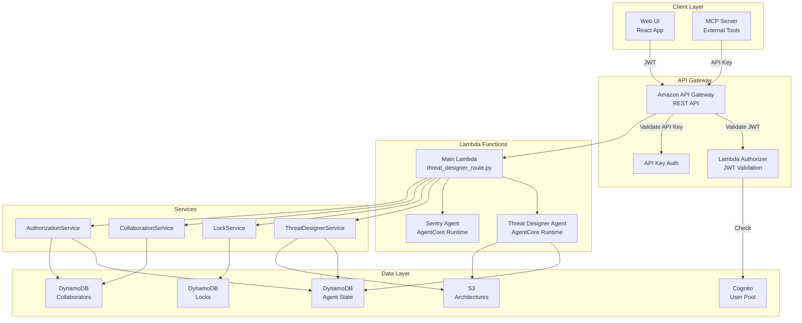
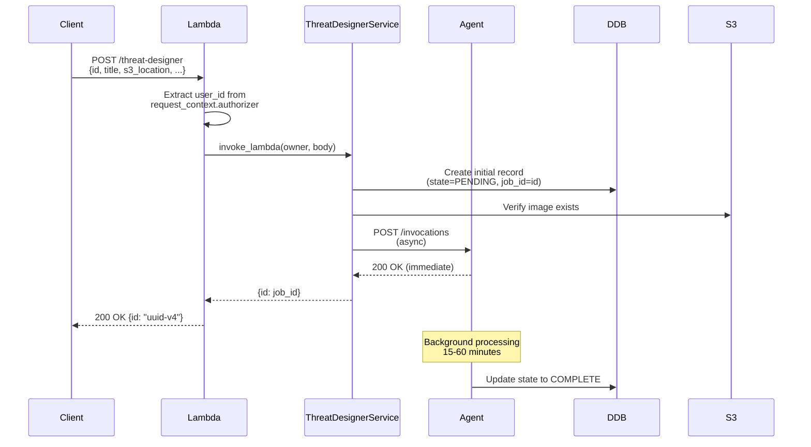
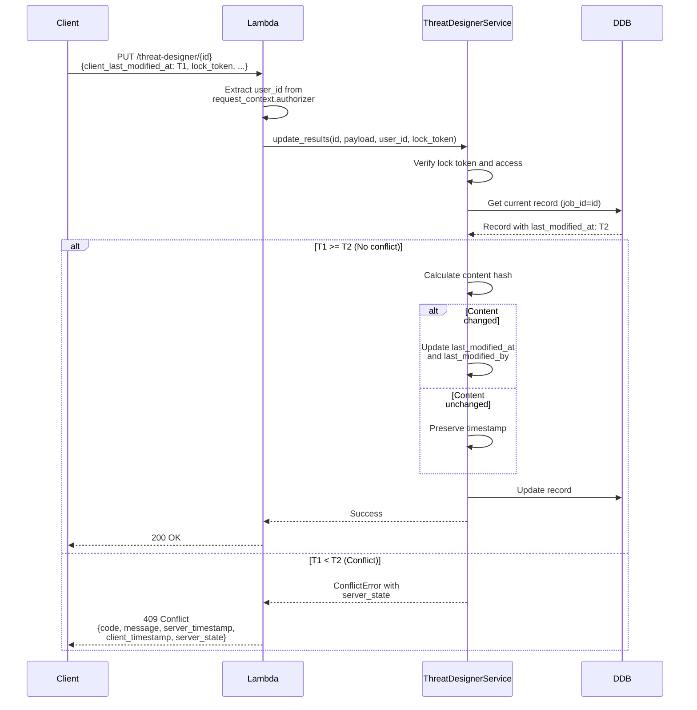
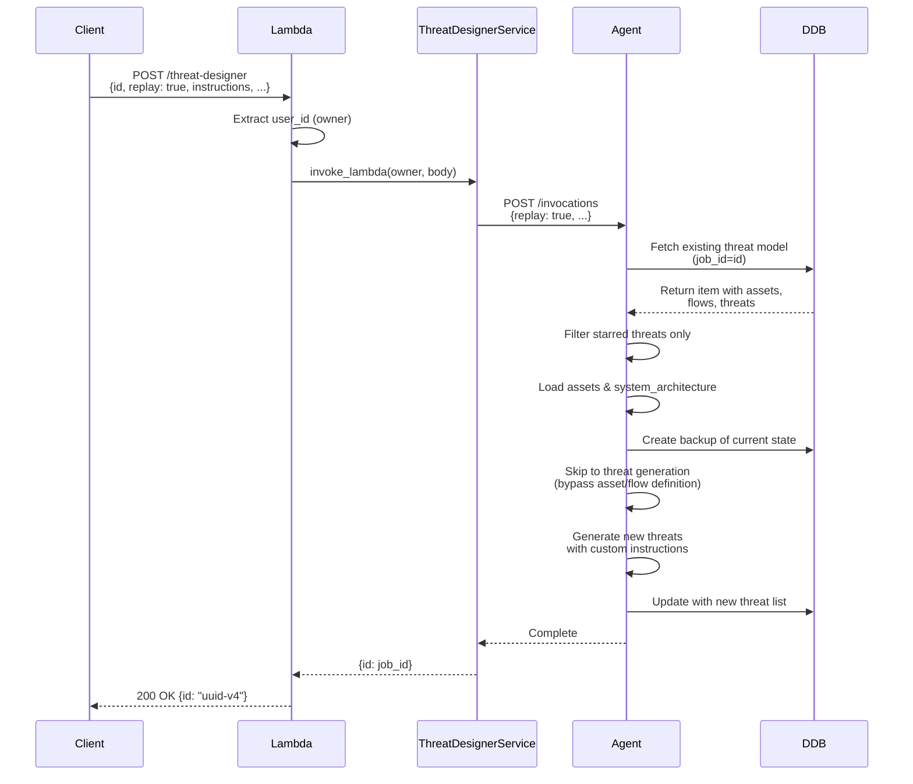
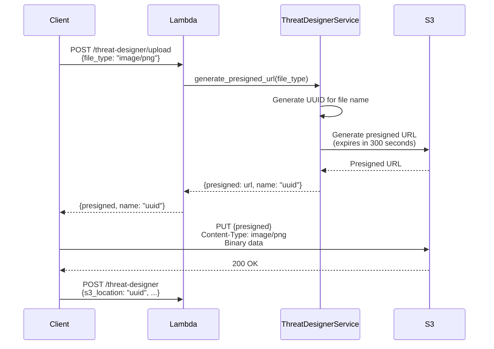
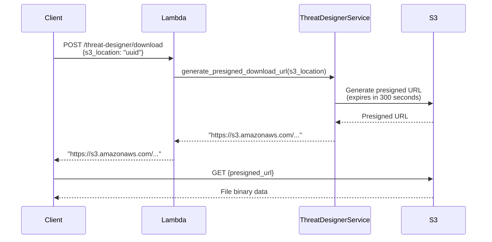
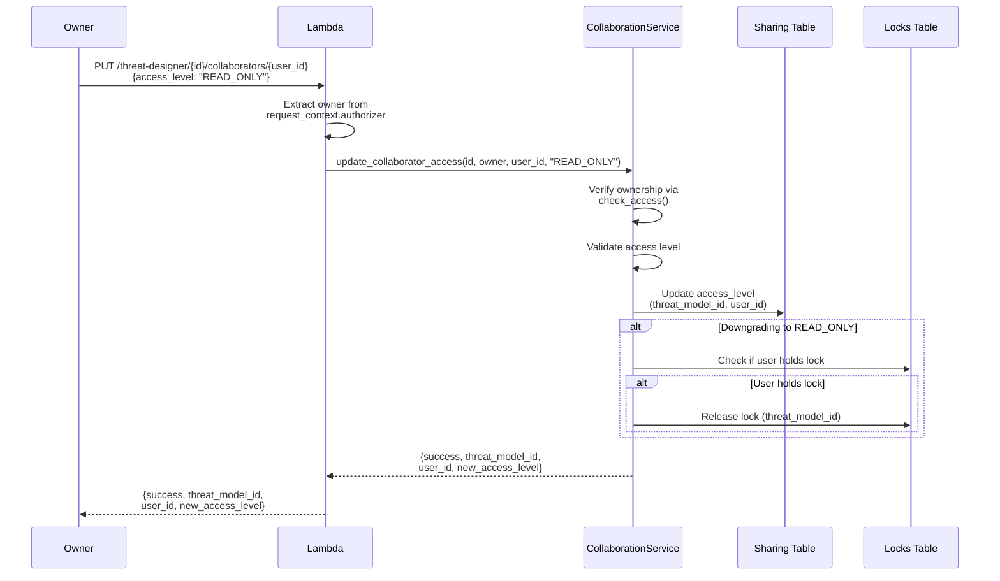
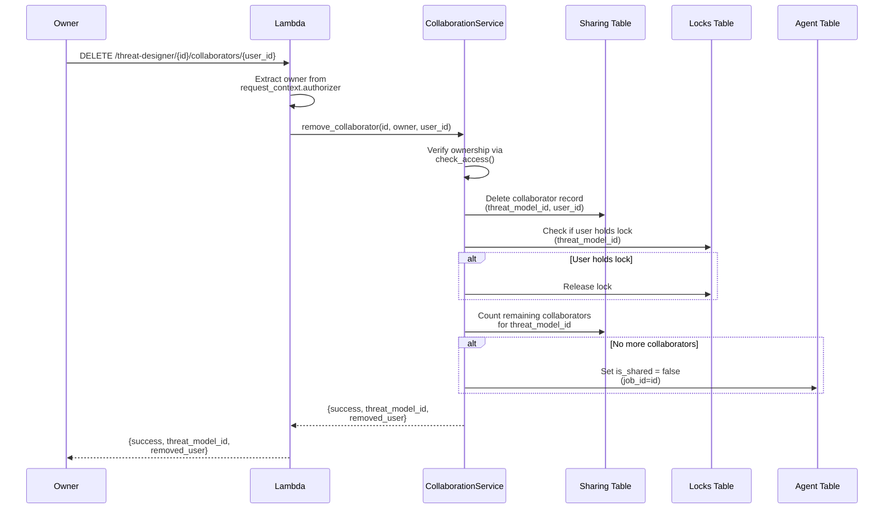

# API Architecture

## Overview

Threat Designer exposes a comprehensive REST API through Amazon API Gateway, providing endpoints for threat model management, collaboration, locking, and administrative operations. The API supports both JWT-based authentication (for web UI) and API key authentication (for MCP server integration).

## Architecture Diagram



## Core Concepts

This section covers foundational concepts that apply across all API endpoints. Understanding these concepts is essential before working with specific endpoints.

### Authentication & Authorization

The API supports two authentication methods: JWT tokens for web UI users and API keys for MCP server integration.

**JWT Authentication (Web UI)**:

- Users authenticate via Amazon Cognito User Pool
- JWT tokens are included in the `Authorization: Bearer {token}` header
- Lambda Authorizer validates tokens and extracts user identity
- User identity is passed to route handlers via `request_context.authorizer`

**API Key Authentication (MCP Server)**:

- MCP endpoints use API key authentication via the `x-api-key` header
- All MCP requests are assigned the special user identifier `"MCP"`
- MCP users bypass certain access control checks (locks, ownership validation)
- MCP endpoints are available under `/threat-designer/mcp/*`

**Authorization Context Structure**:

Route handlers access user identity from the authorization context:

```python
# Authorization context passed from Lambda Authorizer
{
    "principalId": "user-sub-uuid",
    "user_id": "user-sub-uuid",  # Primary identifier used by route handlers
    "email": "user@example.com"
}

# Route handler extracts user_id
user_id = router.current_event.request_context.authorizer.get("user_id")
```

**Important**: The authorization context uses `user_id` (not `user_sub`) as the field name.

For detailed authentication flows and token management, see [Authentication Architecture](./authentication.md).

### Field Naming Conventions

**Threat Model Identifier**: The system uses two field names for the threat model identifier depending on context:

- **`id`**: Used in:
  - Create endpoint request body (optional, generated if not provided)
  - Create endpoint response
  - Replay endpoint request body (required, must be existing ID)
  - Status endpoint response
  - Trail endpoint response
  - State table (DynamoDB primary key)
- **`job_id`**: Used in:
  - Get endpoint response (both root level and within item object)
  - List endpoint response (in catalog items)
  - Delete endpoint response
  - Update endpoint path parameter and internal operations
  - Agent table (DynamoDB primary key)
  - All service function parameters

**Important**: Both `id` and `job_id` refer to the same UUID value. The create endpoint returns `{"id": "uuid"}`, but when you fetch that same threat model, it returns `{"job_id": "uuid", ...}`. This inconsistency exists for historical reasons and backwards compatibility. When integrating with the API, treat these as equivalent identifiers.

**DynamoDB Tables**: The system uses multiple DynamoDB tables:

- **Agent Table**: Stores threat model data with `job_id` as the primary key
- **State Table**: Tracks agent execution state with `id` as the primary key (same value as `job_id`)
- **Locks Table**: Manages edit locks with `threat_model_id` as the primary key
- **Sharing Table**: Stores collaborator access with composite key (`threat_model_id`, `user_id`)
- **Trail Table**: Stores reasoning trail data with `id` as the primary key

### Access Control Model

The system implements a three-tier access control model for threat models:

**Access Levels**:

- **OWNER**: Full control - can view, edit, delete, share, and manage collaborators (user who created the threat model)
- **EDIT**: Can view and modify threat model content, acquire locks, but cannot delete or share
- **READ_ONLY**: View-only access, cannot modify, delete, or share

**Access Level Hierarchy**: OWNER > EDIT > READ_ONLY

**MCP User Bypass**: The special "MCP" user identifier (used for API key authentication) bypasses access control checks in most operations. This allows automation tools and external integrations to operate without ownership restrictions. MCP users only see threat models they own when listing catalogs.

**Operation-Level Access Requirements**:

| Operation            | Required Access Level | Notes                                                 |
| -------------------- | --------------------- | ----------------------------------------------------- |
| Create Threat Model  | N/A                   | Any authenticated user                                |
| Get Threat Model     | READ_ONLY             | Any access level                                      |
| Update Threat Model  | EDIT                  | Also requires valid lock token (JWT users only)       |
| Delete Threat Model  | OWNER                 | Only owner can delete                                 |
| Share Threat Model   | OWNER                 | Only owner can share                                  |
| Manage Collaborators | OWNER                 | Only owner can add/remove/update collaborators        |
| Restore Threat Model | EDIT                  | Any user with edit access                             |
| Acquire Lock         | EDIT                  | Any user with edit access (including owner)           |
| Stop Execution       | N/A                   | Only execution_owner (user who started the execution) |

For detailed information on sharing, collaboration workflows, and permission management, see [Collaboration System](./collaboration_system.md).

### Lock Mechanism Overview

The edit lock mechanism prevents concurrent modifications by ensuring only one user can edit a threat model at a time. All users, including owners, must acquire a lock before editing.

**Lock Behavior**:

- **Lock Expiration**: Locks automatically expire after **180 seconds (3 minutes)** if not refreshed
- **Lock Tokens**: UUIDs generated server-side, must be included in update and heartbeat requests
- **Stale Lock Detection**: Locks older than 180 seconds are automatically released
- **Heartbeat Interval**: Clients should send heartbeat requests every **30 seconds** to maintain locks
- **Access Requirement**: Users must have EDIT or OWNER access to acquire locks

**Lock Requirements by User Type**:

- **JWT Users**: Must acquire and maintain locks before updating threat models
- **MCP Users**: Bypass lock requirements entirely, allowing automated updates without lock management

**Lock Operations**:

- **Acquire Lock**: `POST /threat-designer/{id}/lock` - Attempt to acquire an edit lock
- **Refresh Lock**: `PUT /threat-designer/{id}/lock/heartbeat` - Extend lock expiration
- **Release Lock**: `DELETE /threat-designer/{id}/lock` - Explicitly release a lock
- **Force Release**: `DELETE /threat-designer/{id}/lock/force` - Owner-only operation to break any lock
- **Check Status**: `GET /threat-designer/{id}/lock/status` - View current lock status

**Lock Lost Scenarios**:
When a lock is lost (expired, stolen by another user, or invalid token), the API returns `410 Gone`. Clients should:

1. Stop any pending save operations
2. Notify the user that their lock was lost
3. Offer to reload the latest version from the server
4. Require re-acquisition of the lock to continue editing

For detailed lock flows, conflict resolution, and implementation details, see [Lock Mechanism](./lock_mechanism.md).

## API Endpoints

### Threat Model Management

#### Create Threat Model

**Endpoint**: `POST /threat-designer`

**MCP Endpoint**: `POST /threat-designer/mcp`

**Authentication**: JWT (Web UI) or API Key (MCP)

**Request Body**:

```json
{
  "id": "uuid-v4",
  "title": "My Application Threat Model",
  "description": "E-commerce platform with payment processing",
  "assumptions": ["AWS cloud deployment", "PCI-DSS compliance required", "Multi-region setup"],
  "s3_location": "architectures/my-app.png",
  "iteration": 0,
  "reasoning": 2,
  "instructions": "Focus on payment security and data privacy",
  "replay": false
}
```

**Request Fields**:

- `id` (string, optional): UUID for the threat model. If not provided or `replay` is false, a new UUID is generated
- `title` (string, optional): Title of the threat model. Defaults to " " if not provided
- `description` (string, optional): Description of the system being modeled. Defaults to " " if not provided
- `assumptions` (array, optional): List of assumptions about the system. Defaults to empty array
- `s3_location` (string, required): S3 path to the architecture diagram
- `iteration` (integer, required): Iteration number for the threat model generation
- `reasoning` (integer, optional): Reasoning boost level (0-3). Defaults to 0
- `instructions` (string, optional): Custom instructions for the agent
- `replay` (boolean, optional): If true, replays an existing threat model with the provided `id`. Defaults to false

**Response**:

```json
{
  "id": "uuid-v4"
}
```

**Response Fields**:

- `id` (string): The threat model identifier (see [Field Naming Conventions](#field-naming-conventions) for details on `id` vs `job_id`).

**Note**: The response returns only the `id` field. A unique `session_id` is generated server-side to track the agent execution and is stored in the state table. For details on the agent execution workflow and state management, see [Threat Designer Agent](./threat_designer_agent.md).

**Flow**:



#### Get Threat Model

**Endpoint**: `GET /threat-designer/{id}`

**MCP Endpoint**: `GET /threat-designer/mcp/{id}`

**Authentication**: JWT or API Key

**Authorization**: User must have any access level (OWNER, EDIT, or READ_ONLY)

**Response**:

```json
{
  "job_id": "uuid-v4",
  "state": "Found",
  "item": {
    "job_id": "uuid-v4",
    "title": "My Application Threat Model",
    "state": "COMPLETE",
    "summary": "E-commerce platform with payment gateway integration",
    "assets": {
      "assets": [
        {
          "type": "asset",
          "name": "Payment Database",
          "description": "PostgreSQL database storing payment transactions"
        }
      ]
    },
    "system_architecture": {
      "data_flows": [...],
      "trust_boundaries": [...],
      "threat_sources": [...]
    },
    "threat_list": {
      "threats": [
        {
          "name": "SQL Injection in Payment API",
          "stride_category": "Tampering",
          "description": "Attacker could inject malicious SQL...",
          "target": "Payment Database",
          "impact": "Unauthorized access to payment data",
          "likelihood": "High",
          "mitigations": ["Use parameterized queries", "Input validation"],
          "source": "External Attacker",
          "prerequisites": ["Public API access"],
          "vector": "HTTP POST request",
          "starred": false
        }
      ]
    },
    "owner": "user-sub-uuid",
    "created_at": "2025-01-01T00:00:00Z",
    "last_modified_at": "2025-01-01T00:30:00Z",
    "is_owner": true,
    "access_level": "OWNER"
  }
}
```

**Response Fields**:

- `job_id` (string): Primary key identifier for the threat model (used at both root and item level). See [Field Naming Conventions](#field-naming-conventions) for details on `id` vs `job_id`.
- `state` (string): "Found" if the threat model exists, "Not Found" otherwise
- `item` (object): The threat model data, or null if not found
  - `job_id` (string): The threat model identifier (same as root level)
  - All other threat model fields (title, state, assets, system_architecture, threat_list, etc.)
  - `is_owner` (boolean): True if the requesting user is the owner (only included for authenticated users, not MCP)
  - `access_level` (string): User's access level - "OWNER", "EDIT", or "READ_ONLY" (only included for authenticated users, not MCP)
  - `last_modified_at` (string): ISO 8601 timestamp of last modification, used for version tracking and conflict detection

**Note**: Access information (`is_owner` and `access_level`) is included in the item object for authenticated users to enable proper UI rendering and access control. MCP users do not receive these fields.

#### Update Threat Model

**Endpoint**: `PUT /threat-designer/{id}`

**MCP Endpoint**: `PUT /threat-designer/mcp/{id}`

**Authentication**: JWT or API Key

**Authorization**: User must have EDIT or OWNER access

**Request Body**:

```json
{
  "title": "Updated Title",
  "assets": {...},
  "system_architecture": {...},
  "threat_list": {...},
  "client_last_modified_at": "2025-01-01T00:30:00Z",
  "lock_token": "uuid-lock-token"
}
```

**Request Fields**:

- `client_last_modified_at` (string, optional): ISO 8601 timestamp of the client's last known modification time. Used for conflict detection. If the server's `last_modified_at` is newer, a 409 Conflict is returned
- `lock_token` (string, required for JWT users): Lock token obtained from acquiring a lock. MCP users bypass this requirement
- Other fields: Any threat model fields to update (title, assets, system_architecture, threat_list, etc.)

**Lock Requirements**:

- JWT users MUST acquire a lock before updating (including owners)
- Lock token must be valid and match the current lock holder
- MCP users bypass lock requirements entirely

**Content Hash Mechanism**:
The service calculates a content hash of the payload to detect actual changes. If the content hash matches the previous version:

- The `last_modified_at` timestamp is NOT updated
- The `last_modified_by` field is preserved
- This prevents unnecessary timestamp updates when no actual content changes occur (e.g., when only updating lock tokens or metadata)

If the content hash differs:

- The `last_modified_at` timestamp is updated to the current server time
- The `last_modified_by` field is set to the current user
- The new content hash is stored

**Conflict Detection**:



**Error Responses**: See [Error Responses](#error-responses) section for details on:

- 409 Conflict (version conflicts)
- 403 Unauthorized (lock or access issues)

**Note**: MCP users bypass both lock requirements and access control checks, allowing automated tools to update threat models without manual lock management.

#### Delete Threat Model

**Endpoint**: `DELETE /threat-designer/{id}?force_release=true`

**MCP Endpoint**: `DELETE /threat-designer/mcp/{id}`

**Authentication**: JWT or API Key

**Authorization**: User must be OWNER

**Query Parameters**:

- `force_release` (boolean, optional): If `true`, forcefully releases any active locks before deletion. Defaults to `false`. If a lock is held by another user and this is not set, the operation returns a 409 Conflict error.

**Cascade Behavior**:

When a threat model is deleted, the following operations occur automatically:

1. **Active Execution Stopping**: If there's an active threat modeling execution (state is not COMPLETE or FAILED), the system automatically stops it before deletion. The owner can stop executions started by other users during delete operations.

2. **Lock Release**: If the threat model is locked:
   - If locked by the owner, the lock is automatically released
   - If locked by another user and `force_release=true`, the lock is forcefully released
   - If locked by another user and `force_release=false`, the operation fails with 409 Conflict

3. **Sharing Records Removal**: All collaborator sharing records are deleted from the sharing table. This immediately revokes access for all collaborators.

4. **S3 Object Deletion**: The architecture diagram stored in S3 is permanently deleted.

5. **DynamoDB Record Deletion**: The threat model record is removed from the agent table.

**Response**:

```json
{
  "job_id": "uuid-v4",
  "state": "Deleted"
}
```

**Error Responses**: See [Error Responses](#error-responses) section for details on:

- 409 Conflict (locked by another user)
- 403 Unauthorized (not owner)

**Note**: Only the owner can delete a threat model. Collaborators with EDIT access cannot delete, even if they hold a lock. MCP users can delete any threat model they own without lock restrictions.

#### List All Threat Models

**Endpoint**: `GET /threat-designer/all`

**MCP Endpoint**: `GET /threat-designer/mcp/all`

**Authentication**: JWT or API Key

**Response**:

```json
{
  "catalogs": [
    {
      "job_id": "uuid-1",
      "title": "Application A",
      "state": "COMPLETE",
      "created_at": "2025-01-01T00:00:00Z",
      "owner": "user-sub-uuid",
      "is_owner": true,
      "access_level": "OWNER"
    },
    {
      "job_id": "uuid-2",
      "title": "Application B",
      "state": "PROCESSING",
      "created_at": "2025-01-02T00:00:00Z",
      "owner": "other-user-sub",
      "is_owner": false,
      "access_level": "EDIT",
      "shared_by": "other-user-sub"
    },
    {
      "job_id": "uuid-3",
      "title": "Application C",
      "state": "COMPLETE",
      "created_at": "2025-01-03T00:00:00Z",
      "owner": "another-user-sub",
      "is_owner": false,
      "access_level": "READ_ONLY",
      "shared_by": "another-user-sub"
    }
  ]
}
```

**Response Structure**:

The response includes both threat models owned by the user and threat models shared with the user:

1. **Owned Items**: Threat models where the user is the owner
   - `is_owner`: `true`
   - `access_level`: `"OWNER"`
   - `shared_by`: Not included

2. **Shared Items**: Threat models shared with the user by others
   - `is_owner`: `false`
   - `access_level`: `"EDIT"` or `"READ_ONLY"` (based on sharing permissions)
   - `shared_by`: User ID of the person who shared the threat model

**Access Levels**:

- `OWNER`: Full control (user created the threat model) - can view, edit, delete, share, and manage collaborators
- `EDIT`: Can view and modify but cannot delete or share
- `READ_ONLY`: View only, cannot modify, delete, or share

**MCP User Behavior**:

- MCP users only see threat models they own
- Sharing lookup is skipped for MCP users
- All returned items have `is_owner: true` and `access_level: "OWNER"`

**Note**: This endpoint does not implement pagination. All accessible threat models are returned in a single response.

#### Get Threat Model Status

**Endpoint**: `GET /threat-designer/status/{id}`

**MCP Endpoint**: `GET /threat-designer/mcp/status/{id}`

**Authentication**: JWT or API Key

**Response**:

```json
{
  "id": "uuid-v4",
  "state": "PROCESSING",
  "retry": 2,
  "session_id": "session-uuid-v4",
  "execution_owner": "user-sub-uuid",
  "detail": "Optional detail message about the current state"
}
```

**Response Fields**:

- `id` (string): The threat model identifier
- `state` (string): Current state of the threat model generation (see states below)
- `retry` (integer): Reasoning boost level used for this execution (0-3)
- `session_id` (string): Unique identifier for the agent execution session
- `execution_owner` (string, optional): User ID of the person who started this execution. Only included if set.
- `detail` (string, optional): Additional detail message about the state. Only included if available.

**States**:

- `START`: Execution has been initiated but agent hasn't begun processing
- `PENDING`: Job created, waiting to start (legacy state)
- `PROCESSING`: Agent actively working on threat model generation
- `COMPLETE`: Successfully finished
- `FAILED`: Error occurred during generation
- `Not Found`: Threat model ID does not exist in the state table

For detailed information on agent execution states and workflow, see [Threat Designer Agent](./threat_designer_agent.md).

**Note**: The `execution_owner` field tracks who initiated the current or most recent execution. This is used to control who can stop an active session - only the execution owner can stop their own session (unless overridden during delete operations).

#### Stop Threat Model Execution

**Endpoint**: `DELETE /threat-designer/{id}/session/{session_id}`

**MCP Endpoint**: `DELETE /threat-designer/mcp/{id}/session/{session_id}`

**Authentication**: JWT or API Key

**Authorization**: User must be the `execution_owner` (the user who started the execution)

**Response (Restored)**:

```json
{
  "job_id": "uuid-v4",
  "state": "Restored"
}
```

**Response (Deleted)**:

```json
{
  "job_id": "uuid-v4",
  "state": "Deleted"
}
```

**Authorization Rules**:

1. **Normal Operation**: Only the `execution_owner` (the user who started the current execution) can stop the session. This is true even if the requester is the threat model owner but didn't start this particular execution.

2. **Override During Delete**: When a threat model is being deleted (internal operation), the threat model owner can stop executions started by other users. This uses the `override_execution_owner=True` parameter internally.

**Restore Behavior**:

When a session is stopped:

- If a `backup` exists in the threat model item, the system restores the threat model to the backup state and returns `"state": "Restored"`
- If no `backup` exists, the system deletes the threat model and its S3 object, returning `"state": "Deleted"`

The backup mechanism ensures that stopping an in-progress execution doesn't lose the previous working state of the threat model.

**Error Responses**: See [Error Responses](#error-responses) section for details on:

- 403 Unauthorized (not execution owner)
- 404 Not Found (invalid session)

**Note**: The `session_id` must match the current session stored in the state table. If the agent runtime session is not found (already completed or expired), the cleanup proceeds normally.

### Replay Operations

#### Replay Threat Model

**Endpoint**: `POST /threat-designer` (same endpoint as Create)

**MCP Endpoint**: `POST /threat-designer/mcp` (same endpoint as Create)

**Authentication**: JWT or API Key

**Request Body**:

```json
{
  "id": "existing-uuid-v4",
  "replay": true,
  "s3_location": "architectures/existing-app.png",
  "iteration": 0,
  "reasoning": 3,
  "instructions": "Focus on insider threats and privilege escalation"
}
```

**Request Fields**:

- `id` (string, required): UUID of the existing threat model to replay
- `replay` (boolean, required): Must be set to `true` to trigger replay mode
- `s3_location` (string, required): S3 path to the architecture diagram (typically the same as the original)
- `iteration` (integer, required): Iteration number for the replay
- `reasoning` (integer, optional): Reasoning boost level (0-3). Defaults to 0
- `instructions` (string, optional): Custom instructions to guide the replay. These instructions are used to customize threat generation, gap analysis, and threat improvement during the replay

**Response**:

```json
{
  "id": "existing-uuid-v4"
}
```

**Response Fields**:

- `id` (string): The threat model identifier (same as the input `id`). See [Field Naming Conventions](#field-naming-conventions) for details on `id` vs `job_id`.

**Replay Behavior**:

Replay mode allows you to regenerate threats for an existing threat model while preserving key analysis components. When `replay: true` is set:

1. **Loads Existing State**: The system retrieves the existing threat model from DynamoDB using the provided `id`

2. **Preserves Starred Threats**: Only threats marked with `"starred": true` are loaded into the initial state. All non-starred threats are discarded and will be regenerated

3. **Reuses Assets and Flows**: The complete asset list and system architecture (data flows, trust boundaries, threat sources) from the original analysis are preserved and reused. The agent skips the asset and flow definition phases

4. **Custom Instructions**: If the `instructions` field is provided, these instructions are incorporated into the threat generation, gap analysis, and threat improvement prompts to guide the agent's focus (e.g., "Focus on insider threats", "Emphasize data privacy concerns")

5. **Generates New Threats**: The agent generates new threats based on the preserved assets, flows, and any custom instructions. Starred threats from the original analysis are included in the context to inform new threat generation

6. **Creates Backup**: The system creates a backup of the current threat model state before starting the replay. This backup can be used to restore the threat model if the replay is stopped or fails

**Workflow Routing**:



**Key Differences from New Threat Model**:

| Aspect              | New Threat Model        | Replay                                  |
| ------------------- | ----------------------- | --------------------------------------- |
| Endpoint            | `POST /threat-designer` | `POST /threat-designer` (same)          |
| ID                  | Generated or provided   | Must be existing ID                     |
| `replay` flag       | `false` or omitted      | `true` (required)                       |
| Asset Definition    | Analyzed from diagram   | Reused from original                    |
| Flow Definition     | Analyzed from diagram   | Reused from original                    |
| Trust Boundaries    | Analyzed from diagram   | Reused from original                    |
| Threat List         | Generated from scratch  | Starred threats preserved + new threats |
| Backup Created      | Yes (before completion) | Yes (before replay starts)              |
| Custom Instructions | Optional guidance       | Optional guidance for replay focus      |

**Use Cases**:

- **Iterative Refinement**: Keep starred threats that are accurate while regenerating others
- **Focus Shift**: Use `instructions` to redirect threat analysis (e.g., from external to insider threats)
- **Updated Parameters**: Regenerate with different reasoning levels or iteration counts
- **Preserve Good Analysis**: Keep the asset and flow analysis while refreshing threat identification

**Important Notes**:

- The `id` must reference an existing, completed threat model. If the ID doesn't exist, the operation will fail
- Replay does NOT create a new threat model record in DynamoDB; it updates the existing one
- The backup created during replay allows restoration if the replay is stopped or fails
- Starred threats are included in the context but are not automatically added to the final threat list - they inform the generation of new threats
- The agent workflow skips directly to threat generation, significantly reducing processing time compared to a full analysis. For details on the agent workflow and threat generation process, see [Threat Designer Agent](./threat_designer_agent.md).

#### Restore Previous Version

**Endpoint**: `PUT /threat-designer/restore/{id}`

**MCP Endpoint**: `PUT /threat-designer/mcp/restore/{id}`

**Authentication**: JWT or API Key

**Authorization**: User must have EDIT access (not just ownership)

**Description**:

Restores a threat model to its previous version using backup data. The backup is automatically created before certain operations (e.g., replay, execution start) to allow recovery if needed.

**Restore Behavior**:

1. **Backup Data Source**: The restore operation retrieves backup data from the `backup` field stored in the threat model item in DynamoDB. This backup contains the complete previous state of the threat model.

2. **Preserves Original Owner**: The restore operation preserves the original owner of the threat model. The requester (who must have EDIT access) can restore the threat model, but the ownership remains with the original creator.

3. **Updates State Table**: After restoring the threat model data, the system updates the state table to mark the threat model as `COMPLETE` with the current timestamp. The retry count is preserved from the existing state if available.

4. **Access Control**: Any user with EDIT or OWNER access can restore the threat model. MCP users bypass access control checks.

**Response (Success)**:

```json
{
  "message": "Threat model restored to previous version",
  "restored_at": "2025-01-01T00:15:00Z"
}
```

**Error Responses**: See [Error Responses](#error-responses) section for details on:

- 404 Not Found (no backup or threat model doesn't exist)
- 403 Unauthorized (insufficient access)

**Use Cases**:

- **Recover from Failed Replay**: If a replay operation produces unsatisfactory results, restore to the previous working version
- **Undo Unwanted Changes**: Revert to the last backup if recent modifications need to be discarded
- **Recover from Stopped Execution**: If an execution was stopped mid-process, restore to the last stable state

**Important Notes**:

- The backup is created automatically by the system during operations like replay and execution start
- Only the most recent backup is stored; there is no version history beyond the last backup
- Restoring does not create a new backup of the current state before overwriting
- The restore operation requires at least EDIT access, allowing collaborators to restore shared threat models

### File Operations

#### Generate Upload URL

**Endpoint**: `POST /threat-designer/upload`

**MCP Endpoint**: `POST /threat-designer/mcp/upload`

**Authentication**: JWT (Web UI) or API Key (MCP)

**Description**:

Generates a presigned S3 URL for uploading architecture diagrams. Both JWT-authenticated (web UI) and MCP-authenticated (API key) variants are available.

**Request Body**:

```json
{
  "file_type": "image/png"
}
```

**Request Fields**:

- `file_type` (string, optional): MIME type of the file to upload. Defaults to `"image/png"` if not provided

**Response**:

```json
{
  "presigned": "https://s3.amazonaws.com/bucket/architectures/a1b2c3d4-e5f6-7890-abcd-ef1234567890?X-Amz-Algorithm=...",
  "name": "a1b2c3d4-e5f6-7890-abcd-ef1234567890"
}
```

**Response Fields**:

- `presigned` (string): Presigned S3 URL for uploading the file via HTTP PUT request
- `name` (string): UUID generated server-side that serves as the S3 object key. This UUID should be used as the `s3_location` when creating a threat model

**Important Notes**:

1. **UUID File Name**: The response includes a UUID as the file name (not a path like `architectures/uuid.png`). This UUID is the S3 object key and should be passed directly as the `s3_location` field when creating a threat model.

2. **Default Expiration**: The presigned URL expires after **300 seconds (5 minutes)** by default. The upload must be completed within this time window.

3. **Both Variants Available**:
   - JWT users: Use `POST /threat-designer/upload`
   - MCP users: Use `POST /threat-designer/mcp/upload`
   - Both endpoints have identical behavior and response format

**Upload Flow**:



#### Generate Download URL

**Endpoint**: `POST /threat-designer/download`

**Authentication**: JWT

**Description**:

Generates a presigned S3 URL for downloading architecture diagrams or exported threat model files.

**Request Body**:

```json
{
  "s3_location": "a1b2c3d4-e5f6-7890-abcd-ef1234567890"
}
```

**Request Fields**:

- `s3_location` (string, required): The S3 object key (UUID) of the file to download. This is the same UUID returned from the upload endpoint or stored in the threat model's `s3_location` field

**Response**:

The response is a presigned URL string (not a JSON object):

```
"https://s3.amazonaws.com/bucket/a1b2c3d4-e5f6-7890-abcd-ef1234567890?X-Amz-Algorithm=..."
```

**Response Format**:

- The endpoint returns a plain string containing the presigned S3 URL
- The URL can be used directly in a browser or HTTP GET request to download the file
- The presigned URL expires after **300 seconds (5 minutes)** by default

**Important Notes**:

1. **Field Name**: The request body uses `s3_location` (not `id` or `format`). This field should contain the S3 object key (UUID).

2. **No Format Parameter**: Unlike some export endpoints, this endpoint does not accept a `format` parameter. It downloads the file as-is from S3.

3. **String Response**: The response is a plain string (the presigned URL), not a JSON object with `presigned` and `expires_in` fields.

4. **No MCP Variant**: There is no separate MCP endpoint for downloads. Only the JWT-authenticated endpoint exists at `POST /threat-designer/download`.

**Download Flow**:



### Collaboration

This section covers the API endpoints for sharing threat models and managing collaborators. For detailed information on the collaboration system architecture, access control model, permission matrix, and sharing workflows, see [Collaboration System](./collaboration_system.md).

#### Share Threat Model

**Endpoint**: `POST /threat-designer/{id}/share`

**Authentication**: JWT

**Authorization**: User must be OWNER

**Description**:

Share a threat model with one or more collaborators, granting them either EDIT or READ_ONLY access. Only the owner of a threat model can share it with others.

**Request Body**:

```json
{
  "collaborators": [
    {
      "user_id": "user-sub-uuid-2",
      "access_level": "EDIT"
    },
    {
      "user_id": "user-sub-uuid-3",
      "access_level": "READ_ONLY"
    }
  ]
}
```

**Request Fields**:

- `collaborators` (array, required): List of collaborators to add
  - `user_id` (string, required): The Cognito user ID (sub) of the user to share with
  - `access_level` (string, optional): Access level to grant - "EDIT" or "READ_ONLY". Defaults to "READ_ONLY" if not specified or invalid. See [Access Control Model](./collaboration_system.md#access-control-model) for details on access levels.

**Response**:

```json
{
  "success": true,
  "threat_model_id": "uuid-v4",
  "shared_count": 2
}
```

**Response Fields**:

- `success` (boolean): Always `true` on successful sharing
- `threat_model_id` (string): The ID of the threat model that was shared
- `shared_count` (integer): Number of collaborators successfully added

**Behavior**:

1. **Ownership Verification**: The system verifies that the requester is the owner of the threat model. Non-owners (including collaborators with EDIT access) cannot share threat models.

2. **Sharing Table Updates**: Each collaborator is added to the sharing table with their specified access level, along with metadata including who shared it and when.

3. **State Table Update**: If at least one collaborator is added, the threat model's `is_shared` flag is set to `true` in the agent table.

4. **Duplicate Handling**: If a user is already a collaborator, their record is updated with the new access level (PUT operation).

**Error Responses**: See [Error Responses](#error-responses) section for details on:

- 403 Unauthorized (not owner)
- 404 Not Found (threat model doesn't exist)

**Important Notes**:

- Only the owner can share threat models; collaborators with EDIT access cannot share
- Sharing with the same user multiple times updates their access level
- The owner is automatically excluded from the collaborators list (owners always have OWNER access)
- Invalid access levels default to READ_ONLY with a warning logged

#### Get Collaborators

**Endpoint**: `GET /threat-designer/{id}/collaborators`

**Authentication**: JWT

**Authorization**: User must have any access level (OWNER, EDIT, or READ_ONLY)

**Description**:

Retrieves the list of users who have been granted access to a threat model. The requester must have at least READ_ONLY access to view the collaborators list.

**Response**:

```json
{
  "collaborators": [
    {
      "user_id": "user-sub-uuid-2",
      "username": "user2",
      "email": "user2@example.com",
      "name": "User Two",
      "access_level": "EDIT",
      "shared_at": "2025-01-01T00:00:00Z",
      "shared_by": "user-sub-uuid-1"
    },
    {
      "user_id": "user-sub-uuid-3",
      "username": "user3",
      "email": "user3@example.com",
      "name": "User Three",
      "access_level": "READ_ONLY",
      "shared_at": "2025-01-02T00:00:00Z",
      "shared_by": "user-sub-uuid-1"
    }
  ]
}
```

**Response Fields**:

- `collaborators` (array): List of users with access to the threat model
  - `user_id` (string): Cognito user ID (sub) of the collaborator
  - `username` (string): Cognito username of the collaborator
  - `email` (string, nullable): Email address from Cognito user attributes
  - `name` (string, nullable): Display name from Cognito user attributes
  - `access_level` (string): Access level granted - "EDIT" or "READ_ONLY"
  - `shared_at` (string): ISO 8601 timestamp when access was granted
  - `shared_by` (string): User ID of the person who shared the threat model

**Cognito User Attributes**:

The endpoint enriches each collaborator record with user information from Cognito:

- `username`: The Cognito username (always present)
- `email`: Email address from Cognito attributes (may be null if not set)
- `name`: Display name from Cognito attributes (may be null if not set)

If a user cannot be found in Cognito or lookup fails, the `user_id` is used as a fallback for `username`, and `email` and `name` are set to `null`.

**Requester Exclusion**:

The requester is automatically excluded from the collaborators list. This means:

- If you are the owner viewing collaborators, you won't see yourself in the list
- If you are a collaborator viewing the list, you won't see your own entry
- This prevents redundant information since the requester already knows their own access level

**Error Responses**: See [Error Responses](#error-responses) section for details on:

- 403 Unauthorized (no access)
- 404 Not Found (threat model doesn't exist)

**Important Notes**:

- The requester is excluded from the returned list (both owners and collaborators)
- User information is fetched from Cognito and cached during the request to avoid duplicate lookups
- If Cognito lookup fails for a user, the system gracefully falls back to using the user_id
- Empty array is returned if there are no collaborators (or only the requester has access)

#### Update Collaborator Access

**Endpoint**: `PUT /threat-designer/{id}/collaborators/{user_id}`

**Authentication**: JWT

**Authorization**: User must be OWNER

**Description**:

Updates a collaborator's access level for a threat model. Only the owner can modify collaborator access levels. This is useful for upgrading or downgrading permissions without removing and re-adding the collaborator.

**Path Parameters**:

- `id` (string): The threat model ID
- `user_id` (string): The Cognito user ID (sub) of the collaborator to update

**Request Body**:

```json
{
  "access_level": "READ_ONLY"
}
```

**Request Fields**:

- `access_level` (string, required): New access level - must be "EDIT" or "READ_ONLY"

**Response**:

```json
{
  "success": true,
  "threat_model_id": "uuid-v4",
  "user_id": "user-sub-uuid-2",
  "new_access_level": "READ_ONLY"
}
```

**Response Fields**:

- `success` (boolean): Always `true` on successful update
- `threat_model_id` (string): The ID of the threat model
- `user_id` (string): The user ID whose access was updated
- `new_access_level` (string): The new access level that was set

**Lock Release on Downgrade**:

When a collaborator's access level is downgraded from EDIT to READ_ONLY, the system automatically releases any locks they currently hold. This prevents a READ_ONLY user from maintaining an edit lock.

**Behavior Flow**:



**Error Responses**: See [Error Responses](#error-responses) section for details on:

- 403 Unauthorized (not owner)
- 400 Bad Request (invalid access level)
- 404 Not Found (threat model doesn't exist)

**Important Notes**:

- Only the owner can update collaborator access levels
- Valid access levels are "EDIT" and "READ_ONLY" (case-sensitive)
- Downgrading to READ_ONLY automatically releases any locks held by that user
- Upgrading from READ_ONLY to EDIT allows the user to acquire locks and make edits
- The owner cannot change their own access level (owners always have OWNER access)
- Lock release on downgrade happens automatically without requiring the user's lock token

#### Remove Collaborator

**Endpoint**: `DELETE /threat-designer/{id}/collaborators/{user_id}`

**Authentication**: JWT

**Authorization**: User must be OWNER

**Description**:

Removes a collaborator's access to a threat model. Only the owner can remove collaborators. This operation immediately revokes all access for the specified user.

**Path Parameters**:

- `id` (string): The threat model ID
- `user_id` (string): The Cognito user ID (sub) of the collaborator to remove

**Response**:

```json
{
  "success": true,
  "threat_model_id": "uuid-v4",
  "removed_user": "user-sub-uuid-2"
}
```

**Response Fields**:

- `success` (boolean): Always `true` on successful removal
- `threat_model_id` (string): The ID of the threat model
- `removed_user` (string): The user ID that was removed

**Side Effects**:

1. **Lock Release**: If the removed collaborator currently holds an edit lock on the threat model, the lock is automatically released. This ensures that removing a collaborator doesn't leave the threat model in a locked state.

2. **Immediate Access Revocation**: The user loses all access to the threat model immediately. They can no longer view, edit, or interact with the threat model in any way.

3. **Sharing Table Cleanup**: The collaborator's record is deleted from the sharing table.

4. **is_shared Flag Update**: If the removed collaborator was the last remaining collaborator (no other users have shared access), the threat model's `is_shared` flag is set to `false` in the agent table. This indicates the threat model is no longer shared with anyone.

**Behavior Flow**:



**Error Responses**: See [Error Responses](#error-responses) section for details on:

- 403 Unauthorized (not owner)
- 404 Not Found (threat model doesn't exist)

**Important Notes**:

- Only the owner can remove collaborators; collaborators cannot remove other collaborators
- Removing a collaborator is idempotent - removing a user who isn't a collaborator succeeds without error
- The owner cannot remove themselves (owners always have OWNER access)
- Lock release happens automatically and doesn't require the removed user's lock token

#### List Available Users

**Endpoint**: `GET /threat-designer/users?search=john&limit=50`

**Authentication**: JWT

**Description**:

Lists users from the Cognito User Pool who can be added as collaborators. This endpoint supports optional search filtering and result limiting. The current user is automatically excluded from the results.

**Query Parameters**:

- `search` (string, optional): Search filter to match users by email prefix. For example, `search=john` will match emails starting with "john" (e.g., john@example.com, johnny@example.com)
- `limit` (integer, optional): Maximum number of users to return. Defaults to 100. Maximum value is 100.

**Response**:

```json
{
  "users": [
    {
      "user_id": "user-sub-uuid-2",
      "username": "user2",
      "email": "user2@example.com",
      "name": "User Two",
      "enabled": true,
      "status": "CONFIRMED",
      "email_verified": true
    },
    {
      "user_id": "user-sub-uuid-3",
      "username": "user3",
      "email": "user3@example.com",
      "name": "User Three",
      "enabled": true,
      "status": "CONFIRMED",
      "email_verified": false
    }
  ]
}
```

**Response Fields**:

- `users` (array): List of available users from Cognito
  - `user_id` (string): Cognito user ID (sub attribute) - use this when sharing
  - `username` (string): Cognito username
  - `email` (string, optional): Email address from Cognito attributes
  - `name` (string, optional): Display name from Cognito attributes
  - `enabled` (boolean): Whether the user account is enabled
  - `status` (string): Cognito user status (e.g., "CONFIRMED", "UNCONFIRMED", "FORCE_CHANGE_PASSWORD")
  - `email_verified` (boolean, optional): Whether the email has been verified

**Cognito User Attributes**:

The endpoint extracts the following attributes from Cognito user records:

- `sub`: Used as the `user_id` (required for sharing operations)
- `email`: User's email address
- `name`: User's display name
- `email_verified`: Email verification status

**Current User Exclusion**:

The current user (requester) is automatically excluded from the results. This prevents users from attempting to share threat models with themselves, which would be redundant since they already have access.

**Search Behavior**:

When the `search` parameter is provided:

- Cognito filters users by email prefix match
- The filter is case-insensitive
- Only users whose email starts with the search string are returned
- Example: `search=john` matches "john@example.com" and "johnny@example.com" but not "mary.john@example.com"

**Implementation Notes**:

- Results are fetched from Cognito User Pool in batches of up to 60 users per API call
- Multiple API calls are made internally if needed to reach the requested limit
- Maximum of 100 users can be returned in a single request (enforced by the `limit` parameter)

**Source**: Cognito User Pool

**Use Cases**:

- **User Search**: Find users by email prefix when sharing a threat model
- **Collaborator Selection**: Display a list of available users in a sharing dialog
- **User Discovery**: Browse all users in the organization for collaboration

**Error Responses**: See [Error Responses](#error-responses) section for details on:

- 403 Unauthorized (invalid or missing JWT)
- 500 Internal Server Error (Cognito error)

**Important Notes**:

- The current user is always excluded from results, even if they match the search filter
- The `user_id` field (Cognito sub) should be used when calling the share endpoint
- Disabled users are included in results but can be filtered client-side using the `enabled` field
- Email and name attributes may be null if not set in Cognito
- The endpoint respects Cognito User Pool configuration and permissions

### Lock Management

The edit lock mechanism prevents concurrent modifications by ensuring only one user can edit a threat model at a time. This section describes the API endpoints for lock operations.

For detailed information on lock flows, conflict resolution, heartbeat mechanisms, and the lock data model, see [Lock Mechanism](./lock_mechanism.md).

**Lock Configuration**:

- **Lock Expiration**: Locks automatically expire after **180 seconds (3 minutes)** if not refreshed via heartbeat
- **Heartbeat Interval**: Clients should send heartbeat requests every **30 seconds** to maintain locks
- **Lock Tokens**: UUIDs generated server-side, must be included in update and heartbeat requests

#### Acquire Lock

**Endpoint**: `POST /threat-designer/{id}/lock`

**Authentication**: JWT

**Authorization**: User must have EDIT or OWNER access

**Description**:

Attempts to acquire an edit lock on a threat model. All users, including owners, must acquire a lock before editing a threat model. This ensures that only one user can modify the threat model at a time, preventing concurrent edit conflicts.

**Lock Behavior**:

1. **Stale Lock Detection**: If a lock is older than 180 seconds, it is considered stale and automatically released
2. **Re-acquisition**: Users can re-acquire their own locks (e.g., after page refresh), which generates a new lock token
3. **Access Requirement**: Everyone, including owners, must acquire locks before editing

**Response (Success - 200)**:

```json
{
  "success": true,
  "lock_token": "a1b2c3d4-e5f6-7890-abcd-ef1234567890",
  "acquired_at": "2025-01-01T00:00:00Z",
  "expires_at": 1735689180,
  "message": "Lock acquired successfully"
}
```

**Response Fields (Success)**:

- `success` (boolean): `true` indicating lock was acquired
- `lock_token` (string): UUID generated server-side, must be included in update and heartbeat requests
- `acquired_at` (string): ISO 8601 timestamp when lock was acquired
- `expires_at` (integer): Unix timestamp when lock will expire (180 seconds from acquisition)
- `message` (string): Human-readable success message

**Response (Locked by Another User - 200)**:

```json
{
  "success": false,
  "held_by": "user-sub-uuid-2",
  "username": "other-user",
  "since": "2025-01-01T00:00:00Z",
  "lock_timestamp": 1735689000,
  "message": "Threat model is currently locked by other-user"
}
```

**Response Fields (Locked)**:

- `success` (boolean): `false` indicating lock is held by another user
- `held_by` (string): User ID of the current lock holder
- `username` (string): Username of the current lock holder (from Cognito)
- `since` (string): ISO 8601 timestamp when the lock was acquired
- `lock_timestamp` (integer): Unix timestamp of lock acquisition
- `message` (string): Human-readable message indicating who holds the lock

**Status Codes**:

- `200`: Lock acquired successfully OR lock is held by another user (check `success` field)
- `403`: User lacks EDIT access
- `404`: Threat model not found
- `409`: Lock held by another user (backwards compatibility - route handler converts 200 with `success: false` to 409)

**Important Notes**:

1. **Service vs Route Handler Behavior**:
   - The lock service returns `200` with `success: false` when a lock is held by another user
   - The route handler converts this to `409 Conflict` for backwards compatibility with existing clients
   - New clients should handle both response patterns

2. **Stale Lock Auto-Release**:
   - Locks older than 180 seconds are automatically deleted when a new acquisition attempt is made
   - This prevents abandoned locks from blocking edits indefinitely

3. **Owner Lock Requirement**:
   - Even threat model owners must acquire locks before editing
   - Ownership does not bypass the locking mechanism
   - This ensures consistent conflict prevention across all users

#### Refresh Lock (Heartbeat)

**Endpoint**: `PUT /threat-designer/{id}/lock/heartbeat`

**Authentication**: JWT

**Description**:

Refreshes a lock's timestamp to prevent expiration. Clients must send heartbeat requests every **30 seconds** to maintain their lock. If the lock token is invalid or the lock has been taken by another user, a 410 Gone response is returned.

**Request Body**:

```json
{
  "lock_token": "a1b2c3d4-e5f6-7890-abcd-ef1234567890"
}
```

**Request Fields**:

- `lock_token` (string, required): The lock token received when the lock was acquired

**Response (Success - 200)**:

```json
{
  "success": true,
  "message": "Lock refreshed successfully",
  "expires_at": 1735689360
}
```

**Response Fields (Success)**:

- `success` (boolean): `true` indicating lock was refreshed
- `message` (string): Human-readable success message
- `expires_at` (integer): Unix timestamp when lock will expire (180 seconds from refresh)

**Response (Lock Lost - 410 Gone)**:

```json
{
  "success": false,
  "message": "Lock has been lost",
  "status_code": 410
}
```

**Response (Lock Held by Another User - 410 Gone)**:

```json
{
  "success": false,
  "message": "Lock is held by another user",
  "held_by": "user-sub-uuid-2",
  "status_code": 410
}
```

**Response (Invalid Token - 410 Gone)**:

```json
{
  "success": false,
  "message": "Invalid lock token",
  "status_code": 410
}
```

**Response Fields (Lost)**:

- `success` (boolean): `false` indicating lock was lost
- `message` (string): Human-readable error message explaining why the lock was lost
- `status_code` (integer): Always `410` for lock lost scenarios
- `held_by` (string, optional): User ID of the current lock holder (if lock is held by another user)

**Status Codes**:

- `200`: Lock refreshed successfully
- `410 Gone`: Lock has been lost due to token mismatch, expiration, or another user acquiring the lock

**Lock Lost Scenarios**:

1. **Lock Not Found**: No lock exists for the threat model (may have expired or been released)
2. **User Mismatch**: The lock is held by a different user (someone else acquired it)
3. **Token Mismatch**: The provided lock token doesn't match the current lock token (lock was re-acquired)

**Important Notes**:

1. **410 Gone Response**: When a lock is lost, the service returns `410 Gone` to clearly indicate that the client's lock is no longer valid and they must re-acquire it before continuing edits.

2. **Automatic Expiration**: If heartbeats stop, the lock will automatically expire after 180 seconds, allowing other users to acquire it.

3. **Client Behavior**: When receiving a 410 response, clients should:
   - Stop any pending save operations
   - Notify the user that their lock was lost
   - Prompt the user to re-acquire the lock (which may require conflict resolution if changes were made)

#### Release Lock

**Endpoint**: `DELETE /threat-designer/{id}/lock`

**Authentication**: JWT

**Description**:

Explicitly releases a lock held by the current user. This is a graceful release that should be called when the user finishes editing or navigates away from the edit view.

**Request Body**:

```json
{
  "lock_token": "a1b2c3d4-e5f6-7890-abcd-ef1234567890"
}
```

**Request Fields**:

- `lock_token` (string, optional): The lock token to validate. Can be `null` or omitted for cleanup operations where token validation is not required.

**Response (Success - 200)**:

```json
{
  "success": true,
  "message": "Lock released successfully"
}
```

**Response (No Lock - 200)**:

```json
{
  "success": true,
  "message": "No lock to release"
}
```

**Response Fields**:

- `success` (boolean): `true` indicating the lock was released or no lock existed
- `message` (string): Human-readable message about the operation result

**Status Codes**:

- `200`: Lock released successfully or no lock existed
- `401 Unauthorized`: User does not hold the lock or invalid lock token
- `500`: Internal server error

**Error Responses**: See [Error Responses](#error-responses) section for details on:

- 403 Unauthorized (not lock holder or invalid token)

**Lock Token Validation**:

1. **With Token**: If `lock_token` is provided, the service verifies:
   - The user ID matches the lock holder
   - The lock token matches the stored token
   - If either check fails, returns 401 Unauthorized

2. **Without Token**: If `lock_token` is `null` or omitted:
   - Only verifies the user ID matches the lock holder
   - Useful for cleanup operations where the token may not be available
   - Still prevents users from releasing locks held by others

**Important Notes**:

1. **Graceful Release**: This endpoint should be called when users finish editing to immediately free the lock for others, rather than waiting for expiration.

2. **No Lock Scenario**: If no lock exists for the threat model, the operation succeeds with a message indicating there was no lock to release. This is not considered an error.

3. **Ownership Verification**: Users can only release locks they hold. Attempting to release another user's lock results in 401 Unauthorized. Owners must use the force release endpoint to break locks held by collaborators.

#### Get Lock Status

**Endpoint**: `GET /threat-designer/{id}/lock/status`

**Authentication**: JWT

**Description**:

Retrieves the current lock status for a threat model. This endpoint can be used to check if a threat model is locked before attempting to acquire a lock, or to display lock information in the UI.

**Response (Unlocked - 200)**:

```json
{
  "locked": false,
  "message": "No active lock"
}
```

**Response (Stale Lock - 200)**:

```json
{
  "locked": false,
  "message": "Lock is stale",
  "stale": true
}
```

**Response (Locked - 200)**:

```json
{
  "locked": true,
  "user_id": "user-sub-uuid",
  "username": "john.doe",
  "lock_token": "a1b2c3d4-e5f6-7890-abcd-ef1234567890",
  "since": "2025-01-01T00:00:00Z",
  "lock_timestamp": 1735689000,
  "expires_at": 1735689180,
  "message": "Locked by john.doe"
}
```

**Response Fields (Unlocked)**:

- `locked` (boolean): `false` indicating no active lock
- `message` (string): Human-readable message
- `stale` (boolean, optional): `true` if a stale lock was detected (older than 180 seconds)

**Response Fields (Locked)**:

- `locked` (boolean): `true` indicating an active lock exists
- `user_id` (string): User ID of the lock holder
- `username` (string): Username of the lock holder (from Cognito)
- `lock_token` (string): The current lock token (UUID)
- `since` (string): ISO 8601 timestamp when the lock was acquired
- `lock_timestamp` (integer): Unix timestamp of lock acquisition
- `expires_at` (integer): Unix timestamp when the lock will expire (180 seconds from last refresh)
- `message` (string): Human-readable message indicating who holds the lock

**Status Codes**:

- `200`: Status retrieved successfully (whether locked or unlocked)
- `500`: Internal server error

**Stale Lock Detection**:

The service automatically detects stale locks when checking status:

- Stale locks (older than 180 seconds) are reported as `locked: false` with `stale: true`
- The stale lock is not automatically deleted by this endpoint; it will be deleted when someone attempts to acquire the lock

**Use Cases**:

1. **Pre-acquisition Check**: Check if a threat model is locked before attempting to acquire a lock
2. **UI Display**: Show lock status and holder information in the UI
3. **Lock Monitoring**: Periodically check if a lock is still held during long editing sessions
4. **Conflict Prevention**: Warn users before they attempt to edit a locked threat model

**Important Notes**:

1. **Read-Only Operation**: This endpoint does not modify lock state; it only reports the current status

2. **Stale Lock Reporting**: Stale locks are detected but not removed. They will be automatically cleaned up when the next acquire lock attempt is made.

3. **Token Exposure**: The lock token is included in the response. While this doesn't pose a security risk (tokens are validated against user IDs), clients should not expose tokens unnecessarily.

#### Force Release Lock

**Endpoint**: `DELETE /threat-designer/{id}/lock/force`

**Authentication**: JWT

**Authorization**: User must be OWNER

**Description**:

Forcefully releases a lock held by any user, including collaborators. This is an owner-only operation that allows breaking locks when a collaborator is unable to release their lock (e.g., browser crash, network issues, or unresponsive user).

**Response (Success - 200)**:

```json
{
  "success": true,
  "message": "Lock force released successfully",
  "previous_holder": "user-sub-uuid-2"
}
```

**Response (No Lock - 200)**:

```json
{
  "success": true,
  "message": "No lock to release"
}
```

**Response Fields**:

- `success` (boolean): `true` indicating the lock was forcefully released
- `message` (string): Human-readable message about the operation result
- `previous_holder` (string, optional): User ID of the user who previously held the lock (only included if a lock was released)

**Status Codes**:

- `200`: Lock forcefully released or no lock existed
- `401 Unauthorized`: Requester is not the owner
- `500`: Internal server error

**Error Responses**: See [Error Responses](#error-responses) section for details on:

- 403 Unauthorized (not owner)

**Authorization Rules**:

1. **Owner Only**: Only the threat model owner can force release locks. Collaborators with EDIT access cannot use this endpoint.

2. **Access Verification**: The service verifies ownership by checking the collaboration service's access information. The requester must have `is_owner: true`.

3. **Any Lock Holder**: The owner can force release locks held by any user, including:
   - Collaborators with EDIT access
   - The owner themselves (though regular release is preferred)
   - Stale locks that haven't expired yet

**Use Cases**:

1. **Unresponsive Collaborator**: A collaborator's browser crashed or they lost network connectivity, leaving a lock in place
2. **Emergency Edit**: The owner needs to make urgent changes but a collaborator holds the lock
3. **Cleanup**: Remove locks from users who no longer need access or have been removed as collaborators
4. **Stale Lock Removal**: Manually remove locks that are stale but haven't been automatically cleaned up yet

**Important Notes**:

1. **Previous Holder Information**: The response includes the `previous_holder` field to help owners track who held the lock. This can be useful for communication or audit purposes.

2. **No Lock Scenario**: If no lock exists, the operation succeeds with a message indicating there was no lock to release. This is not considered an error.

3. **Collaborator Notification**: The system does not automatically notify the previous lock holder that their lock was forcefully released. Owners should communicate with collaborators when using this feature.

4. **Alternative to Waiting**: Instead of waiting for a lock to expire (180 seconds), owners can immediately break the lock to enable editing.

**Best Practices**:

- Use regular lock expiration when possible (wait 180 seconds for stale locks to auto-release)
- Communicate with collaborators before force releasing their locks
- Use this feature sparingly to avoid disrupting active editing sessions
- Consider checking lock status first to see how long the lock has been held

### Reasoning Trail

#### Get Reasoning Trail

**Endpoint**: `GET /threat-designer/trail/{id}`

**Authentication**: JWT

**Authorization**: User must have any access level

**Description**:

Retrieves the reasoning trail data for a threat model, which includes the agent's analysis and reasoning during different stages of threat model generation. For detailed information on how the agent generates reasoning trail data during threat model creation, see [Threat Designer Agent](./threat_designer_agent.md).

**Response**:

```json
{
  "id": "uuid-v4",
  "assets": "Asset reasoning text: Analyzing the architecture diagram, I identify the following critical assets...",
  "flows": "Flow reasoning text: The system processes data through the following flows...",
  "gaps": [
    "Gap 1: Missing authentication on admin endpoints",
    "Gap 2: No encryption for data at rest in the cache layer"
  ],
  "threats": [
    "Threat reasoning 1: SQL injection vulnerability in the payment API...",
    "Threat reasoning 2: Cross-site scripting in user profile rendering..."
  ]
}
```

**Response Fields**:

- `id` (string): The threat model identifier
- `assets` (string): Text-based reasoning about asset identification and analysis. Contains the agent's thought process during the asset definition stage
- `flows` (string): Text-based reasoning about data flow and system architecture analysis. Contains the agent's thought process during the flow definition stage
- `gaps` (array of strings): List of identified security gaps or weaknesses in the system architecture. Each item is a string describing a specific gap
- `threats` (array of strings): List of threat reasoning entries. Each item is a string containing the agent's reasoning about a specific threat or threat category

**Response When No Trail Data**:

```json
{
  "id": "uuid-v4"
}
```

**Important Notes**:

1. **Data Structure**: The response is a flat object with `id`, `assets`, `flows`, `gaps`, and `threats` fields. There is no "trail" array wrapper.

2. **String vs Array**: The `assets` and `flows` fields are text strings containing the agent's reasoning. The `gaps` and `threats` fields are arrays of strings, with each array element representing a distinct gap or threat reasoning entry.

3. **Availability**: Trail data is only available when the threat model generation has progressed through the relevant stages. If the threat model is still in early stages or failed before completing analysis, some or all fields may be empty or missing.

4. **Reasoning Boost**: The depth and detail of the reasoning trail may vary based on the reasoning boost level (0-3) used during threat model generation. Higher reasoning levels typically produce more detailed trail data.

## 5. Error Responses

### Standard Error Format

All errors follow a consistent JSON structure:

```json
{
  "code": "ErrorCode",
  "message": "Human-readable error message"
}
```

Some errors include additional fields with context-specific information (see detailed error types below).

### HTTP Status Codes

| Code | Meaning               | When Returned                                               |
| ---- | --------------------- | ----------------------------------------------------------- |
| 200  | Success               | Request completed successfully                              |
| 400  | Bad Request           | Invalid input parameters or malformed request body          |
| 401  | Unauthorized          | Missing or invalid JWT token (API Gateway level)            |
| 403  | Forbidden             | User lacks required permissions for the operation           |
| 404  | Not Found             | Threat model, backup, or session not found                  |
| 409  | Conflict              | Version conflict on update or resource locked during delete |
| 410  | Gone                  | Lock has been lost (expired, stolen, or invalid token)      |
| 500  | Internal Server Error | Unexpected server error                                     |

### Detailed Error Types

#### ConflictError (409 Conflict)

**When Returned**:

- **Version Conflicts**: When updating a threat model and the server's `last_modified_at` timestamp is newer than the client's `client_last_modified_at` timestamp, indicating another user has modified the threat model
- **Delete with Active Lock**: When attempting to delete a threat model that is locked by another user without the `force_release=true` query parameter

**Version Conflict Response**:

```json
{
  "code": "ConflictError",
  "message": "The threat model has been modified by another user",
  "server_timestamp": "2025-01-01T00:35:00Z",
  "client_timestamp": "2025-01-01T00:30:00Z",
  "server_state": {
    "job_id": "uuid-v4",
    "title": "Server's Current Title",
    "assets": {...},
    "system_architecture": {...},
    "threat_list": {...},
    "last_modified_at": "2025-01-01T00:35:00Z",
    "last_modified_by": "other-user-id",
    "owner": "owner-user-id"
  }
}
```

**Response Fields**:

- `code` (string): Always "ConflictError"
- `message` (string): Human-readable description of the conflict
- `server_timestamp` (string): ISO 8601 timestamp of the server's last modification
- `client_timestamp` (string): ISO 8601 timestamp from the client's request
- `server_state` (object): Complete current state of the threat model from the server, allowing the client to perform three-way merge or present conflict resolution UI

**Delete Lock Conflict Response**:

```json
{
  "code": "ConflictError",
  "message": "Cannot delete threat model while it is locked by user-sub-uuid-2. Use force_release=true to override."
}
```

**Handling Strategy**:

1. Present the conflict to the user with both versions
2. Allow user to choose: keep server version, keep client version, or manually merge
3. After resolution, update with the server's `last_modified_at` as the new `client_last_modified_at`
4. Retry the update operation

#### 410 Gone (Lock Lost)

**When Returned**:

- **Lock Refresh Failure**: When calling `PUT /threat-designer/{id}/lock/heartbeat` and the lock is no longer held by the requesting user
- **Lock Expired**: The lock has exceeded the stale threshold (180 seconds without refresh)
- **Lock Stolen**: Another user has acquired the lock
- **Invalid Lock Token**: The provided lock token doesn't match the current lock

**Response**:

```json
{
  "success": false,
  "message": "Lock not found",
  "status_code": 410
}
```

**Alternative Messages**:

```json
{
  "success": false,
  "message": "Lock is held by another user",
  "held_by": "other-user-id",
  "status_code": 410
}
```

```json
{
  "success": false,
  "message": "Invalid lock token",
  "status_code": 410
}
```

**Handling Strategy**:

1. Immediately stop any pending save operations
2. Notify the user that their lock has been lost
3. Offer to reload the latest version from the server
4. Discard unsaved changes or save to local storage for manual recovery
5. User must re-acquire the lock to continue editing

#### UnauthorizedError (403 Forbidden)

**When Returned**:

- User attempts to access a threat model they don't own or haven't been granted access to
- User with READ_ONLY access attempts to acquire a lock or edit
- User attempts to share, delete, or manage collaborators without OWNER access
- User attempts to stop a session they didn't start (not the execution_owner)
- User attempts to update without acquiring a lock first
- Lock is held by another user during update
- Invalid lock token provided during update

**Common Scenarios and Messages**:

**No Access to Threat Model**:

```json
{
  "code": "UnauthorizedError",
  "message": "You do not have access to this threat model"
}
```

**Insufficient Access Level**:

```json
{
  "code": "UnauthorizedError",
  "message": "You do not have permission to edit this threat model"
}
```

```json
{
  "code": "UnauthorizedError",
  "message": "You need EDIT access to acquire a lock"
}
```

**Owner-Only Operations**:

```json
{
  "code": "UnauthorizedError",
  "message": "Only the owner can share threat models"
}
```

```json
{
  "code": "UnauthorizedError",
  "message": "Only the owner can remove collaborators"
}
```

```json
{
  "code": "UnauthorizedError",
  "message": "Only the owner can update collaborator access"
}
```

```json
{
  "code": "UnauthorizedError",
  "message": "Only the owner can force release a lock"
}
```

```json
{
  "code": "UnauthorizedError",
  "message": "Only the owner can perform this operation"
}
```

**Lock-Related Authorization**:

```json
{
  "code": "UnauthorizedError",
  "message": "You must acquire a lock before editing"
}
```

```json
{
  "code": "UnauthorizedError",
  "message": "Lock is held by another user"
}
```

```json
{
  "code": "UnauthorizedError",
  "message": "Invalid lock token"
}
```

```json
{
  "code": "UnauthorizedError",
  "message": "You do not hold this lock"
}
```

**Session Management**:

```json
{
  "code": "UnauthorizedError",
  "message": "You do not have permission to stop this threat modeling session. Only the user who started the execution can stop it."
}
```

```json
{
  "code": "UnauthorizedError",
  "message": "You do not have permission to stop this threat modeling session. Only the threat model owner can stop it during deletion."
}
```

**Handling Strategy**:

1. Check the specific error message to determine the cause
2. For access issues: Request access from the owner or verify you're accessing the correct threat model
3. For lock issues: Ensure you've acquired a lock before editing and that your lock is still valid
4. For permission issues: Verify your access level is sufficient for the operation

#### NotFoundError (404 Not Found)

**When Returned**:

- Threat model with the specified ID doesn't exist
- No backup data available when attempting to restore
- Session ID doesn't match or session not found when attempting to stop execution
- Threat model not found when attempting lock operations

**Common Scenarios and Messages**:

**Threat Model Not Found**:

```json
{
  "code": "NotFoundError",
  "message": "Threat model {id} not found"
}
```

**No Backup Available**:

```json
{
  "code": "NotFoundError",
  "message": "No backup found for job {id}"
}
```

**Session Not Found**:

```json
{
  "code": "NotFoundError",
  "message": "Session not found or session_id does not match"
}
```

**Item Not Found (Generic)**:

```json
{
  "code": "NotFoundError",
  "message": "Item {id} not found"
}
```

**Handling Strategy**:

1. Verify the ID is correct and hasn't been deleted
2. For backup errors: The threat model has no previous version to restore
3. For session errors: The execution may have already completed or been stopped
4. Refresh the threat model list to get current state

### Error Code Summary

| Code                | HTTP Status | Common Causes                              | Resolution                               |
| ------------------- | ----------- | ------------------------------------------ | ---------------------------------------- |
| `BadRequestError`   | 400         | Invalid input parameters or malformed JSON | Validate request format and parameters   |
| `ValidationError`   | 400         | Input validation failed                    | Fix validation errors in request body    |
| `UnauthorizedError` | 403         | Insufficient permissions or access denied  | Check access level and permissions       |
| `ForbiddenError`    | 403         | User lacks required permissions            | Request access from owner                |
| `NotFoundError`     | 404         | Resource doesn't exist                     | Verify ID is correct and resource exists |
| `ConflictError`     | 409         | Version conflict or resource locked        | Resolve conflicts or release locks       |
| `InternalError`     | 500         | Unexpected server error                    | Retry request or contact support         |

### Error Response Examples by Endpoint

#### Update Threat Model Errors

**Version Conflict** (409):

```json
{
  "code": "ConflictError",
  "message": "The threat model has been modified by another user",
  "server_timestamp": "2025-01-01T00:35:00Z",
  "client_timestamp": "2025-01-01T00:30:00Z",
  "server_state": {...}
}
```

**No Lock Acquired** (403):

```json
{
  "code": "UnauthorizedError",
  "message": "You must acquire a lock before editing"
}
```

**Lock Held by Another User** (403):

```json
{
  "code": "UnauthorizedError",
  "message": "Lock is held by another user"
}
```

**Invalid Lock Token** (403):

```json
{
  "code": "UnauthorizedError",
  "message": "Invalid lock token"
}
```

#### Lock Heartbeat Errors

**Lock Lost** (410):

```json
{
  "success": false,
  "message": "Lock not found",
  "status_code": 410
}
```

**Lock Stolen** (410):

```json
{
  "success": false,
  "message": "Lock is held by another user",
  "held_by": "other-user-id",
  "status_code": 410
}
```

#### Delete Threat Model Errors

**Locked by Another User** (409):

```json
{
  "code": "ConflictError",
  "message": "Cannot delete threat model while it is locked by user-sub-uuid-2. Use force_release=true to override."
}
```

**Not Owner** (403):

```json
{
  "code": "UnauthorizedError",
  "message": "Only the owner can perform this operation"
}
```

#### Restore Errors

**No Backup** (404):

```json
{
  "code": "NotFoundError",
  "message": "No backup found for job {id}"
}
```

**Insufficient Access** (403):

```json
{
  "code": "UnauthorizedError",
  "message": "You do not have permission to edit this threat model"
}
```

#### Stop Session Errors

**Not Execution Owner** (403):

```json
{
  "code": "UnauthorizedError",
  "message": "You do not have permission to stop this threat modeling session. Only the user who started the execution can stop it."
}
```

**Session Not Found** (404):

```json
{
  "code": "NotFoundError",
  "message": "Session not found or session_id does not match"
}
```

## 6. CORS Configuration

The API implements Cross-Origin Resource Sharing (CORS) to allow the web UI and other authorized origins to make requests. CORS is configured using AWS Lambda Powertools `CORSConfig` with dynamic origin handling for multi-origin support.

### Implementation Details

**Base Configuration:**

```python
cors_config = CORSConfig(
    max_age=100,
    allow_credentials=True,
    allow_origin=os.environ["PORTAL_REDIRECT_URL"],
    allow_headers=["Content-Type"],
)
```

**Dynamic Origin Handling:**

The API supports multiple trusted origins through the `TRUSTED_ORIGINS` environment variable. For preflight OPTIONS requests, the origin is dynamically validated and set:

```python
@app.route(method="OPTIONS", rule=".*")
def preflight_handler():
    """Handles multi-origin preflight requests"""
    origin = app.current_event.get_header_value(name="Origin", default_value="")
    if origin in trusted_origins:
        app._cors.allow_origin = origin
        app._cors.allow_credentials = True
```

### Allowed Origins

Origins are configured via environment variables in the Lambda function:

- **PORTAL_REDIRECT_URL**: Primary origin (Amplify app URL)
  - Format: `https://{branch_name}.{amplify_domain}`
  - Example: `https://develop.d1234567890.amplifyapp.com`
- **TRUSTED_ORIGINS**: Comma-separated list of allowed origins
  - Production: Amplify app URL
  - Development: `http://localhost:5173`
  - Example: `https://develop.d1234567890.amplifyapp.com, http://localhost:5173`

**Note**: The actual origin from the request is validated against the trusted origins list and returned in the `Access-Control-Allow-Origin` header. This allows the API to support multiple origins while maintaining security.

### Allowed Methods

```
GET, POST, PUT, DELETE, OPTIONS
```

These methods are explicitly set in the security headers for OPTIONS requests:

```python
headers["Access-Control-Allow-Methods"] = [
    "GET",
    "POST",
    "PUT",
    "DELETE",
    "OPTIONS",
]
```

### Allowed Headers

```
Content-Type, authorization
```

**Note**: The implementation uses lowercase `authorization` header. These headers are set for preflight OPTIONS requests:

```python
headers["Access-Control-Allow-Headers"] = ["Content-Type", "authorization"]
```

### CORS Headers

The following CORS headers are set in responses:

- **Access-Control-Allow-Origin**: Set to the requesting origin if it's in the trusted origins list
- **Access-Control-Allow-Credentials**: Set to `true` for trusted origins
- **Access-Control-Allow-Methods**: Set for OPTIONS requests
- **Access-Control-Allow-Headers**: Set for OPTIONS requests
- **Access-Control-Max-Age**: Set to 100 seconds (preflight cache duration)

### Security Headers

In addition to CORS headers, the API sets the following security headers on all responses:

```python
headers["Strict-Transport-Security"] = ["max-age=63072000;"]
headers["Content-Security-Policy"] = ["default-src 'self'"]
headers["X-Content-Type-Options"] = ["nosniff"]
headers["X-Frame-Options"] = ["DENY"]
```

## 7. Security Best Practices

### API Key Management

1. **Rotation**: Rotate API keys every 90 days
2. **Scope**: Use separate keys for different environments
3. **Storage**: Store in AWS Secrets Manager or environment variables
4. **Monitoring**: Track API key usage in CloudWatch

### JWT Token Handling

1. **Expiration**: Tokens expire after 1 hour
2. **Refresh**: Use Cognito refresh tokens
3. **Validation**: Signature verified by Lambda Authorizer
4. **Claims**: Extract user_id for authorization from request_context.authorizer

### Authorization Checks

The system implements three access levels for threat models:

- **OWNER**: Full control - can view, edit, delete, share, and manage collaborators (user created the threat model)
- **EDIT**: Can view and modify threat model content, but cannot delete or share with others
- **READ_ONLY**: View-only access, cannot modify, delete, or share

**Access Level Hierarchy**: OWNER > EDIT > READ_ONLY

**MCP User Bypass**: The special "MCP" user identifier (used for API key authentication) bypasses access control checks in most operations. This allows automation tools and external integrations to operate without ownership restrictions. MCP users can only see threat models they own when listing catalogs.

#### Access Control Implementation

The authorization system is implemented in `backend/app/utils/authorization.py` and uses the collaboration service to verify access:

```python
from services.collaboration_service import check_access
from exceptions.exceptions import UnauthorizedError

def require_access(
    threat_model_id: str, user_id: str, required_level: str = "READ_ONLY"
) -> Dict[str, Any]:
    """
    Verify user has at least the required access level.

    Args:
        threat_model_id: The threat model ID
        user_id: The user to check (from request_context.authorizer)
        required_level: "READ_ONLY" or "EDIT"

    Returns:
        Dict with access details {is_owner: bool, access_level: str, has_access: bool}

    Raises:
        UnauthorizedError: If user doesn't have required access
    """
    # Check access via collaboration service
    access_info = check_access(threat_model_id, user_id)

    if not access_info["has_access"]:
        raise UnauthorizedError("You do not have access to this threat model")

    # Owner has all permissions
    if access_info["is_owner"]:
        return access_info

    # Check if user has required access level
    if required_level == "EDIT":
        if access_info["access_level"] != "EDIT":
            raise UnauthorizedError(
                "You do not have permission to edit this threat model"
            )

    return access_info


def require_owner(threat_model_id: str, user_id: str) -> None:
    """
    Verify user is the owner of the threat model.

    Args:
        threat_model_id: The threat model ID
        user_id: The user to verify (from request_context.authorizer)

    Raises:
        UnauthorizedError: If user is not the owner
    """
    access_info = check_access(threat_model_id, user_id)

    if not access_info["is_owner"]:
        raise UnauthorizedError("Only the owner can perform this operation")
```

#### Collaboration Service Access Check

The underlying access check is performed by the collaboration service:

```python
def check_access(threat_model_id: str, user_id: str) -> Dict[str, Any]:
    """
    Check if a user has access to a threat model and what level.

    Args:
        threat_model_id: The threat model ID
        user_id: The user to check

    Returns:
        Dict with {has_access: bool, access_level: str, is_owner: bool}
    """
    # Get the threat model to check ownership
    response = agent_table.get_item(Key={"job_id": threat_model_id})

    if "Item" not in response:
        raise NotFoundError(f"Threat model {threat_model_id} not found")

    item = response["Item"]
    owner = item.get("owner")

    # Check if user is the owner
    if owner == user_id:
        return {"has_access": True, "is_owner": True, "access_level": "OWNER"}

    # Check if user is a collaborator
    share_response = sharing_table.get_item(
        Key={"threat_model_id": threat_model_id, "user_id": user_id}
    )

    if "Item" in share_response:
        return {
            "has_access": True,
            "is_owner": False,
            "access_level": share_response["Item"].get("access_level"),
        }

    # No access
    return {"has_access": False, "is_owner": False, "access_level": None}
```

#### Operation-Level Access Requirements

| Operation            | Required Access Level | Notes                                                 |
| -------------------- | --------------------- | ----------------------------------------------------- |
| Create Threat Model  | N/A                   | Any authenticated user                                |
| Get Threat Model     | READ_ONLY             | Any access level                                      |
| Update Threat Model  | EDIT                  | Also requires valid lock token (JWT users only)       |
| Delete Threat Model  | OWNER                 | Only owner can delete                                 |
| Share Threat Model   | OWNER                 | Only owner can share                                  |
| Manage Collaborators | OWNER                 | Only owner can add/remove/update collaborators        |
| Restore Threat Model | EDIT                  | Any user with edit access                             |
| Acquire Lock         | EDIT                  | Any user with edit access (including owner)           |
| Stop Execution       | N/A                   | Only execution_owner (user who started the execution) |

**Important Notes**:

1. **MCP User Bypass**: When `user_id == "MCP"`, most service functions skip access control checks entirely. This is handled at the service layer, not in the authorization utilities.

2. **Lock Requirements**: JWT-authenticated users with EDIT access must acquire and hold a valid lock before updating threat models. MCP users bypass this requirement.

3. **Execution Owner**: Stopping an active execution requires being the `execution_owner` (the user who started that specific execution), not just the threat model owner. The only exception is during delete operations, where the owner can stop executions started by others.

4. **Access Info in Responses**: The `check_access` function returns access information that is included in API responses (e.g., `is_owner`, `access_level`) to enable proper UI rendering and client-side access control.

## 8. Monitoring and Logging

### Structured Logging

```json
{
  "timestamp": "2025-01-01T00:00:00Z",
  "level": "INFO",
  "service": "threat-designer-api",
  "operation": "create_threat_model",
  "user_id": "user-sub-uuid",
  "threat_model_id": "uuid-v4",
  "duration_ms": 250,
  "status": "success"
}
```

### Tracing

AWS X-Ray integration for distributed tracing:

- API Gateway → Lambda → Agent
- DynamoDB operations
- S3 operations
- External API calls

## 9. Related Documentation

This section provides links to related documentation that covers concepts referenced throughout this API architecture document. Each document provides detailed information on specific subsystems and features.

### Core System Documentation

- **[Authentication Architecture](./authentication.md)** - Comprehensive guide to authentication flows, including JWT token validation for web UI users and API key authentication for MCP server integration. Covers Lambda Authorizer implementation, token management, and Cognito User Pool integration.

- **[Collaboration System](./collaboration_system.md)** - Detailed documentation on the three-tier access control model (OWNER, EDIT, READ_ONLY), permission matrix, sharing workflows, and collaborator management. Explains how users can share threat models and manage access levels for team collaboration.

- **[Lock Mechanism](./lock_mechanism.md)** - In-depth explanation of the edit locking system that prevents concurrent modifications. Covers lock acquisition flows, heartbeat mechanisms, lock expiration, conflict resolution, and the lock data model. Essential reading for understanding how the system ensures data consistency during collaborative editing.

- **[Threat Designer Agent](./threat_designer_agent.md)** - Architecture and implementation details of the threat modeling agent that generates threat models. Covers the agent workflow, state management, reasoning trail, and integration with the API layer.

### Additional Documentation

- **[Sentry Design](./sentry_design.md)** - Design documentation for the Sentry assistant agent that provides interactive threat modeling guidance and answers questions about threat models.
