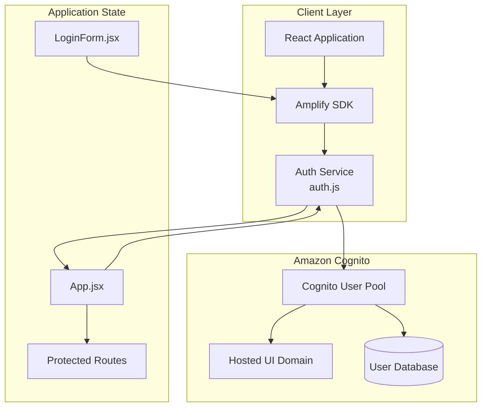
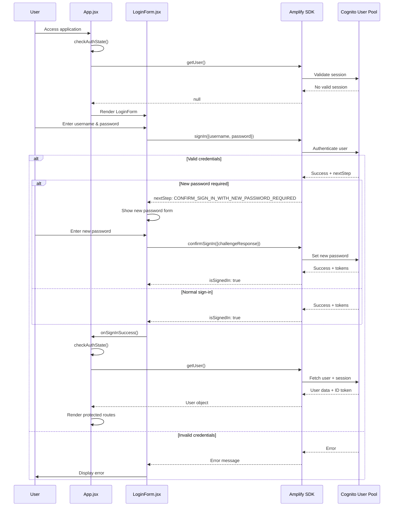
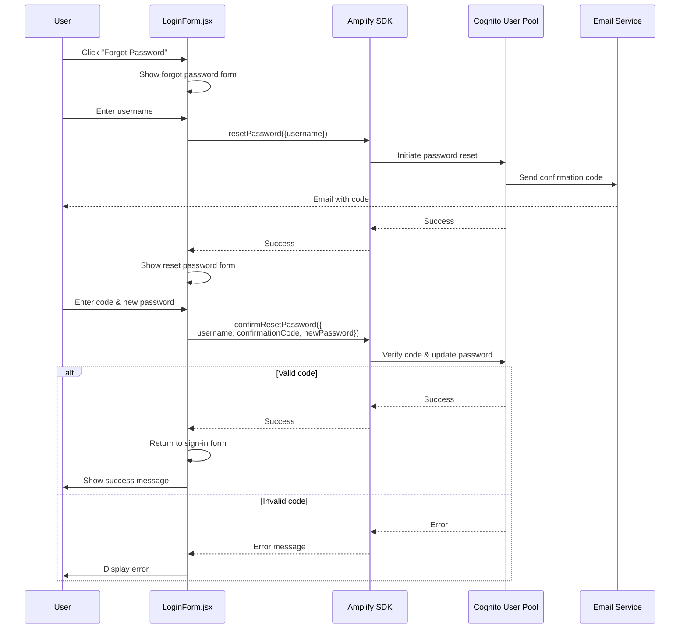
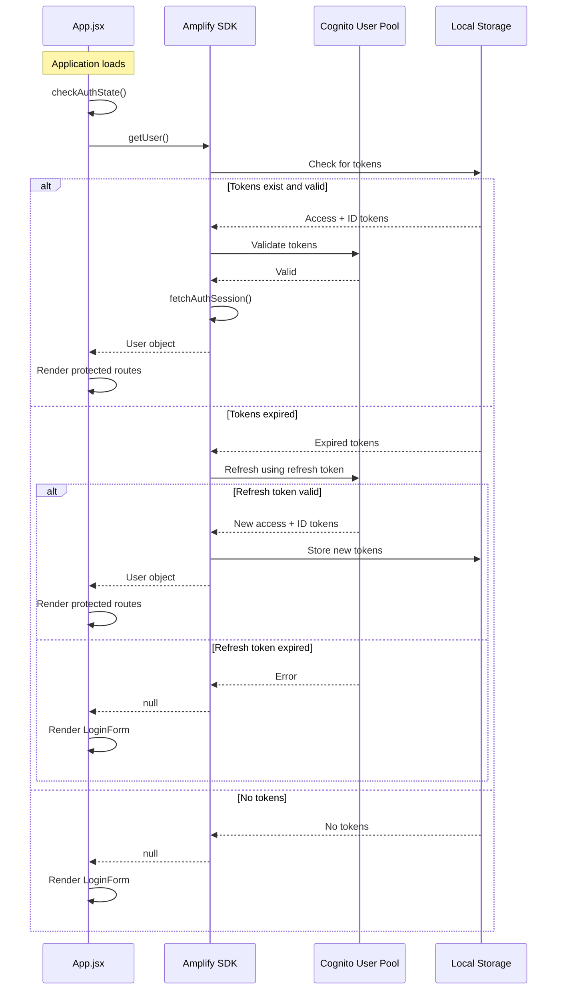
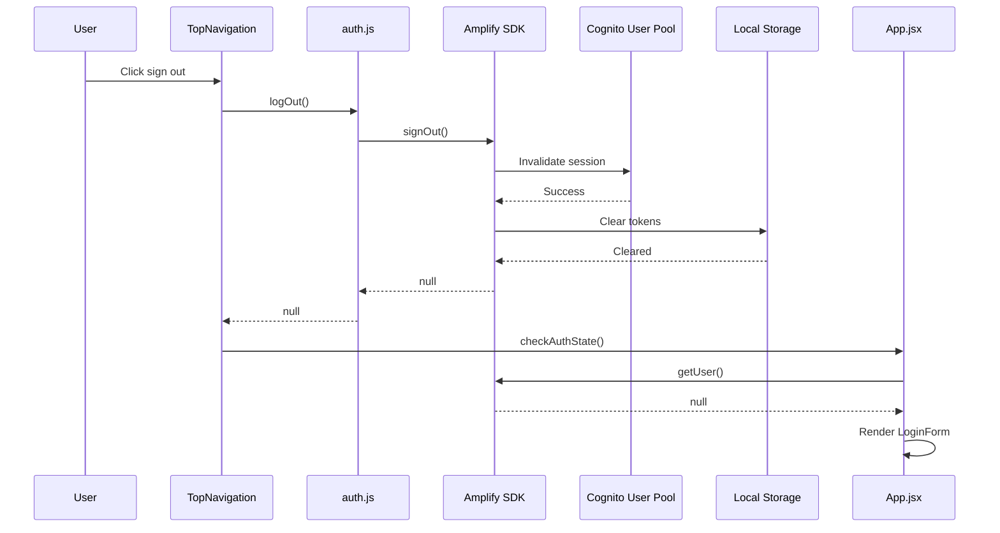

# Authentication Architecture

## Overview

Threat Designer implements user authentication using Amazon Cognito User Pool integrated with the AWS Amplify SDK on the frontend. The authentication system provides secure user sign-in, password management, and session handling for the web application. This document focuses on the authentication flow and does not cover authorization, which is documented in [API Architecture](./architecture.md).

## Architecture Diagram



## Cognito Configuration

### User Pool Settings

The Cognito User Pool is configured with the following security policies:

**Password Policy**:
- Minimum length: 8 characters
- Requires lowercase letters
- Requires uppercase letters
- Requires numbers
- Requires special characters

**Account Settings**:
- Admin-only user creation: Enabled (prevents self-service sign-up)
- Auto-verified attributes: Email
- MFA: Disabled (can be enabled as needed)

**Account Recovery**:
- Recovery mechanism: Verified email
- Priority: 1

**Token Validity**:
- Access token: 8 hours
- ID token: 8 hours
- Refresh token: 30 days

### OAuth Configuration

**Supported Flows**:
- Authorization code flow
- Implicit flow

**Identity Providers**:
- Cognito User Pool (username/password)

**OAuth Scopes**:
- `email`
- `openid`
- `profile`

**Callback URLs**:
- Production: `https://{branch}.{amplify-domain}`
- Development: `http://localhost:5173`

**Logout URLs**:
- Production: `https://{branch}.{amplify-domain}`
- Development: `http://localhost:5173`

### Explicit Auth Flows

The user pool client supports the following authentication flows:

- `ALLOW_USER_SRP_AUTH`: Secure Remote Password (SRP) authentication
- `ALLOW_REFRESH_TOKEN_AUTH`: Token refresh capability
- `ALLOW_USER_PASSWORD_AUTH`: Username/password authentication

### Infrastructure

The Cognito infrastructure is defined in Terraform (`infra/cognito.tf`):

```terraform
resource "aws_cognito_user_pool" "user_pool" {
  name = "${local.prefix}-user-pool"
  
  password_policy {
    minimum_length    = 8
    require_lowercase = true
    require_numbers   = true
    require_symbols   = true
    require_uppercase = true
  }
  
  admin_create_user_config {
    allow_admin_create_user_only = true
  }
}

resource "aws_cognito_user_pool_client" "client" {
  name         = "${local.prefix}-app-client"
  user_pool_id = aws_cognito_user_pool.user_pool.id
  
  access_token_validity  = 8
  id_token_validity      = 8
  refresh_token_validity = 30
  
  token_validity_units {
    access_token  = "hours"
    id_token      = "hours"
    refresh_token = "days"
  }
}
```

## Amplify SDK Integration

### Configuration

The Amplify SDK is configured in `src/config.js` with environment-specific settings:

```javascript
const amplifyConfig = {
  Auth: {
    Cognito: {
      loginWith: {
        oauth: {
          domain: import.meta.env.VITE_COGNITO_DOMAIN,
          scopes: ["email", "openid", "profile"],
          redirectSignIn: [
            "http://localhost:5173",
            import.meta.env.VITE_REDIRECT_SIGN_IN
          ],
          redirectSignOut: [
            "http://localhost:5173",
            import.meta.env.VITE_REDIRECT_SIGN_OUT
          ],
          responseType: "code",
        },
      },
      region: import.meta.env.VITE_COGNITO_REGION,
      userPoolId: import.meta.env.VITE_USER_POOL_ID,
      userPoolClientId: import.meta.env.VITE_APP_CLIENT_ID,
    },
  },
};
```

**Environment Variables**:
- `VITE_COGNITO_DOMAIN`: Cognito hosted UI domain
- `VITE_COGNITO_REGION`: AWS region for Cognito
- `VITE_USER_POOL_ID`: Cognito User Pool ID
- `VITE_APP_CLIENT_ID`: Cognito User Pool Client ID
- `VITE_REDIRECT_SIGN_IN`: Production callback URL
- `VITE_REDIRECT_SIGN_OUT`: Production logout URL

### Initialization

Amplify is initialized in `src/bootstrap.jsx` before the React application renders:

```javascript
import { Amplify } from "aws-amplify";
import { amplifyConfig } from "./config";

Amplify.configure(amplifyConfig);
```

This ensures that all Amplify authentication functions are properly configured before any components attempt to use them.

## Authentication Service

The authentication service (`src/services/Auth/auth.js`) provides a clean abstraction over Amplify's authentication APIs:

### Core Functions

**Sign In**:
```javascript
export const signIn = () => {
  return signInWithRedirect({ provider: "Cognito" });
};
```

**Get Current User**:
```javascript
export const getUser = async () => {
  try {
    const user = await getCurrentUser();
    const session = await fetchAuthSession();

    if (session.tokens) {
      const payload = session.tokens.idToken.payload;
      return {
        ...user,
        given_name: payload.given_name,
        family_name: payload.family_name,
      };
    }

    return user;
  } catch (error) {
    console.error("Error fetching user:", error);
    return null;
  }
};
```

**Get Session**:
```javascript
export const getSession = () => {
  return fetchAuthSession();
};
```

**Sign Out**:
```javascript
export const logOut = () => {
  return signOut().then(() => {
    return null;
  });
};
```

### User Object Structure

The `getUser()` function returns a user object with the following structure:

```javascript
{
  userId: "user-sub-uuid",           // Cognito user sub (unique identifier)
  username: "username",              // Username
  given_name: "John",                // First name from ID token
  family_name: "Doe",                // Last name from ID token
  signInDetails: {...}               // Additional sign-in metadata
}
```

The `given_name` and `family_name` are extracted from the ID token payload, which contains claims about the authenticated user.

## Authentication Flows

### Sign-In Flow



### Password Reset Flow



### Session Management Flow



### Sign-Out Flow



## Login Form Component

The `LoginForm.jsx` component (`src/components/Auth/LoginForm.jsx`) provides a comprehensive authentication UI with multiple states:

### Form States

1. **Sign In** (`formState: "signIn"`):
   - Username and password inputs
   - Sign-in button
   - "Forgot Password" link

2. **New Password Required** (`formState: "newPassword"`):
   - Triggered when user must change temporary password
   - New password input with validation
   - Real-time password requirement checking

3. **Forgot Password** (`formState: "forgotPassword"`):
   - Username input
   - Sends password reset code to user's email

4. **Reset Password** (`formState: "resetPassword"`):
   - Confirmation code input
   - New password input
   - Confirm password input
   - Password validation

### Password Validation

The form implements client-side password validation matching Cognito's requirements:

```javascript
const validatePassword = (password) => {
  const requirements = {
    minLength: password.length >= 8,
    hasUpperCase: /[A-Z]/.test(password),
    hasLowerCase: /[a-z]/.test(password),
    hasNumber: /\d/.test(password),
    hasSpecialChar: /[!@#$%^&*(),.?":{}|<>]/.test(password),
  };

  return {
    isValid: Object.values(requirements).every(Boolean),
    requirements,
  };
};
```

### Error Handling

The form displays user-friendly error messages for common authentication failures:

- Invalid credentials
- Password doesn't meet requirements
- Passwords don't match (during reset)
- Network errors
- Invalid confirmation codes

### Loading States

The form implements loading states during asynchronous operations:

```javascript
const [loading, setLoading] = useState(false);

const handleSignIn = async (e) => {
  setLoading(true);
  try {
    // Authentication logic
  } finally {
    setLoading(false);
  }
};
```

This prevents duplicate submissions and provides visual feedback to users.

## Application Integration

### App.jsx Authentication Check

The main `App.jsx` component manages the authentication state for the entire application:

```javascript
const [loading, setLoading] = useState(true);
const [authUser, setAuthUser] = useState(null);

useEffect(() => {
  checkAuthState();
}, []);

const checkAuthState = async () => {
  setLoading(true);
  try {
    const user = await getUser();
    setAuthUser(user);
  } catch (error) {
    console.log(error);
    setAuthUser(null);
  } finally {
    setTimeout(() => {
      setLoading(false);
    }, 2000);
  }
};
```

### Conditional Rendering

Based on the authentication state, the app renders different components:

```javascript
return (
  <div>
    {loading ? (
      <Spinner size="large" />
    ) : authUser ? (
      // Authenticated: Render protected application
      <AppRefreshManager>
        <ChatSessionProvider>
          <SplitPanelProvider>
            <TopNavigationMFE user={authUser} />
            <AppLayoutMFE user={authUser} />
          </SplitPanelProvider>
        </ChatSessionProvider>
      </AppRefreshManager>
    ) : (
      // Not authenticated: Render login page
      <LoginPageInternal setAuthUser={checkAuthState} />
    )}
  </div>
);
```

### User Propagation

Once authenticated, the user object is passed down through the component tree:

```javascript
<TopNavigationMFE user={authUser} setAuthUser={checkAuthState} />
<AppLayoutMFE user={authUser} />
```

This allows components to:
- Display user information (name, email)
- Make authenticated API calls
- Implement user-specific features

## Token Management

### Token Storage

Amplify automatically manages token storage in the browser's local storage:

- **Access Token**: Used for API authorization (8-hour validity)
- **ID Token**: Contains user claims (8-hour validity)
- **Refresh Token**: Used to obtain new access/ID tokens (30-day validity)

### Token Refresh

Amplify SDK automatically handles token refresh:

1. Before making an API call, Amplify checks if the access token is expired
2. If expired, Amplify uses the refresh token to obtain new tokens
3. If the refresh token is expired, the user is signed out
4. New tokens are stored automatically

This process is transparent to the application code.

### Session Validation

The `fetchAuthSession()` function validates the current session:

```javascript
export const getSession = () => {
  return fetchAuthSession();
};
```

This returns:

```javascript
{
  tokens: {
    accessToken: {...},
    idToken: {
      payload: {
        sub: "user-sub-uuid",
        email: "user@example.com",
        given_name: "John",
        family_name: "Doe",
        ...
      },
      toString: () => "jwt-token-string"
    },
    ...
  },
  credentials: {...},
  identityId: "..."
}
```

## API Integration

### Adding JWT to API Requests

When making API calls to the backend, the application must include the JWT token in the Authorization header. The `fetchAuthSession()` function provides the ID token:

```javascript
import { getSession } from './services/Auth/auth';

const makeAuthenticatedRequest = async (url, options = {}) => {
  const session = await getSession();
  const token = session.tokens.idToken.toString();
  
  return fetch(url, {
    ...options,
    headers: {
      ...options.headers,
      'Authorization': `Bearer ${token}`,
    },
  });
};
```

### API Gateway Integration

The JWT token is validated by the Lambda Authorizer in API Gateway (see [API Architecture](./architecture.md) for details):

1. Client sends request with `Authorization: Bearer {jwt_token}` header
2. API Gateway invokes Lambda Authorizer
3. Authorizer validates token with Cognito
4. Authorizer extracts user identity (`user_id`, `email`) from token
5. Authorizer returns authorization context to API Gateway
6. API Gateway forwards request to Lambda with user context

## Security Considerations

### Password Security

- **Strong Password Policy**: Enforced at Cognito level (8+ chars, mixed case, numbers, symbols)
- **Client-Side Validation**: Provides immediate feedback before submission
- **Secure Transmission**: All authentication requests use HTTPS
- **No Password Storage**: Passwords are never stored in the frontend

### Token Security

- **Short-Lived Tokens**: Access and ID tokens expire after 8 hours
- **Secure Storage**: Tokens stored in browser local storage (managed by Amplify)
- **Automatic Refresh**: Reduces exposure window for compromised tokens
- **HTTPS Only**: Tokens transmitted only over secure connections

### Session Security

- **Automatic Timeout**: Sessions expire after token validity period
- **Explicit Sign-Out**: Users can manually invalidate sessions
- **Server-Side Validation**: All tokens validated by Cognito on each request

### Admin-Only User Creation

- **No Self-Service Sign-Up**: Prevents unauthorized account creation
- **Admin Control**: Only administrators can create user accounts
- **Temporary Passwords**: New users must change password on first sign-in

## User Administration

### Creating Users

Users are created via Terraform during infrastructure deployment:

```terraform
resource "aws_cognito_user" "example" {
  user_pool_id = aws_cognito_user_pool.user_pool.id
  username     = var.username

  attributes = {
    email          = var.email
    email_verified = true
    given_name     = var.given_name
    family_name    = var.family_name
  }

  temporary_password = random_password.temp.result
}
```

### First Sign-In Flow

1. Administrator creates user with temporary password
2. User receives temporary password (via secure channel)
3. User signs in with username and temporary password
4. Cognito returns `CONFIRM_SIGN_IN_WITH_NEW_PASSWORD_REQUIRED` challenge
5. User sets new password meeting policy requirements
6. User is signed in with new password

### Password Reset

Users can reset their own passwords:

1. User clicks "Forgot Password" on login form
2. User enters username
3. Cognito sends confirmation code to verified email
4. User enters code and new password
5. Password is updated, user can sign in

## Troubleshooting

### Common Issues

**Issue**: User cannot sign in after password reset
- **Cause**: New password doesn't meet policy requirements
- **Solution**: Ensure password has 8+ characters, mixed case, numbers, and symbols

**Issue**: Session expires unexpectedly
- **Cause**: Access token expired and refresh token also expired
- **Solution**: User must sign in again (30-day refresh token validity)

**Issue**: "User does not exist" error
- **Cause**: Username incorrect or user not created in Cognito
- **Solution**: Verify username and check Cognito User Pool

**Issue**: Redirect loop after sign-in
- **Cause**: Callback URL mismatch between Cognito and Amplify config
- **Solution**: Verify `VITE_REDIRECT_SIGN_IN` matches Cognito callback URL

### Debugging

**Check Authentication State**:
```javascript
import { getUser, getSession } from './services/Auth/auth';

const debugAuth = async () => {
  const user = await getUser();
  const session = await getSession();
  console.log('User:', user);
  console.log('Session:', session);
};
```

**Check Token Expiration**:
```javascript
const session = await getSession();
const idToken = session.tokens.idToken;
const expiresAt = new Date(idToken.payload.exp * 1000);
console.log('Token expires at:', expiresAt);
```

**Monitor Amplify Events**:
```javascript
import { Hub } from 'aws-amplify/utils';

Hub.listen('auth', (data) => {
  console.log('Auth event:', data);
});
```


