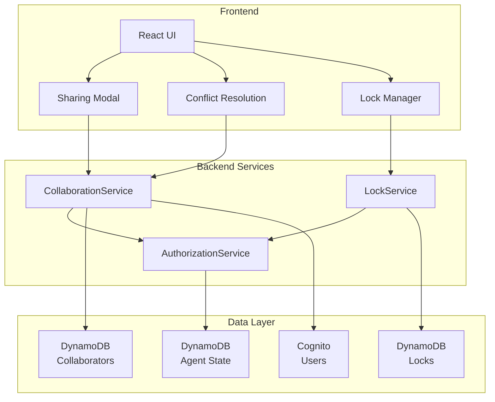
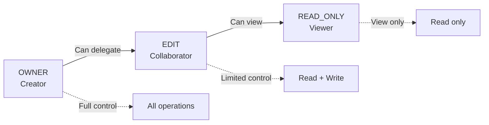
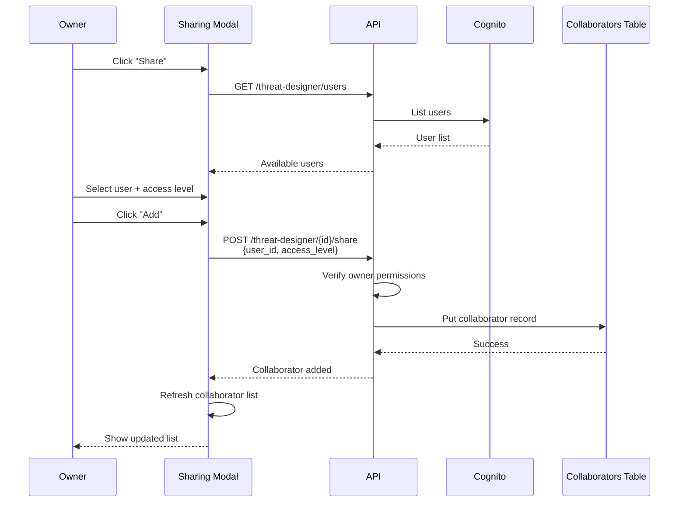
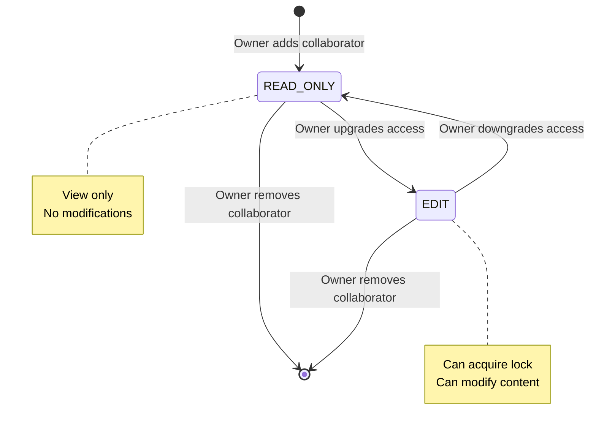
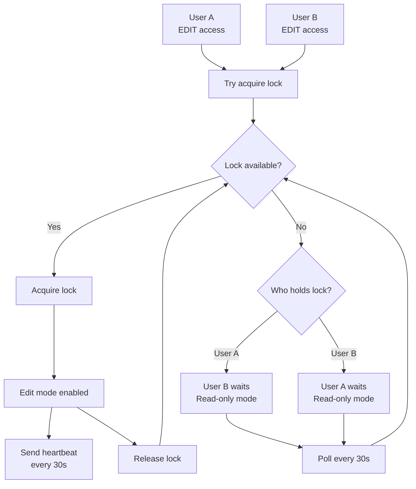
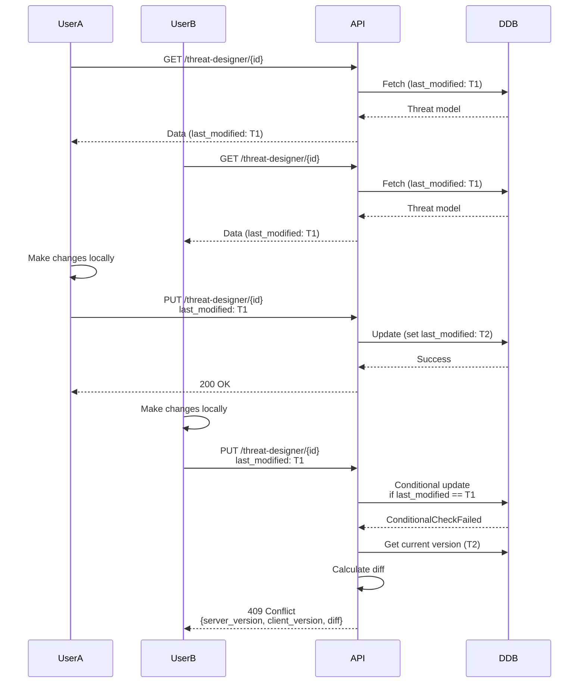
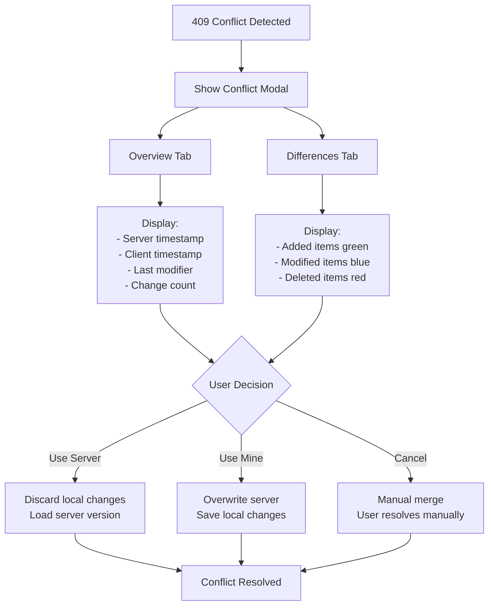

# Collaboration System Architecture

## Overview

The Threat Designer collaboration system enables multiple users to work on threat models simultaneously while maintaining data integrity through role-based access control, edit locking, and conflict resolution mechanisms.

## System Components



## Access Control Model

### Three-Tier Access Levels



### Permission Matrix

| Feature | OWNER | EDIT | READ_ONLY |
|---------|-------|------|-----------|
| **Viewing** |
| View threat model | ✅ | ✅ | ✅ |
| View collaborators | ✅ | ✅ | ✅ |
| View lock status | ✅ | ✅ | ✅ |
| Download exports | ✅ | ✅ | ✅ |
| **Editing** |
| Acquire edit lock | ✅ | ✅ | ❌ |
| Modify threats | ✅ | ✅ | ❌ |
| Modify assets/flows | ✅ | ✅ | ❌ |
| Save changes | ✅ | ✅ | ❌ |
| Replay analysis | ✅ | ✅ | ❌ |
| **Management** |
| Share with others | ✅ | ❌ | ❌ |
| Add collaborators | ✅ | ❌ | ❌ |
| Remove collaborators | ✅ | ❌ | ❌ |
| Change access levels | ✅ | ❌ | ❌ |
| Force release locks | ✅ | ❌ | ❌ |
| Delete threat model | ✅ | ❌ | ❌ |

## Sharing Workflow

### Share Threat Model Flow



### Collaborator Data Model

```python
{
    "threat_model_id": "uuid-v4",  # Partition key
    "user_id": "user-sub-uuid",    # Sort key
    "access_level": "EDIT",         # OWNER | EDIT | READ_ONLY
    "added_at": "2025-01-01T00:00:00Z",
    "added_by": "owner-user-sub",
    "email": "user@example.com",
    "username": "user"
}
```

### Access Level Changes



## Concurrent Access Management

### Edit Lock Integration

The collaboration system integrates with the lock mechanism to prevent conflicts:



### Lock Behavior by Access Level

| Access Level | Can Acquire Lock | Lock Behavior |
|--------------|------------------|---------------|
| OWNER | ✅ Always | Can force-release any lock |
| EDIT | ✅ If available | Must wait if locked |
| READ_ONLY | ❌ Never | Always read-only mode |

## Conflict Resolution

### Conflict Detection



### Conflict Resolution Modal



### Collaboration Limits

- Lock timeout: 3 minutes
- Heartbeat interval: 30 seconds


