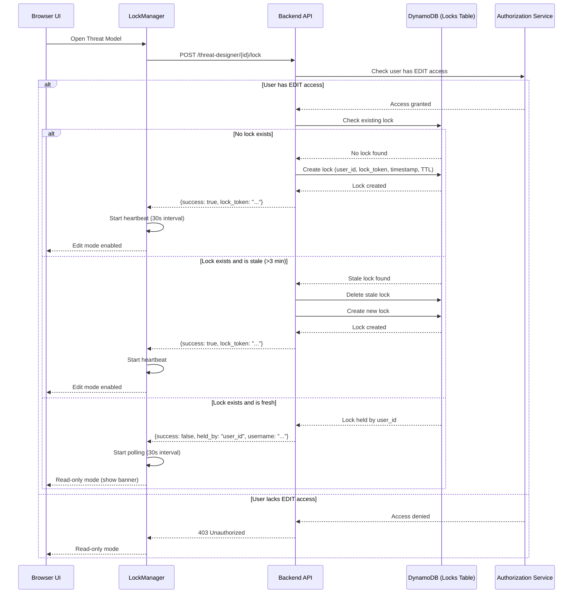

# Lock Mechanism

## Overview

The edit lock mechanism prevents concurrent modifications to threat models by ensuring only one user can edit at a time. Locks are managed through DynamoDB with automatic expiration and heartbeat-based refresh.

## Lock Data Model

**Key Fields:**

- `threat_model_id`: Primary key, identifies which threat model is locked
- `user_id`: UUID of the user holding the lock
- `lock_token`: UUID for validating lock ownership during operations
- `lock_timestamp`: Unix timestamp of last heartbeat (used for staleness check)
- `acquired_at`: ISO timestamp when lock was first acquired
- `ttl`: DynamoDB TTL field (lock_timestamp + 180 seconds)

## Lock Acquisition Flow

## Lock Heartbeat and Expiration

## Lock Release Flow

## Lock Conflict Resolution

