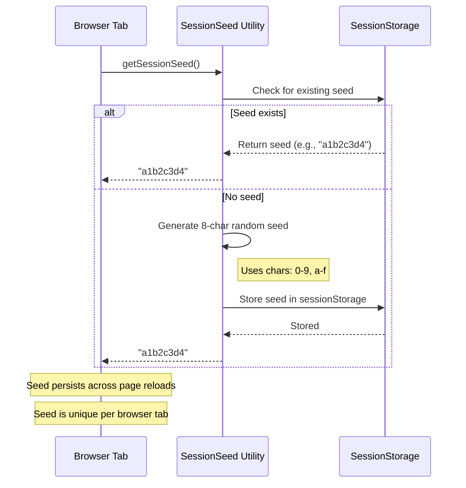
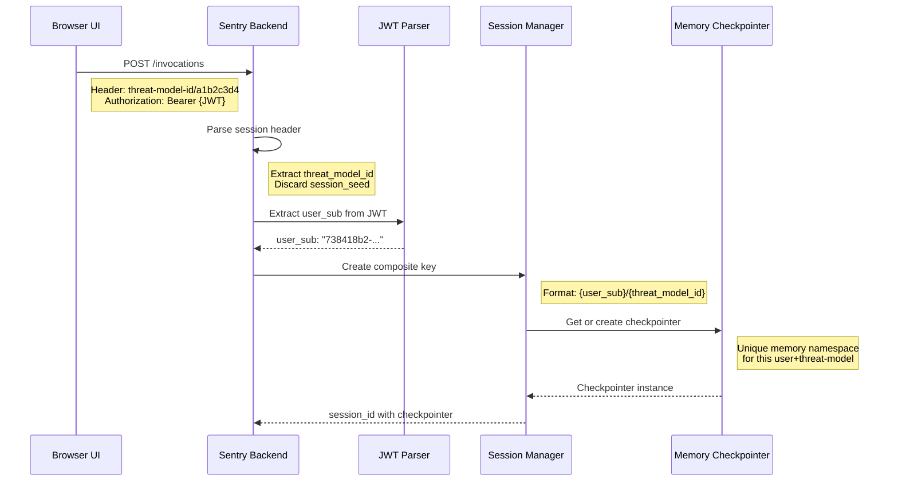
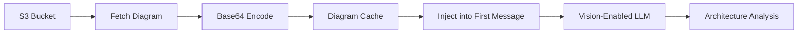
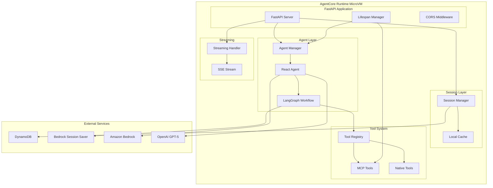
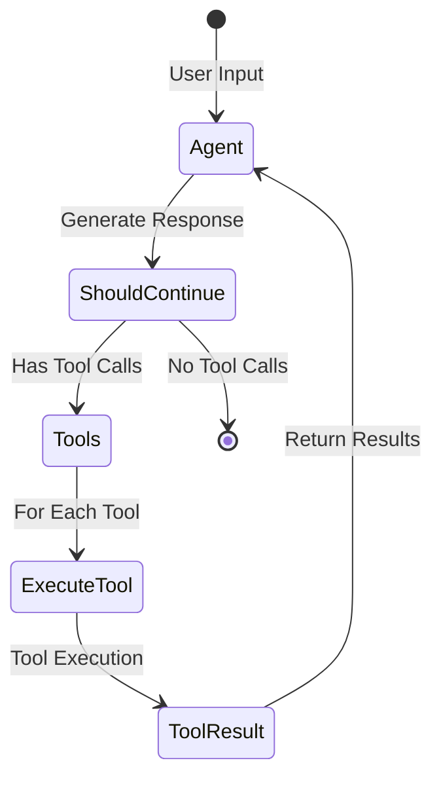
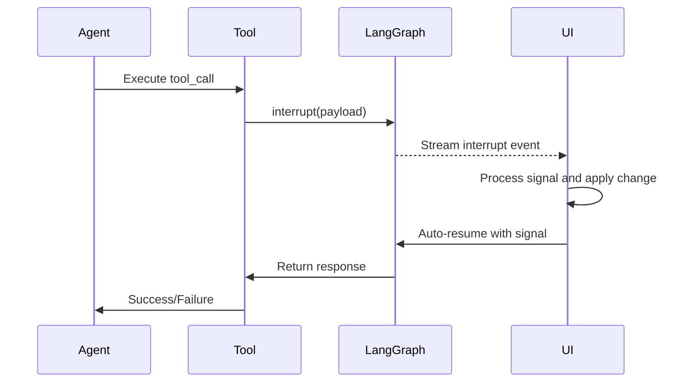
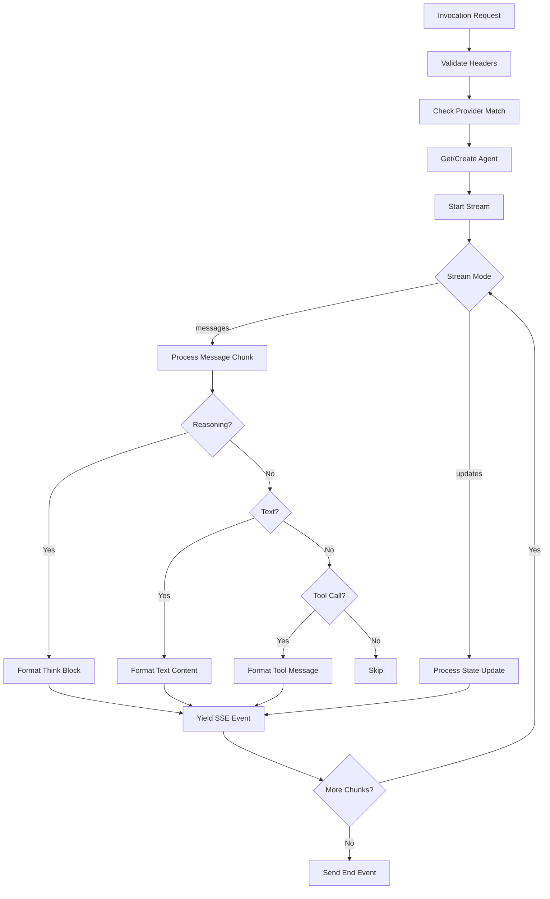

# Sentry Agent Architecture

## 1. Overview

Sentry is an AI-powered security assistant for Threat Designer that enables conversational threat modeling through a sophisticated agent architecture. The system combines LangGraph-based agentic workflows, Amazon Bedrock/OpenAI integration, dynamic tool management, and intelligent session handling to provide context-aware security analysis.

This document covers:

- System architecture and components
- Agent structure and ReAct pattern
- Tool system (native and MCP)
- Streaming infrastructure
- Session management and isolation
- Request handling and API endpoints

---

## 2. Core Concepts

### 2.1 Session Management & Isolation

Sentry uses a two-part session identification strategy to achieve both per-tab isolation and user conversation continuity.

#### Session Seed Generation

The session seed creates unique session headers (`threat-model-id/seed`) for each browser tab. This ensures that Amazon Bedrock AgentCore Runtime treats each tab as a separate session, providing isolation between concurrent requests from the same user or different users interacting with the same threat model.



**Key Points:**

- Each browser tab generates a unique seed stored in sessionStorage
- Seeds ensure AgentCore Runtime creates separate execution contexts per tab
- Prevents request collisions when multiple tabs are active simultaneously

#### Conversation History Persistence

While seeds provide per-tab isolation at the AgentCore level, Sentry maintains a single conversation history per user+threat-model combination.

**Backend Session Key Creation:**



**Two-Level Session Strategy:**

1. **AgentCore Session (per tab):**
   - Uses `threat-model-id/seed` header
   - Provides request isolation between sessions
   - Prevents concurrent execution conflicts

2. **Memory Checkpointer (per user+threat-model):**
   - Uses `user_sub/threat_model_id` composite key
   - Creates unique conversation history namespace
   - Preserves conversation across all tabs for same user+threat-model
   - Survives AgentCore session termination

**Result:**

- Multiple tabs can interact with the same threat model simultaneously
- Each tab has isolated AgentCore execution
- All tabs share the same conversation history
- Conversation persists across page reloads and session restarts

#### Amazon Bedrock AgentCore Runtime

Sentry runs within Amazon Bedrock AgentCore Runtime, which provides isolated execution environments through dedicated microVMs. Each AgentCore session (identified by the unique session header) receives isolated compute, memory, and filesystem resources.

**Session Persistence:**

Since AgentCore sessions are ephemeral (up to 8 hours), Sentry uses:

- **LangGraph Checkpointer**: Persists conversation state to Amazon Bedrock Session Saver
- **DynamoDB**: Maps composite keys (`user_sub/threat_model_id`) to session metadata
- **Local Cache**: Fast lookup for active sessions

This ensures conversation history survives AgentCore session termination and can be restored when users return.

### 2.2 Model Provider Support

Sentry supports multiple AI providers with unified interface:

#### Amazon Bedrock (Default)

```python
{
    "model_id": "us.anthropic.claude-sonnet-4-20250514-v1:0",
    "max_tokens": 64000,
    "temperature": 0 or 1,
    "thinking": {
        "type": "enabled",
        "budget_tokens": 16000/32000/63999  # Based on budget level
    },
    "anthropic_beta": ["interleaved-thinking-2025-05-14"]
}
```

**Features:**

- Extended thinking with configurable token budgets
- Prompt caching for system prompts and context
- Vision support for architecture diagrams

#### OpenAI GPT-5

```python
{
    "model": "gpt-5-mini-2025-08-07",
    "max_tokens": 128000,
    "temperature": 0,
    "reasoning": {
        "effort": "minimal/low/medium/high",  # Based on budget level
        "summary": "detailed"
    },
    "use_responses_api": True
}
```

**Features:**

- Reasoning effort levels (0-3 mapped to minimal/low/medium/high)
- Function calling format
- Reasoning summaries

### 2.3 System Prompt & Context Management

#### Dynamic Context Injection

Sentry's system prompt is dynamically constructed with threat model context:

**Prompt Structure:**

```python
SystemMessage([
    {"type": "text", "text": main_prompt},
    {"cachePoint": {"type": "default"}},  # Bedrock only
    {"type": "text", "text": context_prompt},
    {"cachePoint": {"type": "default"}}   # Bedrock only
])
```

**Context Components:**

- Threat model metadata (name, description, assumptions)
- Data flow diagrams and trust boundaries
- Existing threats and mitigations
- STRIDE methodology guidelines
- Threat validation rules

**Prompt Caching (Bedrock):**

- System prompt cached at first cache point
- Context cached at second cache point
- Reduces latency and costs for repeated invocations
- Cache invalidated when context changes

#### Architecture Diagram Support

Sentry supports vision-based analysis of architecture diagrams:

**Diagram Processing Flow:**



**Implementation Details:**

- Diagrams fetched from S3 on first use
- Converted to base64 data URLs
- Cached in memory with hash-based keys
- Injected into first HumanMessage
- Supports JPEG, PNG

**Cache Management:**

- Diagram hash based on S3 path
- Persistent across agent recreations
- Cleared on application restart
- Reduces S3 API calls and latency

**Vision Preprocessing:**

```python
# First message structure with diagram
HumanMessage([
    {"type": "image_url", "image_url": {"url": "data:image/jpeg;base64,..."}},
    {"cachePoint": {"type": "default"}},  # Bedrock only
    {"type": "text", "text": user_prompt}
])
```

---

## 3. Agent Architecture

### 3.1 Core Components



**Note:** All application components run within a single AgentCore Runtime isolated microVM. External services (DynamoDB, Bedrock, OpenAI) are accessed via API calls from within the microVM.

### 3.2 Agent Manager

The Agent Manager (`agent_manager.py`) maintains agent state and handles dynamic reconfiguration. It uses the session management strategy described in **Session Management & Isolation (Section 2.1)** to ensure proper isolation and persistence.

**Responsibilities:**

- Agent lifecycle management (creation, caching, recreation)
- Tool preference management
- Context and diagram state tracking
- Budget level configuration
- Agent reuse optimization

**State Tracking:**

```python
{
    "cached_agent": CompiledGraph,           # Reusable agent instance
    "current_tool_preferences": List[str],   # Active tool filter
    "current_tools_hash": str,               # Tool set fingerprint
    "current_context": Dict,                 # Threat model context
    "current_context_hash": str,             # Context fingerprint
    "current_diagram_path": str,             # Architecture diagram path
    "current_diagram_hash": str,             # Diagram fingerprint
    "current_diagram_data": Dict,            # Cached diagram base64
    "current_budget_level": int              # Thinking budget (0-3)
}
```

**Agent Recreation Triggers:**

- Tool preferences change
- Context update
- Diagram change
- Budget level modification
- Agent not yet initialized

### 3.3 React Agent Pattern

Sentry implements a ReAct (Reasoning + Acting) agent using LangGraph. The agent uses the model providers described in **Model Provider Support (Section 2.2)** and manages context as described in **System Prompt & Context Management (Section 2.3)**.



**Agent Node Responsibilities:**

- Receives messages
- Calls LLM with tools
- Generates reasoning
- Decides on tool use

**Tools Node Responsibilities:**

- Parallel tool execution
- Error handling
- Result formatting

**Key Features:**

- Iterative reasoning and action cycles
- Tool call detection and routing
- Image preprocessing for vision capabilities
- Checkpointing for conversation persistence
- Recursion limit protection (50 iterations)

---

## 4. Tool System

### 4.1 Native Threat Modeling Tools

**add_threats**

- Adds new threats to threat catalog
- Uses interrupt mechanism for UI confirmation
- Validates threat data model
- Returns success/failure status

**edit_threats**

- Updates existing threats
- Preserves threat IDs
- Validates modifications
- Interrupt-based confirmation

**delete_threats**

- Removes threats from catalog
- Requires threat identification
- Confirmation workflow
- Cascading cleanup

**Tool Data Model:**

```python
class Threat(BaseModel):
    name: str                    # Threat identifier
    stride_category: Literal[...]  # STRIDE classification
    description: str             # 35-50 words, threat grammar
    target: str                  # Asset/component
    impact: str                  # Business/technical impact
    likelihood: Literal["Low", "Medium", "High"]
    mitigations: List[str]       # 2-5 controls
    source: str                  # Threat actor
    prerequisites: List[str]     # Required conditions
    vector: str                  # Attack pathway
```

### 4.2 MCP (Model Context Protocol) Integration

MCP (Model Context Protocol) extends Sentry's capabilities by allowing integration of external tools beyond the native threat modeling tools. This enables the agent to access additional resources like documentation, APIs, or specialized services.

**Configuration:**

MCP servers are configured in `backend/sentry/mcp_config.json`:

```json
{
  "mcpServers": {
    "aws-docs": {
      "command": "uvx",
      "args": ["awslabs.aws-documentation-mcp-server@latest"],
      "env": { "FASTMCP_LOG_LEVEL": "ERROR" }
    }
  }
}
```

To add or modify external tools, update this configuration file with the appropriate MCP server definitions.

**Lifecycle:**

1. Load config at startup (`lifespan` event)
2. Initialize MCP client
3. Fetch available tools from MCP servers
4. Filter excluded tools
5. Merge with native tools
6. Register in tool registry

### 4.3 Tool Preferences

**Preference Modes:**

- `None`: Use all available tools (default)
- `[]`: Use no tools (chat-only mode)
- `["tool1", "tool2"]`: Use specific tools

**Tool Selection Logic:**

```python
if preferences is None:
    return []  # All tools available
elif preferences == []:
    return []  # No tools
else:
    return filter_tools(preferences, all_tools)
```

### 4.4 Interrupt Mechanism

The native threat modeling tools (see **Section 4.1**) use LangGraph interrupts for UI interaction:



**Interrupt Payload:**

```python
{
    "payload": [threat.model_dump() for threat in threats],
    "tool_name": "add_threats",  # or "edit_threats", "delete_threats"
    "type": "interrupt"
}
```

**Resume Format:**

```python
{
    "type": "resume_interrupt",
    "prompt": "add_threats"  # or "edit_threats", "delete_threats"
}
```

**Process Flow:**

1. Tool execution triggers interrupt with threat data payload
2. LangGraph streams interrupt event to UI
3. UI automatically processes signal and applies change to threat model
4. UI immediately reinvokes agent with resume signal
5. Tool returns success/failure status to agent

**Important:** The UI component automatically processes the interrupt signal without user confirmation - the process is fully automated.

---

## 5. Streaming Infrastructure

### 5.1 Streaming Handler

The streaming handler (`streaming.py`) manages real-time response delivery:

**Features:**

- Server-Sent Events (SSE) protocol
- Async streaming with backpressure
- Cancellation support
- Provider mismatch detection
- Reasoning content tracking
- Tool execution streaming

### 5.2 Stream Processing Pipeline



### 5.3 Stream Data Types

**Text Content:**

```json
{ "type": "text", "content": "Analysis of the threat model..." }
```

**Thinking/Reasoning:**

```json
{ "type": "think", "content": "Analyzing the architecture for potential vulnerabilities..." }
```

**Tool Start:**

```json
{ "type": "tool", "id": "call_abc123", "tool_name": "add_threats", "tool_start": true }
```

**Tool Result:**

```json
{
  "type": "tool",
  "id": "call_abc123",
  "tool_name": "add_threats",
  "tool_start": false,
  "content": { "response": [{ "name": "SQL Injection" }] },
  "error": false
}
```

**Interrupt:**

```json
{"type": "interrupt", "content": {"payload": [...], "tool_name": "add_threats"}}
```

**End Marker:**

```json
{ "end": true }
```

### 5.4 Cancellation Handling

**Cancellation Flow:**

1. User triggers stop request
2. Current task cancelled via `asyncio.CancelledError`
3. Response buffer analyzed for pending tools
4. Synthetic ToolMessages created for incomplete tools
5. AIMessageChunks combined and cleaned
6. Stream terminated gracefully

For details on agent state tracking and cleanup, see **Agent Manager (Section 3.2)**.

**Pending Tool Detection:**

- Scan response buffer for tool_use/function_call blocks
- Identify tools without corresponding ToolMessages
- Deduplicate by tool call ID
- Generate cancellation messages

**State Cleanup:**

```python
{"type": "tool_use", "name": "add_threats", "id": "call_123", "input": {"cancelled": True}}
```

**OpenAI Reasoning Removal:**

- Remove reasoning content blocks on cancellation
- Prevents ID reference errors on resume
- Preserves reasoning summaries

### 5.5 Semaphore Management

**Request Throttling:**

- Semaphore limit: 4 concurrent requests
- Prevents resource exhaustion
- Returns 429 when saturated
- Per-session task tracking

**Task Lifecycle:**

```python
_current_tasks = {"session_id_1": asyncio.Task, "session_id_2": asyncio.Task}
```

**Cleanup:**

- Automatic cleanup on completion
- Manual cleanup on cancellation
- Periodic finished task removal
- Session-specific tracking

### 5.6 Provider Mismatch Detection

Detects when a conversation was started with a different model provider than the current deployment. For provider configuration details, see **Model Provider Support (Section 2.2)**.

**Detection Logic:**

1. Check session metadata for stored provider
2. If no metadata, detect from message format
3. Compare with current deployment provider
4. Return error if mismatch detected

**Message Format Detection:**

- `function_call` → OpenAI
- `tool_use` → Bedrock
- `reasoning` → OpenAI
- `reasoning_content` → Bedrock

**Error Response:**

```json
{
  "type": "error",
  "content": "This conversation was started with OpenAI but the system is now configured to use Amazon Bedrock. Please start a new conversation."
}
```

---

## 6. Request Handling & API Endpoints

### 6.1 FastAPI Application Structure

**Lifespan Management:**

```python
@asynccontextmanager
async def lifespan(app: FastAPI):
    # Startup
    - Load MCP configuration
    - Initialize MCP tools
    - Merge with native tools
    - Initialize default agent
    - Start background tasks

    yield

    # Shutdown
    - Cancel background tasks
    - Clear session cache
    - Reset invocation status
```

**Background Tasks:**

- Invocation status reset (every 15 minutes)
- Prevents stale "busy" status
- Automatic cleanup of finished tasks

### 6.2 Endpoint: POST /invocations

**Request Types:**

1. **Standard Invocation** (no type or `resume_interrupt`)
   - Streams AI response
   - Processes user prompt
   - Executes tools as needed

2. **ping**
   - Returns agent availability
   - No processing required

3. **stop**
   - Cancels active stream
   - Cleans up pending tools

4. **tools**
   - Returns available tools list
   - Filtered by preferences

5. **history**
   - Retrieves conversation history
   - Formats for frontend display

6. **delete_history**
   - Clears DynamoDB mapping
   - Deletes conversation state

7. **prepare**
   - Pre-initializes agent with context
   - Loads diagram into cache
   - Validates tool preferences

**Request Processing:**

For standard invocations, the endpoint follows the agent execution flow described in **Agent Architecture (Section 3)**. Session management uses the two-level strategy described in **Session Management & Isolation (Section 2.1)**, where the session header provides per-tab isolation while the composite key (`user_sub/threat_model_id`) maintains conversation history.

**See also:**

- **Agent Architecture (Section 3)** for agent execution flow
- **Session Management & Isolation (Section 2.1)** for session concepts
- **Streaming Infrastructure (Section 5)** for response streaming details

### 6.3 Endpoint: GET /ping

**Health Check Response:**

```json
{
    "status": "Healthy" | "HealthyBusy",
    "time_of_last_update": 1234567890
}
```

**Status Logic:**

- `Healthy`: No active invocations
- `HealthyBusy`: Processing requests
- Timestamp updated only on status change

**Invocation Tracking:**

- Thread-safe lock for status updates
- Global `active_invocation` flag
- Set on request start
- Reset after 15 minutes or on completion

---

## 7. Error Handling & Resilience

### 7.1 Exception Types

**MissingHeader Exception:**

```python
class MissingHeader(Exception):
    code = 401
    detail = "Missing required session header"
```

**Raised when:**

- `X-Amzn-Bedrock-AgentCore-Runtime-Session-Id` header missing (see **Session Management & Isolation, Section 2.1**)
- Early validation before processing

**Handled by:**

- SSE stream decorator
- Returns formatted error response
- Prevents unnecessary processing

### 7.2 Cancellation Resilience

**Graceful Cancellation:**

1. Catch `asyncio.CancelledError`
2. Analyze response buffer for pending tools
3. Create synthetic ToolMessages for incomplete tools
4. Combine and clean AIMessageChunks
5. Update agent state with cleaned messages
6. Stream cancellation messages to UI
7. Send end marker

**State Consistency:**

- Ensures LangGraph state remains valid
- Prevents orphaned tool calls
- Maintains conversation coherence
- Enables clean resume on next invocation

---

## 8. Security Considerations

### 8.1 Multi-Tenancy Isolation

**User Isolation:**

- JWT-based user identification
- User sub extracted from token
- Composite keys include user sub
- Prevents cross-user access

**Session Isolation:**

For details on session isolation mechanisms, see **Session Management & Isolation (Section 2.1)**, which describes:

- AgentCore Runtime microVM isolation per session header
- Two-level session strategy (per-tab and per-user+threat-model)
- Session persistence and memory management

**Key Security Properties:**

- Separate execution environments per session header
- Memory sanitization on termination
- No cross-session contamination

### 8.2 Authentication & Authorization

**JWT Validation:**

- Token validated by AgentCore Runtime
- Claims extracted for user identification

**Session Header Validation:**

- Required header check
- Format validation (threat_model_id/seed)
- Early rejection of invalid requests

---
