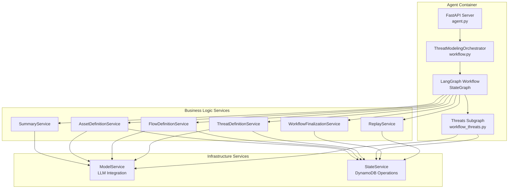
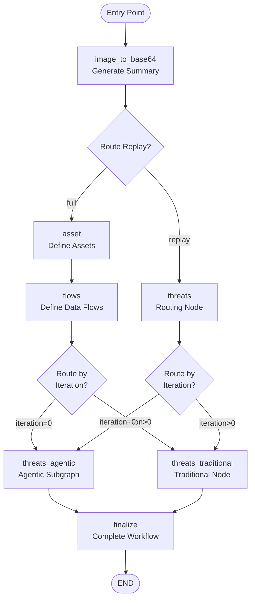
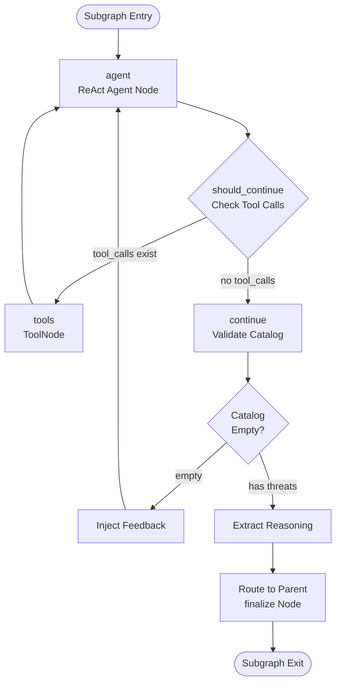
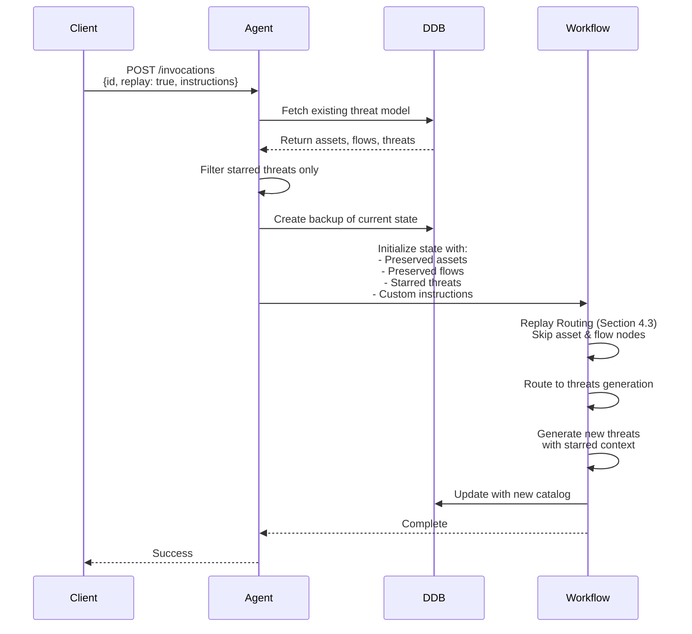

# Threat Designer Agent Architecture

## Overview

The Threat Designer Agent is a LangGraph-based autonomous system that performs comprehensive security threat modeling using the STRIDE methodology. The agent analyzes architecture diagrams and generates detailed threat catalogs through a multi-stage workflow that combines structured analysis with agentic reasoning.

The agent operates as a containerized FastAPI service running on Amazon Bedrock AgentCore runtime that receives invocation requests, executes the threat modeling workflow asynchronously, and persists results to DynamoDB. The workflow is built using LangGraph's state graph pattern, enabling complex orchestration with conditional routing, subgraphs, and state management.

## Architecture Components

### Core Technologies

- **LangGraph**: State graph orchestration framework for building multi-agent workflows
- **LangChain**: LLM integration and tool-calling framework
- **AgentCore Runtime**: Hosting environment where the agent runs
- **Amazon Bedrock/OpenAI**: LLM providers for structured generation and reasoning
- **DynamoDB**: State persistence and job tracking
- **S3**: Architecture diagram storage

### Service Architecture



## Core Concepts

This section covers foundational patterns and concepts that are used throughout the Threat Designer Agent. Understanding these patterns is essential before diving into the workflow architecture and execution details.

### State Management Patterns

LangGraph uses reducers to control how state updates are merged. The Threat Designer uses two key reducer patterns:

#### 1. Accumulation (operator.add)

**Used For**: `threat_list`, `gap`

**Behavior**: Combines new values with existing values

```python
class AgentState(TypedDict):
    threat_list: Annotated[ThreatsList, operator.add]
    gap: Annotated[List[str], operator.add]
```

**Example**:

```python
# Initial state
state["threat_list"] = ThreatsList(threats=[threat1, threat2])

# Update from tool
update = {"threat_list": ThreatsList(threats=[threat3, threat4])}

# Result after merge (using ThreatsList.__add__)
state["threat_list"] = ThreatsList(threats=[threat1, threat2, threat3, threat4])
```

**ThreatsList Custom Reducer**:

```python
def __add__(self, other: "ThreatsList") -> "ThreatsList":
    """Combine two ThreatsList instances, avoiding duplicates based on name."""
    existing_names = {threat.name for threat in self.threats}
    new_threats = [
        threat for threat in other.threats if threat.name not in existing_names
    ]
    combined_threats = self.threats + new_threats
    return ThreatsList(threats=combined_threats)
```

#### 2. Replacement (Overwrite)

**Used For**: Explicit replacement of accumulated state

**Behavior**: Replaces existing value completely

```python
from langgraph.types import Overwrite

return Command(
    update={"threat_list": Overwrite(updated_threat_list)}
)
```

**When to Use**:

- Removing threats (need to replace, not accumulate)
- Exiting subgraph with final state
- Resetting state to specific value

#### State Inheritance (Parent → Subgraph)

When entering the agentic subgraph, state is inherited from the parent graph:

**Parent State (AgentState)**:

```python
{
    "job_id": "uuid",
    "image_data": "base64...",
    "description": "...",
    "assumptions": [...],
    "assets": AssetsList(...),
    "system_architecture": FlowsList(...),
    "threat_list": ThreatsList(...),
    "iteration": 0,
    "replay": False,
    "instructions": "..."
}
```

**Subgraph State (ThreatState)**:

```python
{
    # Inherited from parent
    "job_id": "uuid",
    "image_data": "base64...",
    "description": "...",
    "assumptions": [...],
    "assets": AssetsList(...),
    "system_architecture": FlowsList(...),
    "threat_list": ThreatsList(...),
    "iteration": 0,
    "replay": False,
    "instructions": "...",

    # Subgraph-specific
    "messages": [],  # Conversation history
    "tool_use": 0,
    "gap_tool_use": 0,
    "gap": []
}
```

**Key Points**:

- Subgraph receives all parent state fields
- Subgraph adds its own fields (messages, tool counters)
- Updates to shared fields (threat_list) propagate back to parent
- Subgraph-specific fields (messages) don't propagate to parent

#### State Persistence

**StateService** handles all DynamoDB operations for job tracking, reasoning trails, and workflow finalization.

**Job State Tracking**

**Table**: State table (configured via `ENV_AGENT_STATE_TABLE`)

**Operations**:

```python
# Update job state
state_service.update_job_state(
    job_id="uuid",
    state=JobState.THREAT.value,
    detail="Adding threats"
)

# Query state
status = get_job_status(job_id)
# Returns: {"state": "THREAT", "detail": "Adding threats", "retry": 2}
```

**State Transitions**:

```
START → ASSETS → FLOW → THREAT → FINALIZE → COMPLETE
                           ↓
                      THREAT_RETRY (if retrying)
                           ↓
                        FAILED (on error)
```

**States**:

- `START`: Execution initiated
- `PENDING`: Job created, waiting to start
- `ASSETS`: Analyzing assets
- `FLOW`: Analyzing data flows
- `THREAT`: Generating threats
- `THREAT_RETRY`: Retrying threat generation
- `FINALIZE`: Completing workflow
- `COMPLETE`: Successfully finished
- `FAILED`: Error occurred

**Reasoning Trail Tracking**

The agent captures reasoning trails from LLM responses and persists them to DynamoDB for debugging and analysis. Reasoning trails are extracted from message content during workflow execution and stored by workflow stage (assets, flows, threats, gaps).

**Key Operations**:

- `update_trail()`: Persist reasoning trails with append or replace mode
- `get_reasoning_trail()`: Retrieve reasoning trails for a job

**Trail Structure**: Organized by workflow stage (assets, flows, threats, gaps)

**Use Cases**: Debugging agent decisions, understanding threat generation logic, improving prompts, auditing agent behavior

For detailed reasoning trail extraction logic and format examples, see the continue node description (Section 5.3).

**Workflow Finalization**

**Operation**: `state_service.finalize_workflow(state)`

**Behavior**:

1. Extracts all relevant fields from AgentState
2. Converts Pydantic models to dictionaries
3. Adds metadata (created_at, last_modified_at, owner)
4. Writes complete threat model to agent table
5. Creates backup of current state

**Persisted Fields**:

- `job_id`: Primary key
- `title`: Threat model title
- `state`: "COMPLETE"
- `summary`: Architecture summary
- `assets`: Asset list
- `system_architecture`: Flows, boundaries, actors
- `threat_list`: Complete threat catalog
- `description`: User description
- `assumptions`: User assumptions
- `s3_location`: Architecture diagram path
- `owner`: User who created the threat model
- `created_at`: Creation timestamp
- `last_modified_at`: Last update timestamp
- `backup`: Previous version (for restore)

**Backup and Restore**

Backups are created before risky operations:

```python
# Before replay
def route_replay(self, state: AgentState) -> str:
    if state.get("replay", False):
        job_id = state.get("job_id")
        # Create backup before replay
        self.state_service.update_with_backup(job_id)
        return "replay"
    return "full"
```

When execution is stopped, the system restores from backup:

```python
def stop_session(job_id, session_id):
    # Get threat model
    item = get_threat_model(job_id)

    if item.get("backup"):
        # Restore from backup
        restore_from_backup(job_id, item["backup"])
        return {"state": "Restored"}
    else:
        # No backup, delete threat model
        delete_threat_model(job_id)
        return {"state": "Deleted"}
```

### Message Building Patterns

The `MessageBuilder` class constructs standardized messages for LLM invocations:

```python
class MessageBuilder:
    def __init__(self, image_data: str, description: str, assumptions: str):
        self.image_data = image_data
        self.description = description
        self.assumptions = assumptions
        self.provider = os.environ.get(ENV_MODEL_PROVIDER, MODEL_PROVIDER_BEDROCK)
```

#### Base Message Structure

All messages include architecture context:

```python
def base_msg(self, caching: bool = False, details: bool = True) -> List[Dict]:
    base_message = [
        {"type": "text", "text": "<architecture_diagram>"},
        {
            "type": "image_url",
            "image_url": {"url": f"data:image/jpeg;base64,{self.image_data}"}
        },
        {"type": "text", "text": "</architecture_diagram>"}
    ]

    if details:
        base_message.extend([
            {"type": "text", "text": f"<description>{self.description}</description>"},
            {"type": "text", "text": f"<assumptions>{self.assumptions}</assumptions>"}
        ])

    if caching:
        base_message.extend(self._add_cache_point_if_bedrock())

    return base_message
```

#### Prompt Caching

For Bedrock provider, cache points reduce token usage:

```python
def _add_cache_point_if_bedrock(self) -> List[Dict]:
    if self.provider == MODEL_PROVIDER_BEDROCK:
        return [{"cachePoint": {"type": "default"}}]
    return []
```

**Cache Strategy**:

- Cache architecture diagram and base context
- Reuse cached content across multiple LLM calls
- Reduces token costs for repeated context
- Only supported on Bedrock provider

#### Message Types

Each message type extends the base message structure with task-specific prompts and context. For the complete base message structure, see above.

**Asset Message**

Adds asset identification prompt:

```python
asset_msg = [{"type": "text", "text": "Identify Assets"}]
```

Uses `base_msg()` without caching. See `MessageBuilder.create_asset_message()` for complete implementation.

**Flow Message**

Adds flow identification prompt with asset context:

```python
system_flows_msg = [
    {"type": "text", "text": f"<identified_assets_and_entities>{assets}</identified_assets_and_entities>"},
    {"type": "text", "text": "Identify system flows"}
]
```

Uses `base_msg()` without caching. See `MessageBuilder.create_system_flows_message()` for complete implementation.

**Threat Message**

Adds threat improvement prompt with full context and caching:

```python
threat_msg = [
    {"type": "text", "text": f"<identified_assets_and_entities>{assets}</identified_assets_and_entities>"},
    {"type": "text", "text": f"<data_flow>{flows}</data_flow>"},
    # Cache point added here for Bedrock
    {"type": "text", "text": f"<threats>{threat_list}</threats>"},
    {"type": "text", "text": "Identify missing threats and respective mitigations"}
]
```

Uses `base_msg(caching=True)` to enable prompt caching. See `MessageBuilder.create_threat_improve_message()` for complete implementation.

**Threat Agent Message (Agentic)**

Creates message for agentic mode with optional empty catalog indicator:

```python
threat_msg = [
    # Conditionally includes empty catalog notice
    {"type": "text", "text": "Create the comprehensive threat catalog while honoring the ground rules."}
    # Cache point added here for Bedrock
]
```

Uses `base_msg(caching=True, details=False)` - excludes description/assumptions since they're included in the system prompt. See `MessageBuilder.create_threat_agent_message()` for complete implementation.

**Gap Analysis Message**

Creates message for gap analysis with previous gap context:

```python
gap_msg = [
    {"type": "text", "text": f"<identified_assets_and_entities>{assets}</identified_assets_and_entities>"},
    {"type": "text", "text": f"<data_flow>{flows}</data_flow>"},
    # Cache point added here for Bedrock
    {"type": "text", "text": f"<threats>{threat_list}</threats>"},
    {"type": "text", "text": f"<previous_gap>{gap}</previous_gap>\n"},
    {"type": "text", "text": "Proceed with gap analysis"}
]
```

Uses `base_msg(caching=True)` to enable prompt caching. See `MessageBuilder.create_gap_analysis_message()` for complete implementation.

### Prompt Engineering Patterns

All prompts follow consistent patterns to ensure high-quality, reliable threat modeling results.

#### System Prompt Structure

All prompts follow a consistent XML-based structure:

```xml
<instruction>
High-level task description
</instruction>

<critical_instructions>
Must-follow rules and constraints
</critical_instructions>

<task_specific_sections>
Detailed guidance for the specific task
</task_specific_sections>

<examples>
Concrete examples of good/bad outputs
</examples>

<output_requirements>
Final quality checklist
</output_requirements>
```

#### Threat Generation Prompt Pattern

The threat generation prompts implement a multi-layered validation approach:

**1. Critical Pre-Generation Checks**

```xml
<critical_instructions>
BEFORE generating any threat, you MUST:
1. If <assumptions> are provided: Verify it doesn't violate any assumption
2. Verify the threat actor exists in <data_flow> threat_sources
3. Confirm it's not a duplicate of existing threats
4. Ensure it's within customer control boundary
5. Validate the threat is realistic and plausible

If a potential threat fails ANY of these checks, DO NOT include it.
</critical_instructions>
```

**2. Assumption Enforcement**

```xml
<assumption_enforcement>
**WHEN ASSUMPTIONS ARE PROVIDED:**
Assumptions define what is already secure or out of scope. These are non-negotiable constraints:
- If an assumption states "X is trusted", DO NOT generate threats about X being compromised
- If an assumption states "Y is already implemented", DO NOT suggest Y as a mitigation
- Assumptions override all other considerations

**WHEN NO ASSUMPTIONS ARE PROVIDED:**
Use reasonable security baselines for the given context
</assumption_enforcement>
```

**3. Realism Validation**

```xml
<threat_realism_guidance>
Every threat must be REALISTIC and PLAUSIBLE. Apply these filters:

**Generate threats that:**
- Have documented real-world precedent or clear attack paths
- Can be executed with reasonable attacker resources/skill
- Target common vulnerabilities or misconfigurations

**Avoid threats that:**
- Require nation-state resources for low-value targets
- Assume attackers have unrealistic capabilities
- Are purely theoretical without practical attack vectors
</threat_realism_guidance>
```

**4. Step-by-Step Generation Process**

```xml
<threat_generation_process>
For EACH potential threat, follow this exact sequence:

**1. Assumption Check (Conditional)**
   - IF assumptions exist: Ask "Does this threat contradict any assumption?"
     - If YES → Skip this threat entirely
     - If NO → Continue to step 2

**2. Realism Validation**
   - Ask: "Is this threat plausible and realistic?"
   - If NO → Skip this threat entirely
   - If YES → Continue to step 3

**3. Source Validation**
   - Find the exact threat source in <data_flow> threat_sources
   - If NO → Skip this threat entirely
   - If YES → Continue to step 4

**4. Duplication Check**
   - Compare against ALL existing threats
   - If NO → Skip this threat entirely
   - If YES → Continue to step 5

**5. Control Boundary Check**
   - Ask: "Can the customer control this?"
   - If NO → Skip this threat entirely
   - If YES → Proceed to format the threat

Only after passing ALL checks should you include the threat.
</threat_generation_process>
```

#### Gap Analysis Prompt Pattern

The gap analysis prompt implements comprehensive validation:

**1. Primary Mission**

```xml
<primary_mission>
Systematically evaluate threat catalogs against:
1. **Coverage** - Missing threat scenarios
2. **Compliance** - Adherence to ground rules
3. **Accuracy** - Hallucinations and impossibilities
4. **Chains** - Complete attack paths
</primary_mission>
```

**2. Mandatory Compliance Checks**

```xml
<mandatory_compliance_checks>
For EACH threat, verify:

**1. Actor Validity**
- Actor EXISTS in data_flow.threat_sources
- Flag violations: "Invalid actor: [threat name] uses unlisted '[actor]'"

**2. Assumption Compliance** (if assumptions provided)
- No contradictions with stated assumptions
- Flag violations: "Assumption violation: [threat name] contradicts '[assumption]'"

**3. Control Boundary**
- Customer can implement suggested mitigations
- Flag violations: "Boundary violation: [threat name] requires provider-only controls"

**4. Architectural Feasibility**
- Attack path is technically possible
- Flag violations: "Impossible threat: [threat name] - [reason]"

ANY violation = Request revision
</mandatory_compliance_checks>
```

**3. Coverage Analysis**

```xml
<coverage_gaps>
**Check for missing:**

**STRIDE Coverage per Component:**
- Authentication points → Need Spoofing threats
- Data modification points → Need Tampering threats
- Audit requirements → Need Repudiation threats
- Sensitive data → Need Information Disclosure threats
- Critical services → Need DoS threats
- Authorization boundaries → Need Privilege Escalation threats

**Attack Surface Coverage:**
- All entry points have threats
- All trust boundaries addressed
- All sensitive data flows covered
- All external integrations considered
</coverage_gaps>
```

**4. Decision Logic**

```xml
<decision_and_communication>
**STOP (stop=true) when:**
- No CRITICAL gaps
- Minimal MAJOR gaps (<10%)
- Comprehensive coverage achieved
- All rules followed

**CONTINUE (stop=false) when:**
- Any CRITICAL gap exists
- Multiple MAJOR gaps (>10%)
- Systematic coverage missing
- Hallucinations detected
</decision_and_communication>
```

## LangGraph Workflow Architecture

### Main Workflow Graph

The main workflow is defined in `workflow.py` and orchestrates the complete threat modeling process through a series of nodes with conditional routing.



### Node Descriptions

#### 1. image_to_base64 (Entry Point)

**Purpose**: Generate a concise summary of the architecture diagram

**Service**: `SummaryService`

**Inputs**:

- Architecture diagram (base64 encoded)
- User description
- User assumptions

**Outputs**:

- `summary`: Short headline summary (max 40 words by default)
- `image_data`: Base64 encoded image data

**Behavior**:

- If summary already exists in state, returns immediately
- Otherwise, invokes LLM with summary prompt to generate architecture overview
- Uses structured output to ensure consistent format

**Model**: Configured via `model_summary` in ConfigSchema

#### 2. asset (Define Assets)

**Purpose**: Identify critical assets and entities in the architecture

**Service**: `AssetDefinitionService`

**Inputs**:

- Architecture diagram
- User description
- User assumptions

**Outputs**:

- `assets`: AssetsList containing identified assets and entities

**Behavior**:

- Updates job state to `ASSETS`
- Constructs message with architecture context
- Invokes LLM with structured output schema (AssetsList)
- Extracts reasoning trail if reasoning mode enabled
- Returns list of assets with type (Asset/Entity), name, and description

**Model**: Configured via `model_assets` in ConfigSchema

**Asset Types**:

- **Asset**: Components requiring protection (databases, APIs, data stores)
- **Entity**: Actors interacting with the system (users, services, systems)

#### 3. flows (Define Data Flows)

**Purpose**: Map data flows, trust boundaries, and threat actors

**Service**: `FlowDefinitionService`

**Inputs**:

- Architecture diagram
- User description
- User assumptions
- Identified assets

**Outputs**:

- `system_architecture`: FlowsList containing:
  - `data_flows`: Movement of data between components
  - `trust_boundaries`: Security domain transitions
  - `threat_sources`: Relevant threat actor categories

**Behavior**:

- Updates job state to `FLOW`
- Constructs message including asset context
- Invokes LLM with structured output schema (FlowsList)
- Extracts reasoning trail if reasoning mode enabled
- Returns comprehensive system architecture analysis

**Model**: Configured via `model_flows` in ConfigSchema

**Data Flow Elements**:

- Flow description
- Source entity
- Target entity
- Flow type (Internal/External/Cross-boundary)
- Criticality level

**Trust Boundary Types**:

- Network boundaries
- Process boundaries
- Physical boundaries
- Organizational boundaries
- Administrative boundaries

#### 4. threats (Routing Node)

**Purpose**: Passthrough node for conditional routing to threat generation

**Service**: `ThreatModelingOrchestrator.threats_router`

**Behavior**:

- Returns empty dictionary (no state changes)
- Exists solely for routing logic
- Routes to either agentic subgraph or traditional node based on iteration parameter

**Routing Logic**:

```python
def route_threats_by_iteration(state: AgentState) -> str:
    iteration = state.get("iteration", 0)
    if iteration == 0:
        return WORKFLOW_NODE_THREATS_AGENTIC  # Agentic subgraph
    return WORKFLOW_NODE_THREATS_TRADITIONAL  # Traditional node
```

#### 5. threats_traditional (Traditional Threat Generation)

**Purpose**: Generate threats using traditional structured prompting

**Service**: `ThreatDefinitionService`

**Inputs**:

- Architecture diagram
- User description
- User assumptions
- Assets
- System architecture
- Existing threat list (for improvements)
- Gap analysis results
- Retry count
- Iteration parameter

**Outputs**:

- `threat_list`: ThreatsList with identified threats
- `retry`: Incremented retry counter

**Behavior**:

1. Checks if should finalize (max retries reached or iteration limit)
2. Updates job state based on retry count
3. Constructs appropriate prompt (initial or improvement)
4. Invokes LLM with structured output schema (ThreatsList)
5. Updates reasoning trail if enabled
6. Returns Command to route to next node

**Routing Decisions**:

- If `iteration == 0`: Routes to `gap_analysis` node
- If `iteration > 0`: Routes back to `threats` routing node
- If max retries reached: Routes to `finalize`

**Model**: Configured via `model_threats` in ConfigSchema

**Prompt Selection**:

- First iteration (`retry == 1`): Uses `threats_prompt()` for initial generation
- Subsequent iterations: Uses `threats_improve_prompt()` for refinement

#### 6. threats_agentic (Agentic Subgraph)

**Purpose**: Generate threats using autonomous agent with tool-calling capabilities

**Service**: Threats subgraph (defined in `workflow_threats.py`)

**Behavior**: Enters a separate LangGraph subgraph with its own state and workflow (see Agentic Subgraph Architecture, Section 5)

**When Used**: Only when `iteration == 0` (first iteration with agentic mode)

**Exit Condition**: Subgraph routes back to parent graph's `finalize` node when complete

#### 7. finalize (Workflow Completion)

**Purpose**: Finalize workflow and persist results

**Service**: `WorkflowFinalizationService`

**Inputs**:

- Complete AgentState with all analysis results

**Outputs**:

- Command to END workflow

**Behavior**:

1. Updates job state to `FINALIZE`
2. Calls `state_service.finalize_workflow(state)` to persist results
3. Sleeps for 3 seconds (allows final state updates to propagate)
4. Updates job state to `COMPLETE`
5. Returns Command(goto=END)

For details on state persistence and finalization, see State Persistence (Section 3.1).

**Error Handling**:

- On exception, updates job state to `FAILED`
- Re-raises exception for upstream handling

### Conditional Routing

This section describes all routing logic used throughout the workflow. Other sections reference these routing functions rather than duplicating the logic.

#### Replay Routing

**Function**: `ReplayService.route_replay`

**Decision Point**: After `image_to_base64` node

**Purpose**: Determines whether to execute full workflow or skip to threat generation

**Logic**:

```python
def route_replay(state: AgentState) -> str:
    if not state.get("replay", False):
        return "full"  # Normal flow: asset -> flows -> threats

    # Replay mode: skip to threats
    state_service.update_trail(job_id, threats=[], gaps=[], flush=FLUSH_MODE_REPLACE)
    state_service.update_with_backup(job_id)
    return "replay"  # Skip to threats routing node
```

**Routes**:

- `"full"`: Normal execution → routes to `asset` node
- `"replay"`: Replay mode → routes to `threats` routing node

**Replay Behavior**:

- Clears existing reasoning trails
- Creates backup of current state (see State Persistence, Section 3.1)
- Loads backup data (assets, flows, starred threats)
- Skips asset and flow definition
- Routes directly to threat generation

**State Preparation**:

- Preserves existing assets and flows from previous execution
- Filters threat list to only starred threats
- Applies custom instructions if provided
- Resets iteration counters

#### Iteration Routing

**Function**: `ThreatModelingOrchestrator.route_threats_by_iteration`

**Decision Points**:

- After `flows` node (normal execution)
- After `threats` routing node (replay mode)

**Purpose**: Determines whether to use agentic or traditional threat generation

**Logic**:

```python
def route_threats_by_iteration(state: AgentState) -> str:
    iteration = state.get("iteration", 0)
    if iteration == 0:
        return WORKFLOW_NODE_THREATS_AGENTIC  # Agentic subgraph
    return WORKFLOW_NODE_THREATS_TRADITIONAL  # Traditional node
```

**Routes**:

- `WORKFLOW_NODE_THREATS_AGENTIC`: Agentic subgraph with tool-calling and ReAct pattern
- `WORKFLOW_NODE_THREATS_TRADITIONAL`: Traditional structured prompting

**Iteration Modes**:

- `iteration == 0`: Uses agentic subgraph with autonomous tool-calling
- `iteration > 0`: Uses traditional structured prompting with fixed iterations

**Mode Characteristics**:

**Agentic Mode** (`iteration == 0`):

- Agent autonomously decides when to add/remove threats
- Performs gap analysis via tool calls
- Continues until catalog is complete
- No fixed iteration limit
- Higher quality, longer execution time

**Traditional Mode** (`iteration > 0`):

- Fixed number of iterations
- Each iteration improves previous threats
- No tool-calling or autonomous decisions
- Predictable execution time
- Lower token usage

#### Traditional Mode Routing

**Function**: `ThreatDefinitionService.route_after_traditional`

**Decision Point**: After `threats_traditional` node

**Purpose**: Determines next step after traditional threat generation

**Logic**:

```python
def route_after_traditional(state: AgentState) -> str:
    iteration = state.get("iteration", 0)
    retry = state.get("retry", 1)

    # Check if max retries reached
    if retry > iteration:
        return "finalize"

    # First iteration: perform gap analysis
    if iteration == 0:
        return "gap_analysis"

    # Subsequent iterations: continue improving
    return "threats"
```

**Routes**:

- `"finalize"`: Max retries reached → complete workflow
- `"gap_analysis"`: First iteration → analyze gaps
- `"threats"`: Subsequent iterations → continue improving

**Iteration Loop**:

```
First iteration (retry=1, iteration=0):
  threats_traditional → gap_analysis → threats_traditional

Subsequent iterations (retry=2+, iteration>0):
  threats_traditional → threats_traditional

Stop condition (retry > iteration):
  threats_traditional → finalize
```

## Agentic Subgraph Architecture

The agentic subgraph (`workflow_threats.py`) implements a ReAct (Reasoning + Acting) pattern where the agent autonomously decides when to call tools to build the threat catalog.

### Subgraph State

**State Type**: `ThreatState` (extends `MessagesState`)

**Key State Features**:

- Inherits `messages` list from `MessagesState` for conversation history
- Uses `operator.add` reducer for `threat_list` to accumulate threats (see State Management Patterns, Section 3.1)
- Tracks tool usage to enforce limits
- Maintains context from parent graph (assets, flows, etc.)

### Subgraph Workflow



### Subgraph Nodes

#### agent (ReAct Agent)

**Purpose**: Autonomous agent that reasons about threat modeling and calls tools

**Inputs**:

- ThreatState with messages, context, and tool usage counters

**Outputs**:

- Command with updated messages containing agent response

**Behavior**:

1. **Message Initialization** (first invocation):
   - Updates job state to `THREAT`
   - Creates system prompt with ground rules
   - Creates human message with architecture context
   - Includes starred threats if in replay mode

2. **Conversation Continuation** (subsequent invocations):
   - Uses existing message history
   - Continues from last agent or tool response

3. **Model Invocation**:
   - Updates status to "Thinking"
   - Binds tools to model with `tool_choice="auto"` (see Agent Tools, Section 5.4)
   - Invokes model with conversation history
   - Model autonomously decides whether to call tools

4. **Status Updates**:
   - "Thinking": Agent is reasoning
   - "Adding threats": Calling add_threats tool (see Section 5.4.1)
   - "Deleting threats": Calling remove_threat tool (see Section 5.4.2)
   - "Reviewing catalog": Calling read_threat_catalog tool (see Section 5.4.3)
   - "Reviewing for gaps": Calling gap_analysis tool (see Section 5.4.4)

**Model**: Configured via `model_threats_agent` in ConfigSchema

**Tool Binding**:

```python
model_with_tools = model_service.get_model_with_tools(
    model=model,
    tools=[add_threats, remove_threat, read_threat_catalog, gap_analysis],
    tool_choice="auto"  # Agent decides when to call tools
)
```

For detailed tool descriptions, see Agent Tools (Section 5.4).

#### tools (ToolNode)

**Purpose**: Execute tool calls made by the agent

**Implementation**: LangGraph's built-in `ToolNode`

**Available Tools**:

1. `add_threats`: Add new threats to catalog (see Section 5.4.1)
2. `remove_threat`: Delete threats by name (see Section 5.4.2)
3. `read_threat_catalog`: View current threats (see Section 5.4.3)
4. `gap_analysis`: Analyze catalog completeness (see Section 5.4.4)

**Behavior**:

- Automatically executes all tool calls from agent's response
- Returns tool results as ToolMessage objects
- Routes back to agent node for next reasoning step

For detailed tool descriptions, parameters, and behavior, see Agent Tools (Section 5.4).

#### continue (Catalog Validation)

**Purpose**: Validate catalog completeness and route to parent or agent

**Inputs**:

- ThreatState with threat_list and messages

**Outputs**:

- Command to route to agent (if empty) or parent finalize (if complete)

**Behavior**:

1. **Empty Catalog Check**:

   ```python
   if not threat_list or len(threat_list.threats) == 0:
       feedback_message = HumanMessage(
           content="The threat catalog is empty. You must add threats..."
       )
       return Command(goto="agent", update={"messages": [feedback_message]})
   ```

2. **Reasoning Trail Extraction**:
   - Iterates through all messages in conversation
   - Extracts reasoning content from various formats:
     - Anthropic/Bedrock: `{"type": "thinking", "thinking": "..."}`
     - Anthropic extended: `{"type": "reasoning_content", "reasoning_content": {"text": "..."}}`
     - OpenAI: `{"type": "reasoning", "summary": [{"type": "summary_text", "text": "..."}]}`
   - Combines multiple reasoning blocks into trails
   - Persists trails to DynamoDB via `state_service.update_trail()` (see State Persistence, Section 3.1)

3. **Route to Parent**:

   ```python
   return Command(
       goto="finalize",
       update={"threat_list": Overwrite(threat_list)},
       graph=Command.PARENT
   )
   ```

   - Uses `Overwrite` to bypass the `operator.add` reducer (see State Management Patterns, Section 3.1)
   - Routes to parent graph's `finalize` node
   - Exits subgraph

### Agent Tools

This section describes the tools available to the agent during threat catalog generation. These tools are bound to the agent model and can be called autonomously based on the agent's reasoning.

#### 5.4.1 add_threats

**Purpose**: Add new threats to the catalog

**Parameters**:

- `threats`: ThreatsList object with threat details

**Behavior**:

1. Checks tool usage limit (max 7 invocations)
2. Updates job status with threat count
3. Ensures all threats have `starred=False`
4. Increments tool usage counter
5. Returns success message with remaining invocations

**Usage Limit**: 7 invocations per session

**State Updates**:

```python
return Command(
    update={
        "threat_list": threats,  # Accumulated via operator.add
        "tool_use": new_tool_use,
        "messages": [ToolMessage(...)]
    }
)
```

For details on accumulation reducers, see State Management Patterns (Section 3.1).

**Threat Structure**:

```python
class Threat(BaseModel):
    name: str  # Concise threat name
    stride_category: Literal[...]  # STRIDE classification
    description: str  # 35-50 words with threat grammar
    target: str  # Asset being threatened
    impact: str  # Business/technical consequences
    likelihood: Literal["Low", "Medium", "High"]
    mitigations: List[str]  # 2-5 countermeasures
    source: str  # Threat actor
    prerequisites: List[str]  # Required conditions
    vector: str  # Attack pathway
    starred: bool = False  # User prioritization flag
```

#### 5.4.2 remove_threat

**Purpose**: Delete threats from the catalog by name

**Parameters**:

- `threats`: List[str] - Threat names to remove

**Behavior**:

1. Gets current threat_list from state
2. Applies remove method for each threat name
3. Updates job status
4. Increments tool usage counter
5. Returns updated threat list with Overwrite

**State Updates**:

```python
return Command(
    update={
        "threat_list": Overwrite(updated_threat_list),  # Replace, don't accumulate
        "tool_use": new_tool_use,
        "messages": [ToolMessage(...)]
    }
)
```

**Note**: Uses `Overwrite` to replace the threat list instead of accumulating. For details on replacement vs accumulation, see State Management Patterns (Section 3.1).

#### 5.4.3 read_threat_catalog

**Purpose**: View current threats in the catalog

**Parameters**:

- `verbose`: bool - Include full threat details or just summary

**Behavior**:

1. Gets current threat_list from state
2. Updates job status to "Reviewing catalog"
3. Formats output based on verbose flag
4. Returns formatted string

**Output Formats**:

**Summary** (`verbose=False`):

```
Total threats: 5

1. SQL Injection in Payment API
   Likelihood: High
   Stride category: Tampering

2. Weak Authentication on Admin Panel
   Likelihood: Medium
   Stride category: Spoofing
...
```

**Verbose** (`verbose=True`):

```json
[
  {
    "name": "SQL Injection in Payment API",
    "stride_category": "Tampering",
    "description": "...",
    "target": "Payment Database",
    "impact": "...",
    "likelihood": "High",
    "mitigations": [...],
    "source": "External Attacker",
    "prerequisites": [...],
    "vector": "...",
    "starred": false
  }
]
```

#### 5.4.4 gap_analysis

**Purpose**: Analyze catalog for gaps and completeness

**Parameters**: None (uses state context)

**Behavior**:

1. Checks tool usage limit (max 3 invocations)
2. Updates job status to "Reviewing for gaps"
3. Constructs gap analysis message with current catalog
4. Invokes gap analysis model
5. Returns gap results or completion confirmation

**Usage Limit**: 3 invocations per session

**Model Invocation**:

```python
response = model_service.invoke_structured_model(
    messages,
    [ContinueThreatModeling],  # Structured output schema
    config,
    reasoning,
    "model_gaps"
)
```

**Output Schema**:

```python
class ContinueThreatModeling(BaseModel):
    stop: bool  # True if catalog is complete
    gap: Optional[str]  # Gap description if stop=False
```

**State Updates**:

**Gaps Found**:

```python
return Command(
    update={
        "gap_tool_use": new_gap_tool_use,
        "gap": [gap_result.gap],  # Accumulated via operator.add
        "messages": [ToolMessage("Gap identified: ...")]
    }
)
```

For details on accumulation reducers, see State Management Patterns (Section 3.1).

**Catalog Complete**:

```python
return Command(
    update={
        "gap_tool_use": new_gap_tool_use,
        "messages": [ToolMessage("Catalog is comprehensive and complete")]
    }
)
```

**Gap Analysis Criteria**:

- STRIDE coverage per component
- Attack surface coverage
- Common attack patterns
- Hallucination detection
- Attack chain completeness
- Assumption compliance
- Actor validity

### Subgraph Routing

#### should_continue

**Purpose**: Route based on presence of tool calls

**Logic**:

```python
def should_continue(state: ThreatState):
    messages = state["messages"]
    last_message = messages[-1]

    if last_message.tool_calls:
        return "tools"  # Execute tool calls
    return "continue"  # Validate and potentially exit
```

**Routes**:

- `"tools"`: Agent made tool calls → execute them (see Agent Tools, Section 5.4)
- `"continue"`: No tool calls → validate catalog and route to parent or feedback

## Execution Patterns

### Asynchronous Invocation

The agent uses a fire-and-forget pattern for long-running executions:

```python
# FastAPI handler (agent.py)
@app.post("/invocations")
async def handler(request: InvocationRequest):
    job_id = request.input["id"]

    # Create agent configuration
    agent_config = _create_agent_config(request.input)

    # Initialize state
    state = _initialize_state(request.input, job_id)

    # Track active invocation
    with invocation_lock:
        active_invocations += 1

    # Submit to background thread pool
    loop = asyncio.get_event_loop()
    loop.run_in_executor(
        executor,
        _run_agent_async,
        state,
        config,
        job_id,
        agent_config
    )

    # Return immediately
    return JSONResponse({
        "message": "Threat modeling process started",
        "job_id": job_id,
        "status": "processing"
    }, status_code=200)
```

**Background Execution**:

```python
def _run_agent_async(state, config, job_id, agent_config):
    try:
        # Execute workflow (15-60 minutes)
        agent.invoke(state, config=config)

        logger.debug("Threat modeling completed successfully")
    except Exception as e:
        _handle_error_response(e, job_id)
    finally:
        with invocation_lock:
            active_invocations -= 1
```

### Reasoning Modes

The agent supports multiple reasoning modes via the `reasoning` parameter:

#### Reasoning Levels

**0 - Disabled** (Default):

- Standard LLM generation
- No extended thinking
- Fastest execution
- Lower quality for complex scenarios

**1-3 - Enabled**:

- Extended thinking/reasoning enabled
- Model performs internal reasoning before responding
- Reasoning trails captured and persisted
- Higher quality threat analysis
- Longer execution time

**Configuration**:

```python
# Request
{
    "id": "uuid",
    "reasoning": 2,  # Medium reasoning level
    ...
}

# Agent config
config = {
    "configurable": {
        "reasoning": True,  # reasoning != 0
        "model_threats_agent": model_with_reasoning,
        ...
    }
}
```

#### Reasoning Trail Extraction

The agent extracts reasoning from multiple LLM provider formats (Anthropic/Bedrock, OpenAI) and persists them to DynamoDB for analysis and debugging.

**See also**:

- For detailed reasoning trail extraction logic and format examples, see continue node (Section 5.3)
- For reasoning trail persistence operations, see State Persistence (Section 3.1)

### Iteration Control

The agent supports two execution modes controlled by the `iteration` parameter. The routing between these modes is handled by the Iteration Routing logic (see Conditional Routing, Section 4.3).

#### Agentic Mode (iteration = 0)

**Selection**: Automatically selected when `iteration == 0` via Iteration Routing (Section 4.3)

**Workflow**:

```
flows → threats_agentic (subgraph) → finalize
```

**Characteristics**:

- Uses agentic subgraph with tool-calling (see Agentic Subgraph Architecture, Section 5)
- Agent autonomously decides when to add/remove threats
- Performs gap analysis via tool calls
- Continues until catalog is complete
- No fixed iteration limit

**Trade-offs**:

- **Advantages**: More thorough analysis, self-correcting through gap analysis, adapts to architecture complexity, higher quality results
- **Disadvantages**: Longer execution time, higher token usage, less predictable completion time

#### Traditional Mode (iteration > 0)

**Selection**: Automatically selected when `iteration > 0` via Iteration Routing (Section 4.3)

**Workflow**:

```
flows → threats_traditional → threats_traditional → ... → finalize
         (iteration 1)         (iteration 2)
```

**Characteristics**:

- Uses traditional structured prompting
- Fixed number of iterations specified by `iteration` parameter
- Each iteration improves previous threats
- No tool-calling or autonomous decisions
- Routing handled by Traditional Mode Routing (Section 4.3)

**Trade-offs**:

- **Advantages**: Predictable execution time, lower token usage, simpler debugging
- **Disadvantages**: May miss gaps, fixed improvement cycles, less adaptive

**See also**: Conditional Routing (Section 4.3) for complete routing logic and decision trees.

### Replay Pattern

Replay mode allows regenerating threats while preserving analysis. The routing logic for replay mode is described in Conditional Routing (Section 4.3). For details on backup and restore operations, see State Persistence (Section 3.1).

#### Replay Workflow



#### Replay Behavior

**Routing**: Handled by Replay Routing function (see Section 4.3)

**State Preparation**:

1. Fetches existing threat model from DynamoDB
2. Preserves assets and flows from previous execution
3. Filters threat list to only starred threats
4. Creates backup of current state before modifications
5. Applies custom instructions if provided

**Workflow Execution**:

- Skips `asset` and `flows` nodes (uses preserved data)
- Routes directly to threat generation via Replay Routing (Section 4.3)
- Uses Iteration Routing (Section 4.3) to select agentic or traditional mode
- Generates new threats with starred threats as context

**Use Cases**:

- Refine threat catalog with additional instructions
- Regenerate threats after architecture changes
- Focus on specific threat areas (via starred threats)
- Experiment with different threat generation approaches

**See also**: Conditional Routing (Section 4.3) for complete replay routing logic.

## Error Handling and Resilience

### Error Handling Patterns

#### Context Manager Pattern

All operations use context managers for structured logging:

```python
from monitoring import operation_context, with_error_context

@with_error_context("asset node execution")
def _invoke_asset_model(self, messages, config, job_id):
    """Invoke model for asset definition."""
    with operation_context("define_assets", job_id):
        response = self.model_service.invoke_structured_model(...)
        return response
```

**Benefits**:

- Automatic error logging with context
- Structured log fields (job_id, node, operation)
- Exception propagation with enriched context

#### Job State Updates on Failure

```python
def finalize_workflow(self, state: AgentState) -> Command:
    job_id = state.get("job_id", "unknown")

    try:
        self.state_service.update_job_state(job_id, JobState.FINALIZE.value)
        self.state_service.finalize_workflow(state)
        time.sleep(FINALIZATION_SLEEP_SECONDS)
        self.state_service.update_job_state(job_id, JobState.COMPLETE.value)
        return Command(goto=END)
    except Exception as e:
        self.state_service.update_job_state(job_id, JobState.FAILED.value)
        raise e
```

#### Agentic Mode Self-Correction

The agentic mode uses feedback loops for self-correction:

```python
def continue_or_finish(state: ThreatState) -> Command:
    threat_list = state.get("threat_list")

    # Check if catalog is empty
    if not threat_list or len(threat_list.threats) == 0:
        # Inject feedback message
        feedback_message = HumanMessage(
            content="The threat catalog is empty. You must add threats..."
        )
        return Command(goto="agent", update={"messages": [feedback_message]})

    # Catalog is complete, route to parent finalize
    return Command(goto="finalize", graph=Command.PARENT, ...)
```

**Self-Correction Mechanisms**:

1. Empty catalog detection → feedback to agent
2. Gap analysis tool → identifies missing coverage
3. Tool usage limits → prevents infinite loops
4. Reasoning trails → enables debugging and improvement

For details on backup and restore operations, see State Persistence (Section 3.1).

## Performance Optimization

### Prompt Caching

Bedrock provider supports prompt caching to reduce token costs:

```python
def create_threat_improve_message(self, assets, flows, threat_list):
    threat_msg = [
        {"type": "text", "text": f"<assets>{assets}</assets>"},
        {"type": "text", "text": f"<flows>{flows}</flows>"}
    ]

    # Add cache point for Bedrock
    threat_msg.extend(self._add_cache_point_if_bedrock())

    threat_msg.extend([
        {"type": "text", "text": f"<threats>{threat_list}</threats>"},
        {"type": "text", "text": "Identify missing threats..."}
    ])

    base_message = self.base_msg(caching=True)
    base_message.extend(threat_msg)
    return HumanMessage(content=base_message)
```

**Cache Strategy**:

- Cache architecture diagram (largest token cost)
- Cache assets and flows (reused across iterations)
- Don't cache threat list (changes each iteration)
- Cache base context (description, assumptions)

**Token Savings**:

- First call: Full token cost
- Subsequent calls: Only uncached portions charged
- Typical savings: 60-80% on repeated context

### Structured Output

All LLM calls use structured output for reliability:

```python
def invoke_structured_model(
    self,
    messages: list,
    schemas: List[Type[BaseModel]],
    config: RunnableConfig,
    reasoning: bool,
    model_key: str
) -> Dict[str, Any]:
    """Invoke model with structured output."""

    model = config["configurable"].get(model_key)

    # Bind structured output schema
    model_with_structure = model.with_structured_output(
        schemas[0],
        method="json_schema",
        strict=True
    )

    # Invoke model
    response = model_with_structure.invoke(messages, config)

    return {
        "structured_response": response,
        "reasoning": extract_reasoning(response) if reasoning else None
    }
```

**Benefits**:

- Guaranteed valid JSON output
- Type-safe Pydantic models
- Automatic validation
- No parsing errors
- Reduced retry needs

### Asynchronous Execution

The agent uses thread pool executors for non-blocking execution:

```python
# FastAPI initialization
executor = ThreadPoolExecutor(max_workers=10)

# Handler
@app.post("/invocations")
async def handler(request: InvocationRequest):
    # Submit to background thread
    loop = asyncio.get_event_loop()
    loop.run_in_executor(
        executor,
        _run_agent_async,
        state,
        config,
        job_id,
        agent_config
    )

    # Return immediately
    return JSONResponse({"status": "processing"}, status_code=200)
```

**Benefits**:

- Non-blocking API responses
- Supports concurrent executions
- Efficient resource utilization
- Client can poll for status

### Health Check Pattern

The agent implements a health check with busy status:

```python
@app.get("/ping")
async def ping():
    global active_invocations, last_known_status, last_status_update_time

    with invocation_lock:
        # Determine current status
        if active_invocations > 0:
            current_status = "HealthyBusy"
        else:
            current_status = "Healthy"

        # Update timestamp only when status changes
        if last_known_status != current_status:
            last_known_status = current_status
            last_status_update_time = time.time()

        return JSONResponse({
            "status": current_status,
            "time_of_last_update": int(last_status_update_time)
        })
```

**Status Values**:

- `Healthy`: No active executions, ready for new work
- `HealthyBusy`: Active executions in progress, can accept more
