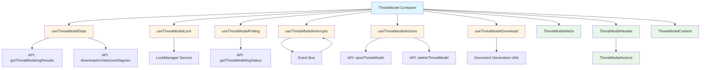

# ThreatModel Component Refactoring

## Overview

The ThreatModel component has been refactored from a monolithic 1000-line file into a well-structured, maintainable architecture. This refactoring separates concerns into custom hooks for business logic, presentational components for UI rendering, and maintains 100% functional parity with the original implementation.

## Component Structure

```
src/components/ThreatModeling/
├── ThreatModel.jsx                    # Main container component (~200 lines)
├── threatmodel/                       # Presentational components
│   ├── ThreatModelHeader.jsx         # Header with breadcrumbs and actions
│   ├── ThreatModelActions.jsx        # Action dropdown menu
│   ├── ThreatModelContent.jsx        # Main content area
│   └── ThreatModelAlerts.jsx         # Alert notifications
├── hooks/                             # Custom hooks for business logic
│   ├── useThreatModelData.js         # Data fetching and management
│   ├── useThreatModelLock.js         # Edit lock management
│   ├── useThreatModelPolling.js      # Status polling
│   ├── useThreatModelInterrupts.js   # Real-time event handling
│   ├── useThreatModelActions.js      # Action handlers
│   └── useThreatModelDownload.js     # Document generation
└── README.md                          # This file
```

## Architecture Diagram



## Custom Hooks

### useThreatModelData

**Purpose**: Manages threat model data fetching, updates, and session initialization.

**Key Responsibilities**:

- Fetch threat model results from the backend
- Download and manage architecture diagram data
- Initialize Sentry agent session context
- Track data changes for conflict detection
- Provide update functions for threat model sections

**Returns**:

- `response`: Complete threat model data object
- `base64Content`: Architecture diagram in base64 format
- `tmStatus`, `tmDetail`, `sessionId`, `iteration`: Status tracking
- `loading`, `isOwner`: State flags
- `updateThreatModeling()`: Function to update specific sections
- `handleRefresh()`: Function to refresh threat modeling trail
- `initializeThreatModelSession()`: Function to initialize session context

**Usage**:

```javascript
const { response, base64Content, tmStatus, updateThreatModeling, handleRefresh } =
  useThreatModelData(threatModelId);
```

---

### useThreatModelLock

**Purpose**: Handles collaborative editing through lock acquisition, maintenance, and release.

**Key Responsibilities**:

- Initialize and manage LockManager instance
- Acquire edit lock when threat model loads
- Maintain lock heartbeat to prevent timeout
- Handle lock loss scenarios (another user takes lock)
- Release lock on navigation or component unmount

**Returns**:

- `isReadOnly`: Boolean indicating if user can edit
- `lockStatus`: Object with lock conflict information (lockedBy, since, message)
- `lockManager`: Ref to LockManager instance

**Usage**:

```javascript
const { isReadOnly, lockStatus, lockManager } = useThreatModelLock(threatModelId, isResultsLoaded);
```

---

### useThreatModelPolling

**Purpose**: Polls threat model processing status and triggers state transitions.

**Key Responsibilities**:

- Poll backend every 1 second for status updates
- Detect status transitions (START → PROCESSING → FINALIZE → COMPLETE)
- Trigger callbacks when status changes
- Handle FAILED status scenarios
- Provide manual refresh trigger mechanism

**Returns**:

- `tmStatus`, `tmDetail`, `sessionId`, `iteration`: Current status data
- `loading`: Loading state flag
- `trigger`, `setTrigger`: Manual refresh trigger

**Usage**:

```javascript
const { tmStatus, tmDetail, trigger, setTrigger } = useThreatModelPolling(
  threatModelId,
  onStatusChange
);
```

---

### useThreatModelInterrupts

**Purpose**: Handles real-time interrupt events from the Sentry agent for collaborative updates.

**Key Responsibilities**:

- Queue interrupt events that arrive before data loads
- Process interrupt events when threat model data is available
- Handle add_threats, edit_threats, delete_threats operations
- Update threat model data based on interrupt payload
- Send acknowledgment messages back to Sentry

**Returns**:

- `handleInterruptEvent()`: Function to handle incoming interrupt events

**Usage**:

```javascript
const { handleInterruptEvent } = useThreatModelInterrupts(
  threatModelId,
  response,
  updateThreatModeling,
  initializeThreatModelSession,
  sendMessage
);
```

---

### useThreatModelActions

**Purpose**: Encapsulates all user action handlers (save, delete, replay, stop, etc.).

**Key Responsibilities**:

- Handle save operation with version conflict detection
- Handle delete with lock release and navigation
- Handle replay with state reset
- Handle stop processing operation
- Handle restore previous version on error
- Handle clone operation for conflicting changes
- Provide server version reload functionality

**Returns**:

- `handleSave()`: Save changes with conflict detection
- `handleDelete()`: Delete threat model
- `handleReplay()`: Start replay from specific iteration
- `handleStop()`: Stop processing
- `handleRestore()`: Restore previous version
- `handleSaveAsClone()`: Clone and save with local changes
- `handleReloadServerVersion()`: Reload page to get server version

**Usage**:

```javascript
const { handleSave, handleDelete, handleReplay, handleStop } = useThreatModelActions({
  threatModelId,
  response,
  sessionId,
  lockManager,
  navigate,
  showAlert,
  // ... other dependencies
});
```

---

### useThreatModelDownload

**Purpose**: Handles document generation and download in multiple formats.

**Key Responsibilities**:

- Generate DOCX documents from threat model data
- Generate PDF documents from threat model data
- Export threat model as JSON
- Trigger browser downloads

**Returns**:

- `handleDownload()`: Function to download in specified format

**Usage**:

```javascript
const { handleDownload } = useThreatModelDownload(response, base64Content);

// Download as PDF
handleDownload("pdf");
```

---

## Presentational Components

### ThreatModelAlerts

**Purpose**: Displays all alert notifications (changes, locks, errors).

**Props**:

- `alert`: Alert state object
- `alertMessages`: Alert message templates
- `lockStatus`: Lock conflict information
- `isReadOnly`: Read-only mode flag
- `showResults`: Whether results are displayed
- `onDismiss`: Alert dismiss handler
- `onSave`: Save action handler
- `loading`: Loading state for save button

**Renders**:

- Change alerts with save button
- Lock conflict warnings
- Read-only mode notifications
- Collaboration indicators

---

### ThreatModelHeader

**Purpose**: Displays breadcrumbs, title, and action buttons.

**Props**:

- `breadcrumbs`: Breadcrumb navigation items
- `title`: Threat model title
- `tmStatus`: Current processing status
- `showResults`, `showProcessing`: Display state flags
- `isReadOnly`, `isOwner`: Permission flags
- `onBreadcrumbClick`: Breadcrumb click handler
- `onActionClick`: Action button click handler

**Renders**:

- Breadcrumb navigation
- Threat model title
- Action dropdown menu (via ThreatModelActions)

---

### ThreatModelActions

**Purpose**: Renders the action dropdown menu with context-aware items.

**Props**:

- `showResults`, `showProcessing`: Display state flags
- `isReadOnly`, `isOwner`: Permission flags
- `onActionClick`: Action click handler

**Renders**:

- Save, Share, Delete actions
- Replay, Trail, Stop actions
- Download actions (PDF, DOCX, JSON)

---

### ThreatModelContent

**Purpose**: Displays the main content area based on current state.

**Props**:

- `loading`, `processing`, `results`, `error`: State flags
- `tmStatus`, `iteration`, `tmDetail`: Status information
- `threatModelId`: Threat model identifier
- `response`, `base64Content`: Threat model data
- `isReadOnly`: Edit permission flag
- `updateThreatModeling`, `refreshTrail`: Update functions
- Modal props and handlers

**Renders**:

- Loading spinner
- Processing component with status
- Threat modeling results
- Error alerts
- Modals (replay, delete, sharing)

---

## Data Flow

### 1. Initial Load Flow

```
User navigates to /threat-model/:id
    ↓
ThreatModel component mounts
    ↓
useThreatModelPolling starts polling
    ↓
Status changes to COMPLETE
    ↓
useThreatModelData fetches results
    ↓
useThreatModelLock acquires edit lock
    ↓
ThreatModelContent displays results
```

### 2. Edit and Save Flow

```
User edits threat model data
    ↓
updateThreatModeling() updates local state
    ↓
Change detection triggers alert
    ↓
User clicks Save
    ↓
handleSave() checks for conflicts
    ↓
API call saves to backend
    ↓
Lock heartbeat continues
    ↓
Alert dismissed
```

### 3. Real-time Collaboration Flow

```
Another user/agent makes changes
    ↓
Backend sends interrupt event
    ↓
useThreatModelInterrupts receives event
    ↓
Event queued if data not loaded
    ↓
Event processed when data available
    ↓
updateThreatModeling() applies changes
    ↓
UI updates with new data
    ↓
Acknowledgment sent to Sentry
```

### 4. Lock Loss Flow

```
Another user acquires lock
    ↓
LockManager detects lock loss
    ↓
onLockLost callback triggered
    ↓
useThreatModelLock updates state
    ↓
isReadOnly set to true
    ↓
lockStatus populated with conflict info
    ↓
ThreatModelAlerts displays warning
    ↓
User sees read-only mode
```

## State Management

### Container State (ThreatModel.jsx)

```javascript
// UI State (consolidated)
const [uiState, setUiState] = useState({
  loading: true,
  processing: false,
  results: false,
  deleteModalVisible: false,
  sharingModalVisible: false,
  replayModalVisible: false,
});

// Alert State (from useAlert hook)
const { alert, showAlert, hideAlert } = useAlert();
```

### Hook State

Each custom hook manages its own internal state:

- **useThreatModelData**: response, base64Content, status tracking
- **useThreatModelLock**: isReadOnly, lockStatus, lockManager ref
- **useThreatModelPolling**: status data, loading, trigger
- **useThreatModelInterrupts**: pendingInterrupts queue (ref)
- **useThreatModelActions**: No internal state (pure handlers)
- **useThreatModelDownload**: No internal state (pure handlers)

## Performance Optimizations

### Memoization

1. **React.memo**: All presentational components are wrapped with React.memo to prevent unnecessary re-renders
2. **useCallback**: All event handlers passed to child components are wrapped in useCallback
3. **useMemo**: Derived state like breadcrumbs array is memoized

### Re-render Prevention

- Consolidated related state to reduce setState calls
- Used refs for values that don't need to trigger re-renders (lockManager, pendingInterrupts)
- Split context providers to minimize context update impact
- Custom comparison functions for complex memo scenarios

### Polling Optimization

- 1-second polling interval for real-time updates
- Immediate cleanup on unmount
- Conditional polling based on status

## Testing Strategy

### Unit Testing Hooks

```javascript
import { renderHook, act } from "@testing-library/react-hooks";
import { useThreatModelData } from "./useThreatModelData";

test("fetches threat model data on mount", async () => {
  const { result, waitForNextUpdate } = renderHook(() => useThreatModelData("tm-123"));

  await waitForNextUpdate();

  expect(result.current.response).toBeDefined();
  expect(result.current.loading).toBe(false);
});
```

### Testing Presentational Components

```javascript
import { render, screen } from "@testing-library/react";
import { ThreatModelAlerts } from "./ThreatModelAlerts";

test("renders change alert with save button", () => {
  render(
    <ThreatModelAlerts
      alert={{ visible: true, type: "info" }}
      alertMessages={{ changes: "You have unsaved changes" }}
      showResults={true}
      onSave={jest.fn()}
    />
  );

  expect(screen.getByText("You have unsaved changes")).toBeInTheDocument();
  expect(screen.getByText("Save")).toBeInTheDocument();
});
```

## Migration Notes

### Breaking Changes

**None** - This refactoring maintains 100% backward compatibility.

### Maintained Interfaces

- Component export: `export const ThreatModel`
- Props interface: `{ user }` prop unchanged
- Route integration: No changes to routing
- Context integration: Existing context usage preserved
- Event bus integration: Existing event receivers preserved

## Future Enhancements

After this refactoring, the following improvements are now easier to implement:

1. **Unit Tests**: Hooks can be tested in isolation
2. **TypeScript Migration**: Gradual migration with clear interfaces
3. **WebSocket Integration**: Replace polling with real-time WebSocket
4. **Offline Support**: Cache threat model data locally
5. **Undo/Redo**: Implement command pattern for edits
6. **Optimistic Updates**: Update UI before server confirmation
7. **Hook Reusability**: Share hooks across other components

## Troubleshooting

### Common Issues

**Issue**: Lock not releasing on navigation

- **Solution**: Ensure lockManager.releaseLock() is called in cleanup

**Issue**: Interrupt events not processing

- **Solution**: Check that response data is loaded before processing

**Issue**: Polling continues after unmount

- **Solution**: Verify interval cleanup in useEffect return function

**Issue**: Save conflicts not detected

- **Solution**: Ensure lastKnownServerTimestamp is updated on fetch

## Contributing

When modifying the ThreatModel component:

1. Keep business logic in custom hooks
2. Keep UI rendering in presentational components
3. Use useCallback for all event handlers passed as props
4. Use React.memo for presentational components
5. Add JSDoc comments for new functions
6. Update this README if architecture changes

## References

- [React Hooks Documentation](https://react.dev/reference/react)
- [React.memo Documentation](https://react.dev/reference/react/memo)
- [Cloudscape Design System](https://cloudscape.design/)
